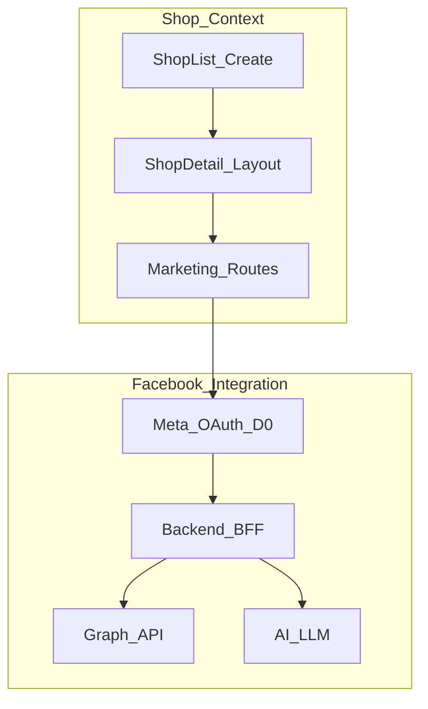

# AIMap — Plan gộp: Shop (list/create/detail) + Support Marketing (Facebook)

**Nguồn gộp:** `support_marketing_ui_mock_1374188e` + `shoplist_shopdetail_ui_struct_31a4c65d` + rà soát FE/backend gap + tra cứu Meta (OAuth, user vs dev).

**File code tham chiếu chính:**

- Marketing workspace: [aimap/frontend/src/pages/shop/ShopMarketingFacebookWorkspacePage.tsx](aimap/frontend/src/pages/shop/ShopMarketingFacebookWorkspacePage.tsx)
- Choose platform: [aimap/frontend/src/pages/shop/ShopMarketingPage.tsx](aimap/frontend/src/pages/shop/ShopMarketingPage.tsx)

---

## Phần A — Shop: danh sách, tạo shop, Shop Detail

### A.1 Layout & routing

- **Dashboard:** [DashboardLayout](aimap/frontend/src/layouts/DashboardLayout.tsx) — sidebar Dashboard, Shops, Credit balance.
- **Shop List + Create:** nằm trong Dashboard layout.
- **Shop Detail:** layout **riêng** (header giống Dashboard: LanguageSwitcher + UserMenu), **sidebar trái 5 mục** + Credit balance dưới cùng.

**Route gợi ý:**

| Route | Nội dung |
|-------|----------|
| `/shops` | ShopListPage |
| `/shops/create` | Form tạo shop |
| `/shops/:id` | Shop dashboard (index trong layout shop) |
| `/shops/:id/image-bot` | Bot tạo ảnh |
| `/shops/:id/storage` | Storage ảnh |
| `/shops/:id/marketing` | Choose platform → `/shops/:id/marketing/facebook` |
| `/shops/:id/marketing/facebook` | Facebook workspace |
| `/shops/:id/pipeline` | Pipeline |
| `/shops/:id/edit` | Sửa shop (tùy) |

### A.2 ShopListPage

- CTA **Tạo cửa hàng** → `/shops/create`.
- Danh sách: logo, tên, **slug/subdomain** (`slug.captone2.site`), ngành, trạng thái; quick actions Vào shop / Chỉnh sửa.
- Empty state + tùy chọn thống kê nhanh.
- API: `GET /api/shops`.

### A.3 Form tạo shop (theo DB)

**12 trường bắt buộc:** name, slug, industry, description, address, city, district, country, postal_code, `contact_info.phone`, `contact_info.email`, `contact_info.owner_name`.

- **Slug:** `GET /api/shops/slugs` một lần khi mở form → cache → kiểm tra trùng khi gõ (không debounce gọi DB từng ký tự).
- **Industry:** 40 tag cố định — bảng đầy đủ trong [aimap/frontend/src/constants/industries.ts](aimap/frontend/src/constants/industries.ts) (hoặc [READ_CONTEXT/database_design.md](READ_CONTEXT/database_design.md)); combobox có tìm kiếm; lưu tag vào DB.

### A.4 Shop Detail sidebar (5 mục)

1. Shop Dashboard  
2. Bot tạo ảnh  
3. Storage  
4. Support marketing  
5. Pipeline  

Credit balance: theo **user**, hiển thị giống Dashboard.

### A.5 Backend Shop (thứ tự gợi ý)

| # | Endpoint | Mục đích |
|---|----------|----------|
| 1 | `GET /api/shops` | Danh sách shop user |
| 2 | `GET /api/shops/slugs` | Slug đã dùng |
| 3 | `POST /api/shops` | Tạo shop |
| 4 | `GET/PATCH /api/shops/:id` | Chi tiết / cập nhật |
| 5 | `GET/POST .../assets` | Storage (Phase 2) |
| 6 | `GET/POST .../marketing-content` | Content marketing |
| 7 | `GET/POST .../pipeline-runs` | Pipeline |
| 8 | `GET .../credit` hoặc `/users/me/credit` | Credit sidebar |
| 9 | `GET .../stats` (tùy) | Shop dashboard |

**Lưu ý:** Nhật ký hoạt động — cập nhật khi member thao tác (theo yêu cầu trong plan shop cũ).

---

## Phần B — Support Marketing: UI & scope

### B.1 Đã chốt

- `/shops/:id/marketing` = Choose Platform (chỉ Facebook active; nền khác disabled).
- `/shops/:id/marketing/facebook` = workspace **4 khu:** Page panel, Write content, Overview post, Manager Posts.
- UX: modal-first, layout cố định, textarea lớn.
- Phase đã làm: **UI mock**; nối API Meta + AI sau.

### B.2 Iteration UI (còn việc)

- Manager Posts: **rút cột** (gom Reach·ER hoặc một metric nổi bật); ~5 dòng + cuộn + sticky header.
- Modal **View:** insights + sparkline (nếu có data) + comment AI + bot eval — không chỉ 4 số.
- **Edit:** `canEditViaApi` từ backend; nếu không → copy / mở FB / nháp mới (không Save gây hiểu nhầm).
- Icon AI: [aimap/frontend/src/assets/image-bot/ai-actions-bot.png](aimap/frontend/src/assets/image-bot/ai-actions-bot.png).

### B.3 Pages API (Meta) — quy tắc sản phẩm

- **Update post:** chỉ khi bài **do app đăng** — [Pages API — Update](https://developers.facebook.com/docs/pages-api/posts/).
- **Delete:** `DELETE /{post-id}` khi đủ quyền.
- **Insights / comments:** qua Graph, **không scrape** HTML Facebook.

---

## Phần C — Tra cứu: kết nối Facebook (hệ thống vs Meta vs user)

### C.1 User cuối (chủ shop) — **không cần là dev**

Luồng đúng: bấm **Kết nối Facebook** → đăng nhập Meta → **cho phép permission** → (tuỳ app) **chọn Page** trong danh sách page user quản lý. **Không** đủ để chỉ nhập tay "Page name + Page ID" — đó chỉ hợp **mock/dev**.

### C.2 Team dev phải làm

- Tạo **Meta App**, cấu hình OAuth redirect (HTTPS), App Domains, Privacy Policy (khi App Review).
- Backend: đổi `code` → token, lưu **user token + page token** (mã hoá), refresh policy.
- Xin **Advanced Access** / **App Review** cho permission cần thiết.

### C.3 Permission tối thiểu (tham chiếu — đối chiếu doc mới nhất)

- `pages_show_list`, `pages_read_engagement`, `read_insights`, `pages_manage_posts` (đọc/ghi post tùy nhu cầu).  
- Chi tiết: [Permissions Reference](https://developers.facebook.com/docs/permissions/).

### C.4 User phải có quyền trên Page

- Vai trò Page (Admin/Editor/…) và **task** Meta gán cho user trên Page — app chỉ thao tác được trong phạm vi đó.

---

## Phần D — Bổ sung so với contract D1–D6 cũ

| Mục | Nội dung |
|-----|----------|
| **D0 OAuth** | `GET` bắt đầu login (URL Meta) + `GET/POST` callback lưu `facebook_connections` / `facebook_pages`. **Thay** UI nhập tay ID. |
| **D7 AI Assist** | `POST /api/shops/:shopId/facebook/assist` (tên có thể đổi): body `{ draftMessage, instruction, locale? }` → `{ suggestedMessage }`; `ai_outputs.kind = write_assist`. |
| **Media / Image Picker** | Dùng `GET /api/shops/:id/assets` (hoặc tương đương) để list ảnh; publish ảnh lên Page = luồng Graph riêng nếu làm sau. |
| **Publish Overview** | Plan gốc **loại** publish khỏi phạm vi tối thiểu; nếu sản phẩm cần **Publish thật** → thêm endpoint + `pages_manage_posts` + upload photo. |
| **permalinkUrl** | FE không dùng `post.id` mock làm URL FB; dùng `permalinkUrl` từ API. |
| **Dashboard modal nhỏ** | Có thể tái dùng `GET .../pages/:pageId/detail?range=30d` lấy subset KPI hoặc query `fields=kpisOnly` nếu backend hỗ trợ. |

---

## Phần E — Backend chi tiết (Facebook): kiến trúc, DB, endpoint D1–D6, job, AI, lỗi

Giả định: Node `aimap/backend`, auth hiện có; mọi gọi `graph.facebook.com` **chỉ từ backend** (BFF).

### E.1 Nguyên tắc

- FE không cầm page token.
- Mọi route có `shopId` + kiểm tra quyền shop.
- Thời gian JSON: ISO 8601 UTC.

### E.2 DB đề xuất

- `facebook_connections` (shop, user token mã hoá, expires).
- `facebook_pages` (page_id, name, picture, followers snapshot, **page_access_token** mã hoá, tasks).
- `facebook_posts_cache` (post snapshot, permalink, insights, `created_by_app_id` → `can_edit_via_api`).
- `post_insight_snapshots` (post_id, date, metric_key, value) — sparkline.
- `ai_outputs` (kind: `page_detail_actions` | `post_comment_summary` | `post_bot_review` | **`write_assist`**).

Cập nhật [READ_CONTEXT/database_design.md](READ_CONTEXT/database_design.md) khi migrate.

### E.3 Endpoint (prefix ví dụ `/api/shops/:shopId/facebook`)

Header: `Authorization` theo backend hiện tại.

#### D1 `GET /pages`

- Query: optional `sync=true`.
- 200: `{ pages: [{ pageId, name, followers, category, pictureUrl, updatedAt }] }`.
- Lỗi: `FB_TOKEN_EXPIRED`, …

#### D2 `GET /pages/:pageId/detail`

- Query: `range=7d|30d`.
- 200: `kpis`, `trendBars`, `engagementMix`, `bestTimes`, `topPosts`, `aiActions`, `sources: { insightsSyncedAt, isPartial }`.
- Insights từ `GET /{page-id}/insights`; AI actions từ LLM + cache.

#### D3 `GET /pages/:pageId/posts`

- Query: `limit`, `after`, optional `range`.
- Post: `postId`, `title`/`messagePreview`, `createdTime`, `timeLabel`, metrics, `canEditViaApi`, `canDeleteViaApi`, **`permalinkUrl`**, paging.

#### D4 `GET /posts/:postId/detail`

- `message`, `permalinkUrl`, `createdTime`, `insights`, `sparkline`, `commentAi`, `botEvaluation`, `capabilities`, `cachedAt`.
- Sparkline rỗng + `isPartial` nếu chưa có snapshot.

#### D5 `PATCH /posts/:postId`

- Body `{ message }`. Nếu không đủ điều kiện app-only → `409` `POST_NOT_EDITABLE_APP_ONLY`.

#### D6 `DELETE /posts/:postId`

- Xóa trên Graph + cập nhật cache.

### E.4 Mapping lỗi (HTTP gợi ý)

| code | HTTP |
|------|------|
| FB_TOKEN_EXPIRED | 401 |
| FB_PERMISSION_MISSING | 403 |
| FB_RATE_LIMIT | 429 |
| POST_NOT_EDITABLE_APP_ONLY | 409 |
| NO_INSIGHTS | 200 partial hoặc policy |
| POST_NOT_FOUND | 404 |

### E.5 Job

- 15–60 phút: followers, insights page.
- Hằng ngày: snapshot post top N.
- On-demand View: TTL cache 5–15 phút.

### E.6 AI (server)

- Input: text từ Graph đã lọc; timeout 15–30s; fallback message lỗi thân thiện.
- Rubric bot evaluation (config JSON).

### E.7 Bảo mật

- Encrypt token at rest; không log full token; audit log theo shop/page/action.

### E.8 Tài liệu Meta

- [Pages API Posts](https://developers.facebook.com/docs/pages-api/posts/)
- [Post reference](https://developers.facebook.com/docs/graph-api/reference/post/)
- [Page insights](https://developers.facebook.com/docs/graph-api/reference/page/insights/)

---

## Phần F — Luồng tích hợp (mermaid)

---

## Phần G — Chốt: plan đã đủ để **bắt đầu triển khai** chưa?

**Đủ để bắt đầu** theo nghĩa:

- Có **phạm vi rõ** (Shop CRUD + layout; Marketing UI + contract backend Graph/AI).
- Có **thứ tự ưu tiên** (Shop Phase 1 → assets/marketing/pipeline; Facebook: OAuth → D1–D4 → job → D5/D6).
- Có **rủi ro đã biết**: App Review Meta, rate limit, post chỉ sửa được nếu do app tạo.

**Chưa đủ để “bàn giao production Facebook”** nếu chưa:

- Implement **D0 OAuth** + token thật (không chỉ spec).
- Quyết định và (nếu cần) implement **D7**, **media**, **publish**.
- Hoàn tất **permission + App Review** trên Meta App.

**Kết luận:** Có thể **khởi động song song**: (1) Shop list/create/detail + storage API; (2) chỉnh FE marketing theo iteration; (3) spike Meta App + OAuth; (4) BFF D1–D4 với sandbox. Plan gộp này là **đủ làm tài liệu master** cho giai đoạn triển khai; các file plan cũ đã gộp vào đây.

---

## Phần H — Đồng bộ tài liệu repo khi code

- [READ_CONTEXT/UI STRUCT.md](READ_CONTEXT/UI STRUCT.md) — cập nhật routing Shop + Marketing (khi thực hiện).
- [aimap/backend/danhsach_API.md](aimap/backend/danhsach_API.md) — mọi endpoint mới.
- [READ_CONTEXT/database_design.md](READ_CONTEXT/database_design.md) — mọi thay đổi schema.
