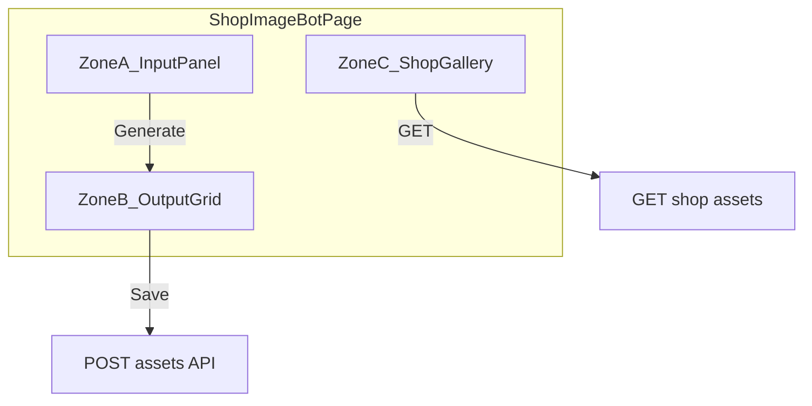

# Kế hoạch chi tiết: Giao diện trang Image Bot (`/shops/[id]/image-bot`)

## Bối cảnh và mục tiêu

- **Route hiện tại:** [ShopImageBotPage.tsx](aimap/frontend/src/pages/shop/ShopImageBotPage.tsx) chỉ placeholder; layout shop: [ShopDetailLayout.tsx](aimap/frontend/src/layouts/ShopDetailLayout.tsx).
- **Theo [UI STRUCT.md](READ_CONTEXT/UI STRUCT.md):** Bot tạo ảnh là entry AI cho shop; khi **Lưu** → ghi vào **assets** của shop. Trang [Storage](aimap/frontend/src/pages/shop/ShopStoragePage.tsx) (`/shops/[id]/storage`) dành cho **quản lý / lọc / upload** đầy đủ; **Image-bot** chỉ cần **strip gallery xem nhanh** toàn ảnh shop (không tìm kiếm/lọc).
- **Kiến trúc ảnh:** [AIMAP-3-Image-ModelsAI-VN.md](READ_CONTEXT/AIMAP-3-Image-ModelsAI-VN.md) mô tả **3 model tạo ảnh** (Imagen/Gemini API, DALL·E 3, FLUX). Yêu cầu UI **2 lựa chọn "GPT" và "Gemini"** nên trong plan: **GPT** ≈ nhánh OpenAI (DALL·E / image API OpenAI), **Gemini** ≈ nhánh Google (Imagen qua Gemini API). Giai đoạn 1 UI có thể **mock** response; giai đoạn 2 backend map đúng provider.

---

## Nguyên tắc layout cố định (không tự co giãn phá vỡ khung)

- **Không** dùng layout khiến panel cha **phóng to/thu nhỏ theo nội dung con** (tránh `flex-1` vô hạn trên toàn trang cho vùng input/output).
- **Zone A, B:** bọc trong container có `**min-h` cố định hoặc `h-*` + `overflow-y-auto`** cho phần nội dung bên trong; ảnh output dùng `**object-contain`** trong khung cố định (ví dụ `aspect-video` hoặc theo tỷ lệ đã chọn).
- **Grid output:** số cột cố định theo breakpoint (vd. 1 / 2 / 3 cột), card có **chiều cao ảnh cố định** (vd. `h-48` hoặc map theo aspect 1:1 vs 2:3).

---

## Zone A — Bảng điều khiển tạo ảnh (trên cùng)

Một **card** hoặc **panel** có tiêu đề (i18n), bên trong form theo thứ tự:

| Nhóm               | Thành phần UI                                                                                                                                                                                                     | Hành vi                                                                                                                                                               |
| ------------------ | ----------------------------------------------------------------------------------------------------------------------------------------------------------------------------------------------------------------- | --------------------------------------------------------------------------------------------------------------------------------------------------------------------- |
| **Tỷ lệ khung**    | Radio hoặc segmented control: `1:1`, `2:3`, `3:2`, `4:5`, `16:9` (danh sách cố định; map sang size API backend sau).                                                                                              | Bắt buộc chọn một.                                                                                                                                                    |
| **Thể loại hình**  | Select: ví dụ *Quảng cáo*, *Giới thiệu sản phẩm*, *Bảng giá*, *Banner shop* (có thể mở rộng).                                                                                                                     | Gửi kèm request dưới dạng `image_style` / `use_case` để Prompt Builder ghép với kho prompt ([database_design](READ_CONTEXT/database_design.md) — `prompt_templates`). |
| **Sản phẩm**       | Toggle **"Chỉ quảng cáo shop (không hiện sản phẩm)"**. Nếu bật sản phẩm: multi-select checklist từ `shops.products` (JSONB) — cần **GET shop detail** [shops.js](aimap/backend/routes/shops.js) `GET /shops/:id`. | Empty products → ẩn multi-select, chỉ cho phép chế độ shop-only hoặc thông báo "Thêm sản phẩm tại Edit shop".                                                         |
| **Prompt bổ sung** | Textarea, optional, placeholder giải thích *ý tưởng thêm* (hệ thống đã có prompt gốc).                                                                                                                            | Map `user_prompt`.                                                                                                                                                    |
| **Ảnh tham khảo**  | Upload nhiều file (preview thumbnail, xóa từng ảnh); giai đoạn 1 có thể chỉ **chọn file + preview**, upload thật khi có API presign/multipart.                                                                    |                                                                                                                                                                       |
| **Model**          | Radio **GPT**                                                                                                                                                                                                     | **Gemini** (nhãn i18n). Backend: GPT → OpenAI image; Gemini → Google Imagen/Gemini image.                                                                             |
| **CTA**            | Nút **Tạo ảnh** (primary), disabled khi đang generate.                                                                                                                                                            | Gọi API gen (sau này); tạm thời có thể mock N ô output.                                                                                                               |

---

## Zone B — Kết quả bot (giữa trang)

- **Vùng cố định:** grid các **card ảnh** (số lượng theo UX: ví dụ 3–4 variant như backlog "nhiều ảnh chọn một").
- Mỗi card gồm:
  - Khung ảnh cố định + **3 nút:** **Save** | **Edit** | **Rebuild**.
  - **Save:** xác nhận lưu vào assets shop (sau có `POST` + trừ credit); UI hiện toast / cập nhật Zone C.
  - **Edit / Rebuild:** bật **panel con ngay dưới đúng card đó** (accordion hoặc `border-t` trong cùng card); **chỉ mở một panel loại Edit hoặc Rebuild tại một card** (hoặc cho phép nhiều — ưu tiên một để gọn).

**Panel con — Edit:**

- Tiêu đề "Chỉnh sửa".
- Textarea: prompt yêu cầu sửa/bổ sung.
- Upload ảnh tham khảo thêm (giống Zone A).
- Chọn model (GPT / Gemini).
- Nút **Áp dụng** → gọi API edit (image-to-image hoặc regen với prompt mới — tùy backend).

**Panel con — Rebuild:**

- Tiêu đề "Tạo lại".
- Prompt tùy chọn.
- Upload ảnh tham khảo tùy chọn.
- Chọn model khác (optional).
- Chọn **tỷ lệ khung khác** (optional, override lần gen này).
- Nút **Tạo lại**.

---

## Zone C — Toàn bộ ảnh của shop (dưới cùng)

- Tiêu đề kiểu "Ảnh trong shop" / i18n; mô tả ngắn: *Xem nhanh; quản lý chi tiết tại Storage*.
- **Horizontal scroll** hoặc **grid nhiều cột** cố định, chỉ **xem** (click mở lightbox tùy chọn).
- Dữ liệu: **GET danh sách assets theo `shop_id`** — hiện backend chưa có route public trong [shops.js](aimap/backend/routes/shops.js); cần bổ sung ví dụ `GET /api/shops/:id/assets` (auth + ownership) hoặc tái dùng endpoint assets chung khi có. Giai đoạn 1 có thể **mock** hoặc gọi API khi sẵn.

---

## Cấu trúc code đề xuất (frontend)

- [ShopImageBotPage.tsx](aimap/frontend/src/pages/shop/ShopImageBotPage.tsx): compose 3 zone.
- Tách component (cùng folder hoặc `components/shop/image-bot/`):
  - `ImageBotInputPanel.tsx`
  - `ImageBotOutputGrid.tsx` + `ImageBotResultCard.tsx` (chứa Save/Edit/Rebuild + sub-panels)
  - `ImageBotShopGallery.tsx`
- Hook `useShopImageBot(shopId)` hoặc `useShopDetail` + `useShopAssets` cho data.
- **i18n:** thêm keys trong [translations.ts](aimap/frontend/src/i18n/translations.ts) (en/vi) cho toàn bộ nhãn Zone A/B/C và form Edit/Rebuild.

---

## Backend / tích hợp (ngoài phạm vi UI thuần, cần cho chức năng đầy đủ)

- Gen ảnh: endpoint nhận `shop_id`, aspect, style, product_ids, user_prompt, reference_images[], model (`openai` | `google`).
- Lưu asset: insert `assets` với `shop_id`, `type` (post/banner/…), `model_source`, `user_prompt` ([database_design](READ_CONTEXT/database_design.md)).
- List ảnh shop: query `assets` WHERE `shop_id`.

---

## Thứ tự triển khai gợi ý

1. **Khung layout + Zone A** (form đầy đủ, state local, chưa gọi gen).
2. **Zone B** (mock 2–3 ảnh placeholder + 3 nút + mở/đóng panel Edit/Rebuild).
3. **Zone C** (mock hoặc API list assets khi có).
4. Nối **GET shop** (products), sau đó API gen/save thật.
5. Polish a11y (label, focus trap trong panel), loading/error.

---

## Liên kết plan Shop Detail

Bổ sung mục **Image Bot** trong [shoplist_shopdetail_ui_struct_31a4c65d.plan.md](.cursor/.cursor/plans/shoplist_shopdetail_ui_struct_31a4c65d.plan.md) (khi cập nhật tài liệu): mô tả 3 zone, phân biệt rõ **image-bot** (tạo + output + gallery xem nhanh) vs **storage** (quản lý đầy đủ).