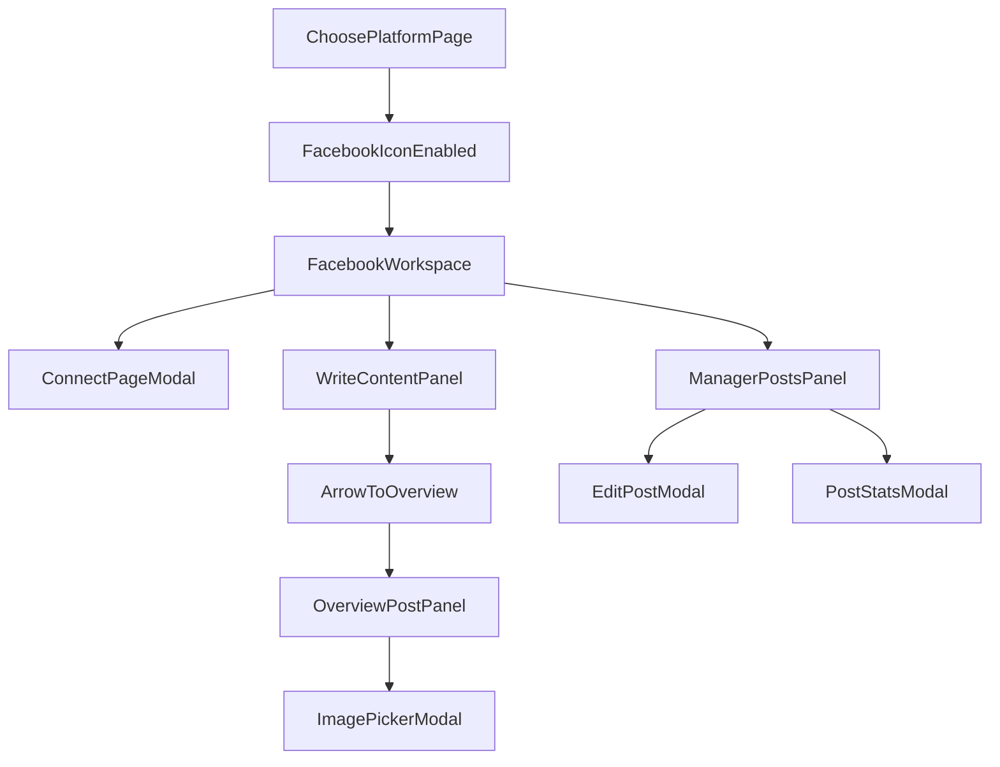

# Plan UI Support Marketing (Theo sketch mới)

## Scope đã chốt

- Route trung gian: `**/shops/:id/marketing` = Choose Platform**.
- Route chính Facebook: `**/shops/:id/marketing/facebook`**.
- Phase hiện tại: **UI mock only** (chưa gọi API Facebook thật).
- Nguyên tắc UX bắt buộc:
  - Bố cục cố định, không bị kéo dài đẩy layout khi tương tác.
  - Hầu hết thao tác con mở **modal giữa màn hình** để user thao tác.
  - Text area viết content lớn như form nhập liệu văn bản.

## IA (Information Architecture) bám sát ý tưởng

- `Choose Platform` page:
  - Hiện icon nền tảng: Facebook, Twitter(X), TikTok... (icon sau bạn bổ sung PNG).
  - Chỉ Facebook bấm được.
  - Nền tảng còn lại làm mờ + label "Chưa hỗ trợ".
- `Facebook Workspace` page gồm 4 khu:
  - **A. Facebook Page Panel**
    - List page đã liên kết.
    - Nút: `Connect page`, `View page dashboard`.
    - Dashboard page (modal) hiển thị chỉ số cơ bản + phần đánh giá tổng quan (AI insight mock).
  - **B. Write Content**
    - Khung nhập text lớn.
    - User tự viết hoặc chọn AI assist (mock).
    - Có nút mũi tên đẩy nội dung sang khu overview.
  - **C. Overview Post**
    - Mô phỏng post Facebook.
    - Có ô vuông dấu `+` để upload ảnh.
    - Bấm `+` mở modal gallery: ảnh từ storage + CTA mở Image Bot.
  - **D. Manager Posts**
    - Dropdown chọn page đã kết nối.
    - List post của page đó (mock data).
    - Hành động xem thống kê / sửa / xóa.
    - Edit mở modal riêng ở giữa màn hình.

## File sẽ chỉnh (UI-first)

- [d:/CAPTONE2/testKhaThi/aimap/frontend/src/App.tsx](d:/CAPTONE2/testKhaThi/aimap/frontend/src/App.tsx) (thêm route con `marketing/facebook`)
- [d:/CAPTONE2/testKhaThi/aimap/frontend/src/pages/shop/ShopMarketingPage.tsx](d:/CAPTONE2/testKhaThi/aimap/frontend/src/pages/shop/ShopMarketingPage.tsx) (Choose Platform)
- [d:/CAPTONE2/testKhaThi/aimap/frontend/src/pages/shop/ShopMarketingFacebookPage.tsx](d:/CAPTONE2/testKhaThi/aimap/frontend/src/pages/shop/ShopMarketingFacebookPage.tsx) (workspace Facebook)
- [d:/CAPTONE2/testKhaThi/aimap/frontend/src/i18n/translations.ts](d:/CAPTONE2/testKhaThi/aimap/frontend/src/i18n/translations.ts) (key text ngắn gọn)

## Thiết kế chi tiết tương tác (modal-first)

- Modal bắt buộc:
  - Connect Page modal.
  - Page Dashboard modal.
  - AI Assist modal (gợi ý/sửa content).
  - Image Picker modal (storage list + CTA image bot).
  - Edit Post modal.
  - View Post Analytics modal.
  - Delete Confirm modal.
- Hạn chế reflow/layout jump:
  - Dùng grid cố định 2 cột cho Write/Overview.
  - Manager Posts ở vùng dưới có chiều cao cố định + nội dung cuộn trong vùng.
  - Modal dùng overlay fixed, không chèn nội dung vào flow chính.

## Data mock model (frontend local state)

- `connectedPages[]`: id, name, followers, engagementScore, healthNote.
- `draftContent`: text + lastEditedAt.
- `overviewPost`: pageId, text, selectedImage.
- `postsByPage[pageId]`: list post + stats (reach, reactions, comments).
- `storageImages[]`: đọc từ storage API sẵn có nếu khả dụng; fallback mock ảnh.

## Luồng màn hình




## Acceptance criteria

- Có đủ 2 route và điều hướng đúng.
- Choose Platform đúng hành vi: Facebook mở được, icon khác disabled + mờ + "Chưa hỗ trợ".
- Facebook page đúng cấu trúc 4 khu như sketch.
- Write Content có text area lớn, chuyển nội dung sang Overview bằng nút mũi tên.
- Tất cả thao tác con mở modal giữa màn hình, không phá bố cục trang chính.
- Layout ổn định khi add/remove item (không đùn đẩy khối chính).

## Bước tiếp theo sau UI mock

- Khi bạn duyệt UI: chuyển sang API thật cho pages/drafts/publish.
- Bổ sung icon PNG thật theo danh sách platform bạn cung cấp.

---

## Iteration (chi tiết): PAGE DETAILS + Quản lý bài post — frontend hợp lệ & căn cứ Meta

Phần này bổ sung theo feedback: bảng post đang **dư cột / nhiều số nhảm**, **View chưa mang lại giá trị**, **Edit còn sơ**, và cần biết **Facebook có cho phép** các thao tác hay không. Không mở rộng sang tính năng marketing khác.

### 1) Manager Posts — rút cột, tránh thông tin thừa

**Vấn đề hiện tại:** Hiển thị đồng thời Reach + React + Comments + Shares + Time trên một hàng khiến bảng rộng, nhiều con số tách rời mà user khó ra quyết định nhanh.

**Hướng UI đề xuất (chọn một trong hai, ưu tiên gọn):**

- **Cách A (tối giản):** `Bài (1 dòng title/message)` | `Đăng` | `Tương tác` (một ô gộp, ví dụ `Reach 12.2k · ER 5.2%` hoặc chỉ `ER` nếu reach đã có ở View) | `Thao tác`
- **Cách B (tập trung hành động):** `Bài` | `Đăng` | `Điểm nổi bật` (một metric duy nhất do backend tính, có định nghĩa) | `Thao tác`

**Quy tắc:** Mỗi cột phải trả lời được câu “để làm gì tiếp theo?”. Nếu không → bỏ hoặc đưa vào modal View.

**Layout:** Giữ vùng bảng **cố định ~5 dòng + cuộn nội bộ + header sticky** (đồng bộ với list page).

### 2) View (chi tiết bài) — phải có giá trị thật, không chỉ 4 ô số

**Mục tiêu:** User mở View và nhận được (1) hiệu suất bài, (2) xu hướng/đối chiếu, (3) tiếng nói khách (comment đã gom), (4) gợi ý hành động, (5) đánh giá bot ngắn.

**Cấu trúc modal đề xuất (các section, text ngắn):**

1. **Tóm tắt bài:** permalink (mở Facebook), thời đăng, đoạn message rút gọn.
2. **Performance (Insights bài):** các chỉ số lấy từ **Post insights** (Page), không tự bịa công thức. Tham chiếu API: edge `insights` trên post Page — [Graph API Post](https://developers.facebook.com/docs/graph-api/reference/post/) (Edges: `insights`, `comments`).
3. **Biểu đồ:** Sparkline / bar nhỏ **chỉ khi backend có time series** (aggregate theo ngày từ insights hoặc snapshot lưu DB). Nếu chưa có dữ liệu lịch sử: hiển thị placeholder + copy “Cần đủ dữ liệu snapshot”.
4. **Comment intelligence (không đọc tay từng dòng trong UI):**
   - Nguồn dữ liệu: `GET /{page-post-id}/comments` (pagination). Tham khảo: [Page Post Comments](https://developers.facebook.com/docs/graph-api/reference/page-post/comments/).
   - **Ràng buộc thực tế:** cần Page access token + permission phù hợp (`pages_read_engagement` và các quyền/feature Meta yêu cầu cho app của bạn). Có rate limit; không được “scrape” HTML Facebook ngoài Graph API cho production.
   - Backend: lấy N comment gần nhất → **AI tóm tắt**: chủ đề chính, sentiment thô (positive/neutral/negative), câu hỏi lặp lại, gợi ý trả lời (không lưu PII thừa; tuân retention policy).
5. **Đánh giá bot (evaluation):** một khối text ngắn + score (0–100) với rubric cố định (ví dụ: hook đầu caption, độ dài, CTA, khớp giờ đăng so benchmark page). Output là **giải thích được** (2–3 bullet), không chỉ một số.

### 3) Edit bài — làm đủ UX và khớp khả năng API

**Thực tế Pages API (bắt buộc đọc kỹ doc):**

- **Cập nhật nội dung bài Page:** `POST https://graph.facebook.com/vX.X/{page_post_id}` với field `message` (ví dụ trong doc). Nguồn: [Posts - Facebook Pages API — Update a Post](https://developers.facebook.com/docs/pages-api/posts/).
- **Giới hạn quan trọng (trích ý chính thức):** *“An app can only update a Page post if the post was made using that app.”*  
  → Frontend **không được** giả định mọi bài đều sửa được. Phải có cờ từ backend: `canEditViaApi: boolean` + lý do ngắn.

**UX hợp lệ:**

- Nếu `canEditViaApi`: form đầy đủ (message; ảnh/video là luồng riêng theo Photos/Video API nếu scope kỹ thuật cho phép).
- Nếu không: nút **Sao chép nội dung**, **Mở trên Facebook**, hoặc **Tạo bản nháp mới trong app** — không hiện Save gây hiểu nhầm.

### 4) Xóa bài — có được không?

**Theo cùng tài liệu Pages API:** xóa bằng `DELETE` tới `/{page_post_id}` và nhận `{ success: true }`. Nguồn: [Posts - Facebook Pages API — Delete a Post](https://developers.facebook.com/docs/pages-api/posts/).

**Lưu ý triển khai:** vẫn cần đủ permission + Page token + user có task phù hợp trên Page. Luôn có nhánh lỗi (permission, post không thuộc quyền quản lý, v.v.).

### 5) Backend cần có gì (tối thiểu) để phục vụ View/Comment AI/Insights

**Endpoints gợi ý (nhất quán với UI):**

- `GET /api/shops/:shopId/facebook/pages/:pageId/posts` — danh sách rút gọn cho bảng (fields tối thiểu).
- `GET /api/shops/:shopId/facebook/posts/:postId/detail` — payload cho modal View:
  - `insights` (raw + đã chuẩn hoá),
  - `engagementSummary` (một object gộp để hiển thị 1 ô),
  - `commentsSample` (đã redact nếu cần),
  - `commentAiSummary` (chủ đề, sentiment, FAQ),
  - `botEvaluation` (score + bullets),
  - `capabilities`: `{ canEditViaApi, canDeleteViaApi, reasons[] }`

**Pipeline:**

- Worker/cache: pull insights + comments theo lịch hoặc on-demand; tránh gọi Graph API quá dày (rate limit).
- AI chỉ chạy trên dữ liệu đã lấy hợp pháp qua API.

**Lỗi chuẩn hoá cho FE:** `FB_TOKEN_EXPIRED`, `FB_PERMISSION_MISSING`, `POST_NOT_EDITABLE_APP_ONLY`, `RATE_LIMIT`, `NO_INSIGHTS`.

### 6) Icon AI actions (frontend)

- File asset: [d:/CAPTONE2/testKhaThi/aimap/frontend/src/assets/image-bot/ai-actions-bot.png](d:/CAPTONE2/testKhaThi/aimap/frontend/src/assets/image-bot/ai-actions-bot.png)
- Dùng cho tiêu đề section **AI actions** trong modal PAGE DETAILS (import ảnh trong `ShopMarketingFacebookWorkspacePage.tsx` khi sang phase implement).

### 7) Acceptance criteria (iteration này)

- Manager Posts: không còn cảm giác “dư React”; số liệu hiển thị có mục đích hoặc được gom.
- View: có ít nhất insights + block AI comment summary + bot evaluation (mock được trước khi nối API).
- Edit: phân nhánh rõ “sửa được qua API” vs “không sửa được”; không form sơ sài gây hiểu nhầm.
- Plan/backend có căn cứ trích dẫn từ **Pages API** cho update/delete và **Graph** cho comments/insights.

---

## Backend — đặc tả chi tiết (phạm vi: Facebook Page list + PAGE DETAILS + Manager Posts + View/Edit/Delete)

Phần này mô tả đủ để team backend triển khai mà không cần đoán: **luồng auth**, **lưu token**, **mapping Graph API**, **schema JSON**, **job/cache**, **AI**, **lỗi**, **an toàn**. Giả định stack hiện tại: Node backend trong `aimap/backend`, JWT/session đã có cho user; mỗi `shop` thuộc user/team.

### A) Nguyên tắc kiến trúc

- **Frontend không gọi trực tiếp** `graph.facebook.com` với page token (tránh lộ token, khó rotate). Mọi gọi Meta **chỉ từ backend** (BFF).
- Mọi route REST đều gắn **`shopId`** và kiểm tra **quyền**: user có quyền truy cập shop này (member/admin) trước khi đọc/ghi Facebook.
- **Idempotency** cho thao tác xóa/sửa (optional header `Idempotency-Key` nếu cần retry an toàn).
- **Chuẩn thời gian:** ISO 8601 UTC trong JSON; hiển thị local ở FE.

### B) Lưu trữ & mô hình dữ liệu (đề xuất DB)

**Bảng `facebook_connections` (1 row / shop hoặc / user tùy model đăng nhập FB):**

- `id` (uuid)
- `shop_id` (fk)
- `fb_user_id` (optional)
- `access_token_user` (encrypted) — short/long-lived user token dùng để lấy page token
- `token_expires_at`
- `created_at`, `updated_at`

**Bảng `facebook_pages`:**

- `id` (uuid, internal)
- `shop_id` (fk)
- `page_id` (string, Meta page id)
- `name`, `category`, `picture_url`, `followers_count` (snapshot)
- `page_access_token` (encrypted)
- `token_expires_at` (nếu Meta trả về; nếu không có thì dùng policy refresh định kỳ)
- `tasks_json` hoặc quyền đã grant (debug)
- `connected_at`, `updated_at`

**Bảng `facebook_posts_cache` (tùy chọn nhưng nên có để list + sparkline):**

- `id` (uuid)
- `shop_id`, `page_id`, `post_id` (Meta post id)
- `message_preview`, `created_time`, `permalink_url`
- `reach`, `reactions`, `comments`, `shares` (snapshot lần cuối)
- `created_by_app_id` (nullable) — **nếu trùng `META_APP_ID` của mình** → `can_edit_via_api = true`
- `insights_json` (raw hoặc chuẩn hoá)
- `synced_at`

**Bảng `post_insight_snapshots` (cho biểu đồ 7 ngày):**

- `post_id`, `date` (date only UTC), `metric_key`, `value`
- Unique (`post_id`, `date`, `metric_key`)

**Bảng `ai_outputs` (cache kết quả AI, tránh gọi LLM lặp):**

- `id`, `shop_id`, `page_id` hoặc `post_id`, `kind` (`page_detail_actions` | `post_comment_summary` | `post_bot_review`)
- `input_hash` (hash nội dung đầu vào)
- `payload_json`
- `created_at`, `expires_at`

**Cập nhật `READ_CONTEXT/database_design.md`** khi migration xong (theo rule repo).

### C) Quyền Meta cần xin (App Review)

Tối thiểu cho luồng đọc insights + comment + quản lý post (tùy sản phẩm cuối):

- `pages_show_list`
- `pages_read_engagement`
- `read_insights`
- `pages_manage_posts` (publish/update/delete khi scope cho phép)
- Có thể cần thêm theo từng endpoint: xem [Permissions Reference](https://developers.facebook.com/docs/permissions/)

Lưu ý: **Update post** theo [Pages API](https://developers.facebook.com/docs/pages-api/posts/) chỉ khi bài **do app tạo** — backend set `canEditViaApi` từ việc so khớp `application` field trên post hoặc lưu mapping lúc publish.

### D) Endpoint REST (contract đầy đủ)

Tất cả dưới prefix ví dụ: `/api/shops/:shopId/facebook/...`  
Header: `Authorization: Bearer <session>` (hoặc cookie session — khớp backend hiện tại).

---

#### D1) `GET /pages`

**Mục đích:** Đổ bảng “Facebook pages” (đã kết nối với shop).

**Query:** không bắt buộc; optional `sync=true` để ép refresh từ Meta.

**Response 200:**

```json
{
  "pages": [
    {
      "pageId": "123456789",
      "name": "AIMAP Coffee",
      "followers": 13200,
      "category": "Cafe",
      "pictureUrl": "https://...",
      "updatedAt": "2026-04-01T10:00:00.000Z"
    }
  ]
}
```

**Backend làm gì:** Đọc `facebook_pages` theo `shop_id`; nếu `sync` thì gọi Graph `GET /me/accounts` hoặc endpoint list page đã cấp quyền (theo flow login), cập nhật snapshot.

**Lỗi:** `401`, `403`, `502` + body `{ "code": "FB_TOKEN_EXPIRED", "message": "..." }`.

---

#### D2) `GET /pages/:pageId/detail`

**Mục đích:** Modal **PAGE DETAILS** (KPI, chart mock thật, best time, top posts, AI actions).

**Query:** `range=7d|30d` (default `30d`).

**Response 200:**

```json
{
  "pageId": "123456789",
  "range": "30d",
  "kpis": {
    "reach": 128400,
    "engagementRate": "7.3%",
    "avgReactionsPerPost": 321,
    "avgCommentsPerPost": 44,
    "followersDelta": 420
  },
  "trendBars": [45, 62, 58, 66, 71, 74, 69],
  "engagementMix": [
    { "label": "reactions", "percent": 56 },
    { "label": "comments", "percent": 27 },
    { "label": "shares", "percent": 17 }
  ],
  "bestTimes": [
    { "day": "Mon", "slot": "11:00", "score": 82 }
  ],
  "topPosts": [
    { "postId": "...", "title": "...", "metric": "15k reach", "reason": "..." }
  ],
  "aiActions": [
    { "action": "...", "expectedImpact": "..." }
  ],
  "sources": { "insightsSyncedAt": "...", "isPartial": false }
}
```

**Backend làm gì:**

- Gọi `GET /{page-id}/insights` với metric danh sách cho phép (period `day`/`week`/`days_28` theo doc).
- Aggregate KPI; trend từ chuỗi ngày.
- **AI actions:** LLM nhận JSON đã chuẩn (không gửi PII user) + rubric cố định; cache `ai_outputs`.

**Lỗi:** `NO_INSIGHTS`, `FB_PERMISSION_MISSING`, `PAGE_NOT_FOUND`.

---

#### D3) `GET /pages/:pageId/posts`

**Mục đích:** Bảng **Manager Posts** (danh sách rút gọn).

**Query:** `limit=50`, `after=<cursor>`, `range` (optional filter theo `created_time` nếu implement).

**Response 200:**

```json
{
  "posts": [
    {
      "postId": "pageId_postId",
      "title": "Khuyến mãi...",
      "messagePreview": "...",
      "createdTime": "2026-03-30T08:00:00.000Z",
      "timeLabel": "2h",
      "reach": 12200,
      "engagementRate": "8.1%",
      "reactions": 870,
      "comments": 123,
      "shares": 27,
      "canEditViaApi": true,
      "canDeleteViaApi": true,
      "permalinkUrl": "https://www.facebook.com/..."
    }
  ],
  "paging": { "nextCursor": null }
}
```

**Backend làm gì:** `GET /{page-id}/feed` hoặc `published_posts` (đúng endpoint theo version); merge với cache DB; tính `engagementRate = (reactions+comments+shares)/reach` nếu reach > 0.

---

#### D4) `GET /posts/:postId/detail`

**Mục đích:** Modal **View** (insights + sparkline + AI comment + bot review).

**Response 200:**

```json
{
  "postId": "...",
  "pageId": "...",
  "message": "Full text...",
  "permalinkUrl": "https://www.facebook.com/...",
  "createdTime": "...",
  "insights": {
    "reach": 12200,
    "engaged": 1020,
    "engagementRate": "8.4%"
  },
  "sparkline": [40, 52, 48, 61, 55, 58, 62],
  "commentAi": {
    "summary": "...",
    "topics": ["Giá", "Combo"],
    "sentiment": "mostly_positive"
  },
  "botEvaluation": {
    "score": 84,
    "bullets": ["...", "..."]
  },
  "capabilities": {
    "canEditViaApi": false,
    "canDeleteViaApi": true,
    "reasons": ["POST_NOT_FROM_THIS_APP"]
  },
  "cachedAt": "..."
}
```

**Backend làm gì:**

1. `GET /{post-id}?fields=message,created_time,permalink_url,from,application,...`
2. `GET /{post-id}/insights?metric=...` (post-level metrics hợp lệ cho version hiện tại).
3. `GET /{post-id}/comments?limit=50&order=reverse_chronological` (hoặc tương đương) — lưu ý pagination và [Comments reference](https://developers.facebook.com/docs/graph-api/reference/page-post/comments/).
4. Chạy pipeline AI (hoặc đọc cache `ai_outputs`).
5. Sparkline: đọc `post_insight_snapshots` hoặc nếu chưa có thì trả mảng rỗng + `isPartial: true`.

---

#### D5) `PATCH /posts/:postId`

**Mục đích:** Sửa nội dung bài (khi được phép).

**Body:**

```json
{ "message": "Nội dung mới..." }
```

**Backend:** Nếu `canEditViaApi` — `POST https://graph.facebook.com/vX.X/{post-id}` với `message` theo [Update a Post](https://developers.facebook.com/docs/pages-api/posts/). Nếu không — `409` với `code: POST_NOT_EDITABLE_APP_ONLY`.

---

#### D6) `DELETE /posts/:postId`

**Mục đích:** Xóa bài trên Facebook.

**Backend:** `DELETE /{post-id}` theo [Delete a Post](https://developers.facebook.com/docs/pages-api/posts/). Cập nhật cache/local DB.

**Lỗi:** permission, không đủ quyền task trên Page, post đã xóa (`404` từ Meta — map về `POST_NOT_FOUND`).

---

### E) Mapping lỗi Meta → mã nội bộ (chuẩn hoá cho FE)

| Mã nội bộ | Khi nào | HTTP gợi ý |
|-----------|---------|------------|
| `FB_TOKEN_EXPIRED` | Token hết hạn | 401 |
| `FB_PERMISSION_MISSING` | Thiếu scope / chưa App Review | 403 |
| `FB_RATE_LIMIT` | Quá giới hạn gọi API | 429 |
| `POST_NOT_EDITABLE_APP_ONLY` | Update không được vì không phải bài app tạo | 409 |
| `NO_INSIGHTS` | Page chưa đủ điều kiện / chưa có dữ liệu | 200 với `isPartial` hoặc 404 tuỳ policy |
| `POST_NOT_FOUND` | Post id không tồn tại | 404 |

Body lỗi thống nhất:

```json
{ "code": "FB_PERMISSION_MISSING", "message": "Short human text", "detail": "Optional debug id" }
```

### F) Job đồng bộ (cron / queue)

- **Mỗi 15–60 phút:** refresh `followers`, snapshot insights page.
- **Mỗi ngày:** lưu `post_insight_snapshots` cho post active (top N).
- **On-demand:** khi user mở modal View → ưu tiên cache TTL 5–15 phút.

Công cụ: `bull`/`pg-boss`/cron đơn giản tùy repo.

### G) AI layer (server-side)

**Input an toàn:** Chỉ text comment/message đã lấy qua API; cắt độ dài; có thể loại bỏ số điện thoại/email nếu policy nội bộ.

**Output:**

- `commentAi.summary` + `topics` + `sentiment` (enum).
- `botEvaluation` theo rubric (file config JSON trong repo: trọng số hook, CTA, độ dài).

**Model:** gọi LLM đã dùng trong project; timeout 15–30s; fallback text “Không tạo được gợi ý lúc này”.

### H) Bảo mật

- Encrypt `page_access_token` at rest (KMS hoặc libsodium master key env).
- Không log full token.
- Audit log: `shop_id`, `page_id`, `action`, `result`, `trace_id`.

### I) Ghi chú tài liệu Meta (để dev không đọc nhầm)

- Posts (create/update/delete): [Posts - Facebook Pages API](https://developers.facebook.com/docs/pages-api/posts/)
- Post object: [Graph API Post](https://developers.facebook.com/docs/graph-api/reference/post/)
- Page insights: [Page Insights](https://developers.facebook.com/docs/graph-api/reference/page/insights/)
- Post insights: edge `insights` trên post Page

### J) Trạng thái hiện tại vs sau này

- **Hiện tại:** FE dùng mock trong `ShopMarketingFacebookWorkspacePage.tsx`.
- **Sau:** Thay state bằng `fetch` các endpoint trên; giữ component layout; map field `capabilities` vào banner Edit.

---

**Kết luận:** Phần backend trên là **đủ để viết migration + route + service Meta + worker + AI cache** cho đúng phạm vi PAGE DETAILS và Manager Posts; không bao gồm publish lịch, ads, hay nền tảng khác.

