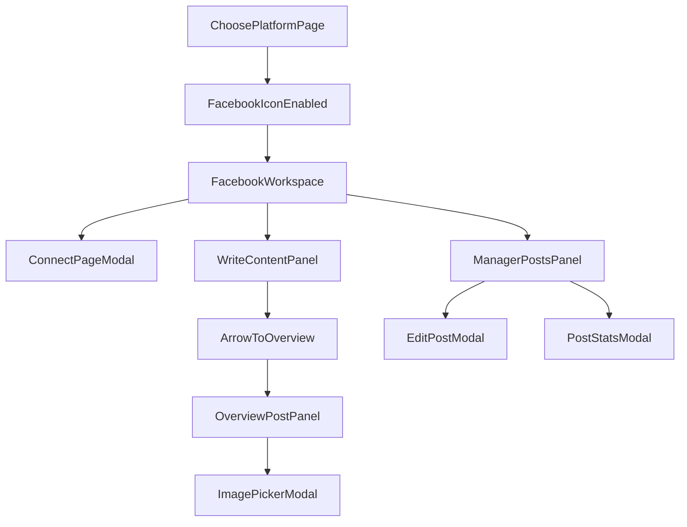

# Plan UI Support Marketing (Theo sketch mới)

## Scope đã chốt

- Route trung gian: `**/shops/:id/marketing` = Choose Platform**.
- Route chính Facebook: `**/shops/:id/marketing/facebook`**.
- Phase hiện tại: **UI mock only** (chưa gọi API Facebook thật).
- Nguyên tắc UX bắt buộc:
  - Bố cục cố định, không bị kéo dài đẩy layout khi tương tác.
  - Hầu hết thao tác con mở **modal giữa màn hình** để user thao tác.
  - Text area viết content lớn như form nhập liệu văn bản.

## IA (Information Architecture) bám sát ý tưởng

- `Choose Platform` page:
  - Hiện icon nền tảng: Facebook, Twitter(X), TikTok... (icon sau bạn bổ sung PNG).
  - Chỉ Facebook bấm được.
  - Nền tảng còn lại làm mờ + label "Chưa hỗ trợ".
- `Facebook Workspace` page gồm 4 khu:
  - **A. Facebook Page Panel**
    - List page đã liên kết.
    - Nút: `Connect page`, `View page dashboard`.
    - Dashboard page (modal) hiển thị chỉ số cơ bản + phần đánh giá tổng quan (AI insight mock).
  - **B. Write Content**
    - Khung nhập text lớn.
    - User tự viết hoặc chọn AI assist (mock).
    - Có nút mũi tên đẩy nội dung sang khu overview.
  - **C. Overview Post**
    - Mô phỏng post Facebook.
    - Có ô vuông dấu `+` để upload ảnh.
    - Bấm `+` mở modal gallery: ảnh từ storage + CTA mở Image Bot.
  - **D. Manager Posts**
    - Dropdown chọn page đã kết nối.
    - List post của page đó (mock data).
    - Hành động xem thống kê / sửa / xóa.
    - Edit mở modal riêng ở giữa màn hình.

## File sẽ chỉnh (UI-first)

- [d:/CAPTONE2/testKhaThi/aimap/frontend/src/App.tsx](d:/CAPTONE2/testKhaThi/aimap/frontend/src/App.tsx) (thêm route con `marketing/facebook`)
- [d:/CAPTONE2/testKhaThi/aimap/frontend/src/pages/shop/ShopMarketingPage.tsx](d:/CAPTONE2/testKhaThi/aimap/frontend/src/pages/shop/ShopMarketingPage.tsx) (Choose Platform)
- [d:/CAPTONE2/testKhaThi/aimap/frontend/src/pages/shop/ShopMarketingFacebookPage.tsx](d:/CAPTONE2/testKhaThi/aimap/frontend/src/pages/shop/ShopMarketingFacebookPage.tsx) (workspace Facebook)
- [d:/CAPTONE2/testKhaThi/aimap/frontend/src/i18n/translations.ts](d:/CAPTONE2/testKhaThi/aimap/frontend/src/i18n/translations.ts) (key text ngắn gọn)

## Thiết kế chi tiết tương tác (modal-first)

- Modal bắt buộc:
  - Connect Page modal.
  - Page Dashboard modal.
  - AI Assist modal (gợi ý/sửa content).
  - Image Picker modal (storage list + CTA image bot).
  - Edit Post modal.
  - View Post Analytics modal.
  - Delete Confirm modal.
- Hạn chế reflow/layout jump:
  - Dùng grid cố định 2 cột cho Write/Overview.
  - Manager Posts ở vùng dưới có chiều cao cố định + nội dung cuộn trong vùng.
  - Modal dùng overlay fixed, không chèn nội dung vào flow chính.

## Data mock model (frontend local state)

- `connectedPages[]`: id, name, followers, engagementScore, healthNote.
- `draftContent`: text + lastEditedAt.
- `overviewPost`: pageId, text, selectedImage.
- `postsByPage[pageId]`: list post + stats (reach, reactions, comments).
- `storageImages[]`: đọc từ storage API sẵn có nếu khả dụng; fallback mock ảnh.

## Luồng màn hình

## Acceptance criteria

- Có đủ 2 route và điều hướng đúng.
- Choose Platform đúng hành vi: Facebook mở được, icon khác disabled + mờ + "Chưa hỗ trợ".
- Facebook page đúng cấu trúc 4 khu như sketch.
- Write Content có text area lớn, chuyển nội dung sang Overview bằng nút mũi tên.
- Tất cả thao tác con mở modal giữa màn hình, không phá bố cục trang chính.
- Layout ổn định khi add/remove item (không đùn đẩy khối chính).

## Bước tiếp theo sau UI mock

- Khi bạn duyệt UI: chuyển sang API thật cho pages/drafts/publish.
- Bổ sung icon PNG thật theo danh sách platform bạn cung cấp.

