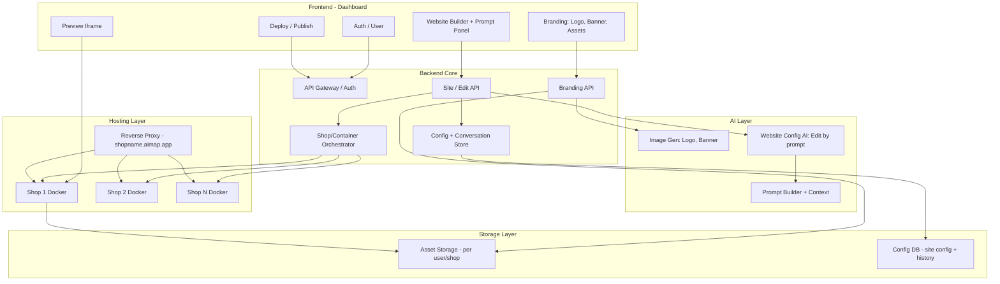

# AIMAP – Production-Ready System Architecture (English)

**AIMAP** = *AI-Powered Marketing Automation Platform for Small Businesses*  
Capstone Project 2 – International School, Duy Tan University

**Scope (per Proposal):** Unified store information input | AI branding (logo, banner, cover) | AI marketing content (posts, product descriptions, captions, hashtags) | Automated visual post creation (Facebook-ready images) | **Facebook Page auto-publishing** (Meta Graph API, OAuth, token storage) | Website auto-generation & prompt-based editing | Realtime preview | Deployment (subdomain `shopname.aimap.app`) | **One Docker container per shop** | **Credit-based usage & Payment Gateway** | **Administrator** (user management, activity logs, revenue/credit monitoring, system dashboard).

---

## I. System Architecture (Overview)



**Logic flow (text):**

- **User** signs in → **Frontend** (Dashboard). **Store info** (business name, products, pricing, contact, branding preferences) is collected once as the single input source for the automation pipeline.
- **Branding:** Branding Agent (Image AI) generates logo, banner, cover → save to **Asset Storage** (per user/shop); optional custom uploads.
- **Content:** Content Agent (LLM) generates marketing posts, product descriptions, captions, hashtags from store info.
- **Visual Post:** Visual Post Agent creates social-ready images (branding + product + text), export in Facebook dimensions.
- **Website:** Website Builder Agent produces/updates site config from store + branding; user can edit by prompt (Web AI + conversation history). **Orchestrator** creates/updates **Docker** per shop → **Preview** iframe points to the shop’s container.
- **Social Posting:** Social Posting Agent publishes content + images to authorized Facebook Page via **Meta Graph API** (OAuth, stored tokens).
- **Credit & Payment:** Users consume credits for actions; **Payment Gateway** for purchasing credits; **Admin** manages users, views activity logs, revenue/credit reports, and system performance dashboard.
- **Hosting:** One container per shop; **Reverse Proxy** routes `shopname.aimap.app` to the correct container; deploy = start container + update static content.

---

## II. Scope & Data Flow

### 0. Unified Store Information Input

- **Input:** Structured store information: business name, product details, pricing, contact information, branding preferences. Validated before starting the automation workflow.
- **Role:** Single source of truth for Branding, Content, Visual Post, and Website Builder agents.

### 1. Branding & Image Generation

- **Input:** From store info: shop name, industry, brand style; optional custom image uploads.
- **Output:** Logo, banner, marketing images; stored in **Asset Storage** with **per-user** (or per-shop) namespace: `users/:userId/assets/` or `shops/:shopId/assets/`.
- **Reuse:** Website config JSON references assets by URL (backend returns signed URL or internal path); template renderer uses that URL for img/background.
- **Flow:** User submits form → Backend calls **Image AI** (API or self-hosted) → saves files to object storage (S3/MinIO/local) → returns URL and saves metadata (name, type: logo/banner/marketing) → Dashboard shows asset library; when creating/editing website, user picks assets from library or AI attaches assets to config (imageUrl, logoUrl).

**Additional features (per Proposal):**

- **AI marketing content (Content Agent):** Generate advertising posts, product descriptions, captions, and hashtag suggestions (LLM) from store info.
- **Automated visual post creation (Visual Post Agent):** Combine branding, product details, and promotional text into social media–ready images; export in Facebook-compatible dimensions.
- **Facebook Page auto-publishing (Social Posting Agent):** OAuth via Meta Graph API; secure storage of Page Access Tokens; automatic publishing of generated content and images to the authorized Facebook Page.
- **Multi-Agent orchestration:** Orchestrator coordinates Branding, Content, Visual Post, Website Builder, Deploy, and Social Posting agents; sequential execution and data consistency between agents.
- **Credit-based usage & Payment Gateway:** Users purchase and spend credits for services; payment gateway integration for credit purchase; Admin monitors revenue and credit transactions.
- **Administrator:** User account management, activity logs, revenue/credit monitoring, system performance dashboard (usage, API calls, publishing frequency).

### 2. Data Flow A – First-time website creation

```
User (Dashboard) → Choose "Create website" (optionally pick branding from assets)
  → Backend: Create shop/site record, default config (optionally attach logo/banner from branding)
  → Orchestrator: Create Docker container for shop (1 shop = 1 container)
  → Backend: Render HTML from config + template
  → Push HTML/assets into container (or container mounts volume / pulls from backend)
  → Return siteId, previewUrl (pointing to container)
  → Frontend: iframe src = previewUrl; show Prompt Panel
```

**Hosting:** Preview URL can be `https://preview.aimap.app/sites/:siteId` (proxy to container) or direct container URL. After user “Deploy”, subdomain `shopname.aimap.app` points to the same container.

### 3. Data Flow B – Edit website by prompt

```
User enters prompt ("Make header smaller", "Change primary color to blue", "Add customer reviews section")
  → Frontend: POST /api/shops/:shopId/edit { prompt }
  → Backend: Load currentConfig + conversation history (last N)
  → AI Layer: Prompt builder (system + history + currentConfig + prompt) → LLM
  → LLM returns new JSON config
  → Backend: Parse → Validate (schema + business rules)
  → If invalid: 422, rollback (do not save); if valid: Save config, append conversation history
  → Backend: Render new HTML → Push into shop’s Docker container
  → Return 200 + config
  → Frontend: Reload iframe (or srcdoc/postMessage) → Preview updates immediately
```

---

## III. AI Context Handling

**Goal:** AI remembers current website structure, does not break layout, does not regenerate the whole site when unnecessary, and supports multiple consecutive edit rounds.

**Recommendation: Config-driven (JSON) + conversation history; no AST, no diff-based patch, no vector DB for “website context”.**

| Mechanism | Use it? | Reason |
|-----------|---------|--------|
| **Snapshot “code” (full HTML/JS)** | No (for main context) | Long, hard to parse, AI tends to regenerate inconsistently; use only for backup/rollback if needed. |
| **Parse to AST** | No for MVP | Complex, language-dependent; with JSON config, AST is unnecessary. |
| **Diff-based patch** | No for MVP | Hard to validate; merge conflicts with multiple edits; JSON config “full replace” is simpler. |
| **File-based memory** | Yes (for config + history) | Store config file per shopId; store conversation messages (user/assistant) per shopId. Simple, easy to debug. |
| **Vector database** | Optional | Use later for “semantic search” across sites or RAG over assets; not needed for “remember current website structure” (currentConfig + history suffice). |

**How to keep AI aligned across multiple turns:**

- Always send **full currentConfig** (JSON) + **conversation history** (last N turns, e.g. 20).
- System prompt: “Return only the new JSON config that conforms to the schema; do not drop sections; apply only the requested changes.”
- After each success: append user message + assistant message (short summary) to history.
- When history is too long: use a lighter model to **summarize** old turns into one paragraph, replace in history, then send to main model.

**Conclusion:** Store **config JSON** (current structure snapshot) + **conversation history** (file-based or DB). No code snapshot, no AST, no diff patch; no vector DB required for website context.

---

## IV. Code Editing Strategy

AI does not edit code files directly; AI only outputs **JSON layout config**. Backend uses a template engine to render HTML from config.

| Strategy | Pros | Cons | Verdict |
|----------|------|------|---------|
| **Rewrite entire file** | Simple | Easy to lose unmentioned parts; no control over structure; hard to validate. | Do not use. |
| **Generate diff/patch only** | Fewer tokens | Complex merge; error-prone; hard to guarantee validity. | Not for MVP. |
| **JSON layout config** | Fixed schema; validatable; consistent template render; AI only produces JSON; easy rollback. | Flexibility limited by schema. | **Recommended.** |
| **Component-based rendering** | Clear structure; reusable. | Can be implemented on top of JSON config (each section = component). | Fits JSON config. |

**Recommendation:** **JSON layout config** + **template engine** (Handlebars/EJS): each section type (hero, features, cta, footer) = one partial; config has `sections[]` with `type` and `props`. AI only generates/updates JSON; backend validates and renders. Component-based = how you organize templates (partials), not a different “AI → code” strategy.

---

## V. Preview Update Strategy

| Option | How it works | Pros | Cons |
|--------|--------------|------|------|
| **Reload iframe** | After successful edit, frontend sets `iframe.src = previewUrl` (or cache-bust). | Simple, stable, no realtime channel. | Possible brief flicker. |
| **WebSocket live update** | Backend pushes “updated” event; frontend reloads or receives HTML/config. | Realtime, good for collaborative. | More complex; overkill for single-user MVP. |
| **Static rebuild + cache invalidation** | On each config change, backend rebuilds HTML and pushes to container; CDN/backend invalidates cache. | Preview stays in sync with container. | Must ensure “push complete” before returning 200. |

**MVP recommendation:** **Reload iframe** after edit API returns 200. Backend ensures HTML is rendered and pushed to the shop’s Docker container before returning 200. Simple and stable enough.

**Later scaling:** Add **WebSocket** to broadcast “config updated” for multiple tabs or users; frontend listens and reloads iframe or fetches new HTML. Or return HTML in the edit response and use `iframe.srcdoc` to reduce flicker (no dependency on container update timing).

---

## VI. AI Model Strategy

| Question | Recommendation |
|----------|----------------|
| **API (GPT/Claude/Gemini) or self-host?** | **API** for MVP (Gemini 3 Pro for website edit + design; GPT-4o for structured JSON when needed; lighter model for history summarization). Self-host (Gemma, Llama) when cutting cost or on-prem, accepting lower quality. |
| **Fine-tune?** | **No** for MVP. Clear schema + good prompts + few-shot are enough. Fine-tune only with large volume (users, sites) and need for fixed behavior. |
| **Code-specialized model?** | Not required. Task is “config JSON” per schema, not arbitrary code generation; general-purpose models (Gemini/GPT) are sufficient. |
| **Keeping AI aligned across multiple turns** | Send **full currentConfig** + **conversation history** (last N); clear system prompt; “return full updated config”; strict validation; retry once on error. |

**Model assignment by function (suggested):**

- **Edit website by prompt:** Gemini 3 Pro (or Claude 3.5) – strong design, large context.
- **Structured output (strict JSON schema):** GPT-4o with Structured Outputs – fallback or when schema correctness is priority.
- **Logo/banner/marketing images:** DALL·E 3, Stable Diffusion API, or Imagen – depending on quality and cost.
- **Conversation history summarization (when long):** Gemini Flash or GPT-4o mini – cheap, fast.

---

## VII. Storage Layer & Hosting (one Docker per shop)

**Storage:**

- **Asset storage (per user/shop):** Object storage (S3/MinIO) with prefix `users/:userId/` or `shops/:shopId/assets/`. Logo, banner, marketing images, uploads; returned URLs used in website config.
- **Config + conversation:** DB (Postgres or SQLite) or files: `sites` table (siteId, shopId, config JSON, createdAt, updatedAt); `conversation_messages` (siteId, role, content, timestamp). Or one JSON file per shop for config + one for history (simpler for MVP).

**Hosting:**

- **One Docker container per shop.** Orchestrator (backend or separate service) creates container when shop is created; container runs nginx (or small service) serving static HTML/assets.
- **Subdomain:** `shopname.aimap.app` → Reverse proxy (Nginx/Traefik/Caddy) routes by host to the right container (mapping shopname ↔ containerId).
- **Preview:** Use `preview.aimap.app/sites/:siteId` (proxy to container) or per-container port; dashboard iframe points to that URL.
- **Custom domain later:** Proxy reads Host header; map custom domain → shopId → same container.

---

## VIII. Risks & Implementation Order

**Main risks:** AI returns invalid config → validate, rollback, do not save; config bloat/duplication → business rules (section id unique, section limit); history too long → summarize with lighter model; Docker not yet updated → return 200 only after push completes.

**Suggested implementation order:**

1. Config schema + template engine (partials by section type).
2. Backend core: Auth, Config store, Conversation store, create site / edit site APIs.
3. AI layer: Prompt builder, call Gemini/GPT, parse + validate JSON.
4. Docker orchestrator: one container per shop; backend renders HTML and pushes to container.
5. Frontend: Dashboard, Branding UI (upload + call Image AI), Website Builder + Prompt Panel, Preview iframe.
6. Branding: Image AI (logo, banner), asset storage per user/shop, wire asset URLs into config.
7. Hosting: Reverse proxy, subdomain `shopname.aimap.app` → container; Deploy flow.
8. Optimizations: History summarization, retry/fallback model, preview via srcdoc/WebSocket if needed.
