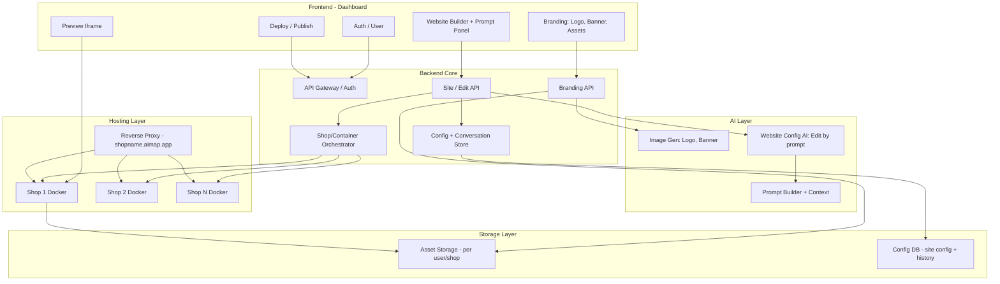

# AIMAP – Kiến trúc hệ thống production-ready

**AIMAP = AI-Powered Marketing Automation Platform for Small Businesses**

Phạm vi: Branding & Image Generation | AI Website Builder (frontend-only) | Prompt-based Editing | Preview realtime | Hosting (subdomain) | **Mỗi 1 shop user tạo = 1 Docker riêng**.

---

## I. System Architecture (Tổng thể)




**Luồng logic (text):**

- **User** đăng nhập → **Frontend** (Dashboard).
- **Branding:** User nhập tên shop, ngành, phong cách → **Branding API** → **Image AI** (logo, banner, ảnh marketing) → lưu **Asset Storage** (theo user/shop); có thể upload ảnh riêng.
- **Website:** User tạo site → **Site API** → **Config Store** (config + conversation history) → **Web AI** (sinh/cập nhật config từ prompt) → **Orchestrator** tạo/cập nhật **Docker** tương ứng shop → **Preview** iframe trỏ tới container của shop.
- **Hosting:** Mỗi shop = 1 container; **Reverse Proxy** route `shopname.aimap.app` → container đúng; deploy = bật container + cập nhật static.

---

## II. Phạm vi chi tiết & Data Flow

### 1. Branding & Image Generation

- **Input:** Tên shop, ngành hàng, phong cách thương hiệu; upload ảnh riêng (optional).
- **Output:** Logo, banner, hình ảnh marketing; lưu **Asset Storage** với namespace **per user** (hoặc per shop): `users/:userId/assets/` hoặc `shops/:shopId/assets/`.
- **Tái sử dụng:** Website config JSON tham chiếu asset bằng URL (backend trả signed URL hoặc path nội bộ); template render dùng URL đó cho img/background.
- **Flow:** User submit form → Backend gọi **Image AI** (API hoặc self-host) → lưu file vào object storage (S3/MinIO/local) → trả URL và lưu metadata (tên, loại: logo/banner/marketing) → Dashboard hiển thị thư viện; khi tạo/sửa website, user chọn asset từ thư viện hoặc AI gắn asset vào config (imageUrl, logoUrl).

### 2. Data Flow A – Tạo website lần đầu

```
User (Dashboard) → Chọn "Tạo website" (có thể chọn branding từ asset)
  → Backend: Tạo bản ghi shop/site, config mặc định (có thể gắn logo/banner từ branding)
  → Orchestrator: Tạo Docker container cho shop (1 shop = 1 container)
  → Backend: Render HTML từ config + template
  → Đẩy HTML/assets vào container (hoặc container mount volume / pull từ backend)
  → Trả siteId, previewUrl (trỏ tới container)
  → Frontend: iframe src = previewUrl; hiển thị Prompt Panel
```

**Host:** Preview URL có thể là `https://preview.aimap.app/sites/:siteId` (proxy tới container) hoặc trực tiếp container. Sau khi user “Deploy”, subdomain `shopname.aimap.app` trỏ tới cùng container đó.

### 3. Data Flow B – Chỉnh sửa website bằng prompt

```
User nhập prompt ("Làm header nhỏ lại", "Đổi màu chủ đạo sang xanh", "Thêm phần đánh giá")
  → Frontend: POST /api/shops/:shopId/edit { prompt }
  → Backend: Load currentConfig + conversation history (last N)
  → AI Layer: Prompt builder (system + history + currentConfig + prompt) → LLM
  → LLM trả JSON config mới
  → Backend: Parse → Validate (schema + business rules)
  → Nếu invalid: 422, rollback (không lưu); nếu valid: Lưu config, append conversation history
  → Backend: Render HTML mới → Đẩy vào Docker container của shop
  → Trả 200 + config
  → Frontend: Reload iframe (hoặc srcdoc/postMessage) → Preview cập nhật ngay
```

---

## III. AI Context Handling

**Mục tiêu:** AI nhớ cấu trúc website hiện tại, không phá layout, không generate lại toàn bộ khi không cần, chỉnh sửa nhiều vòng liên tiếp.

**Đề xuất: Config-driven (JSON) + Conversation history, không AST, không diff-based patch, không vector DB cho “context website”.**


| Cơ chế                             | Nên dùng?                 | Lý do                                                                                                                                                      |
| ---------------------------------- | ------------------------- | ---------------------------------------------------------------------------------------------------------------------------------------------------------- |
| **Snapshot “code” (full HTML/JS)** | Không (cho context chính) | Dài, khó parse, AI dễ sinh lại lung tung; chỉ nên dùng làm backup/rollback nếu cần.                                                                        |
| **Parse thành AST**                | Không cho MVP             | Phức tạp, phụ thuộc ngôn ngữ; với config JSON thì không cần AST.                                                                                           |
| **Diff-based patch**               | Không cho MVP             | Khó validate đúng; merge conflict khi nhiều chỉnh sửa; JSON config “full replace” đơn giản hơn.                                                            |
| **File-based memory**              | Có (cho config + history) | Lưu file config theo shopId; lưu conversation messages (user/assistant) theo shopId. Đơn giản, dễ debug.                                                   |
| **Vector database**                | Không bắt buộc            | Dùng nếu sau này có “tìm kiếm theo ý” trong nhiều site hoặc RAG trên asset; không cần cho “nhớ cấu trúc website hiện tại” (đã có currentConfig + history). |


**Cách đảm bảo AI follow context nhiều vòng:**

- Luôn gửi **full currentConfig** (JSON) + **lịch sử hội thoại** (N turn gần nhất, ví dụ 20).
- System prompt: “Chỉ trả về JSON config mới đúng schema; không bỏ section; chỉ áp dụng thay đổi theo yêu cầu.”
- Sau mỗi lần thành công: append user message + assistant message (tóm tắt ngắn) vào history.
- Khi history quá dài: dùng model nhẹ **tóm tắt** các turn cũ thành 1 đoạn, thay thế trong history rồi gửi tiếp cho model chính.

**Kết luận:** Lưu **config JSON** (snapshot cấu trúc hiện tại) + **conversation history** (file-based hoặc DB). Không snapshot “code”, không AST, không diff patch; không cần vector DB cho context website.

---

## IV. Code Editing Strategy

AI không sửa file code trực tiếp; AI chỉ output **JSON layout config**. Backend dùng template engine render HTML từ config.


| Chiến lược                    | Ưu                                                                                           | Nhược                                                                | Đánh giá             |
| ----------------------------- | -------------------------------------------------------------------------------------------- | -------------------------------------------------------------------- | -------------------- |
| **Rewrite toàn bộ file**      | Đơn giản                                                                                     | Dễ mất đoạn không nhắc; không kiểm soát được cấu trúc; khó validate. | Không dùng.          |
| **Chỉ generate diff/patch**   | Ít token                                                                                     | Merge phức tạp; dễ lỗi; khó đảm bảo valid.                           | Không dùng cho MVP.  |
| **JSON layout config**        | Schema cố định; validate được; template render nhất quán; AI chỉ cần sinh JSON; dễ rollback. | Linh hoạt bị giới hạn bởi schema.                                    | **Đề xuất chính.**   |
| **Component-based rendering** | Cấu trúc rõ; dễ tái sử dụng.                                                                 | Có thể implement trên nền JSON config (mỗi section = component).     | Hợp với JSON config. |


**Đề xuất:** **JSON layout config** + **template engine** (Handlebars/EJS): mỗi section type (hero, features, cta, footer) = 1 partial; config chứa `sections[]` với `type` và `props`. AI chỉ sinh/cập nhật JSON; backend validate và render. Component-based = cách tổ chức template (partials), không đổi chiến lược “AI → JSON”.

---

## V. Preview Update Strategy


| Phương án                               | Cách hoạt động                                                                               | Ưu                                          | Nhược                                       |
| --------------------------------------- | -------------------------------------------------------------------------------------------- | ------------------------------------------- | ------------------------------------------- |
| **Reload iframe**                       | Sau khi edit thành công, frontend set `iframe.src = previewUrl` (hoặc cache-bust).           | Đơn giản, ổn định, không cần kênh realtime. | Có thể nháy.                                |
| **WebSocket live update**               | Backend push event “updated”; frontend reload hoặc nhận HTML/config.                         | Realtime, tốt cho collaborative.            | Phức tạp hơn; overkill cho single-user MVP. |
| **Static rebuild + cache invalidation** | Mỗi lần config đổi, backend rebuild HTML và đẩy vào container; CDN/backend invalidate cache. | Preview luôn đồng bộ với container.         | Cần đảm bảo “đẩy xong” rồi mới trả 200.     |


**Đề xuất MVP:** **Reload iframe** sau khi API edit trả 200. Backend đảm bảo đã render và đẩy HTML vào Docker container của shop trước khi trả 200. Đơn giản, đủ ổn định.

**Scale sau:** Có thể thêm **WebSocket** để broadcast “config updated” khi có nhiều tab hoặc nhiều user; frontend nhận event rồi reload iframe hoặc fetch HTML mới. Hoặc trả luôn HTML trong response edit và dùng `iframe.srcdoc` để giảm nháy (không phụ thuộc container kịp cập nhật).

---

## VI. AI Model Strategy


| Câu hỏi                                    | Đề xuất                                                                                                                                                                                                                |
| ------------------------------------------ | ---------------------------------------------------------------------------------------------------------------------------------------------------------------------------------------------------------------------- |
| **API (GPT/Claude/Gemini) hay self-host?** | **API** cho MVP (Gemini 3 Pro cho edit website + design; GPT-4o cho structured JSON nếu cần; model nhẹ cho tóm tắt history). Self-host (Gemma, Llama) khi cần giảm chi phí hoặc on-prem, chấp nhận chất lượng kém hơn. |
| **Có cần fine-tune?**                      | **Không** cho MVP. Schema rõ + prompt tốt + few-shot đủ. Fine-tune chỉ khi có lượng lớn (user, site) và cần hành vi cố định.                                                                                           |
| **Có cần code-specialized model?**         | Không bắt buộc. Nhiệm vụ là “config JSON” theo schema, không phải generate code tùy ý; model đa năng (Gemini/GPT) đủ.                                                                                                  |
| **Đảm bảo AI follow context nhiều vòng**   | Gửi **full currentConfig** + **conversation history** (last N); system prompt rõ; “trả về toàn bộ config đã cập nhật”; validate chặt; retry 1 lần khi lỗi.                                                             |


**Phân công model theo chức năng (đề xuất):**

- **Chỉnh sửa website theo prompt:** Gemini 3 Pro (hoặc Claude 3.5) – design đẹp, context lớn.
- **Structured output (ép JSON đúng schema):** GPT-4o với Structured Outputs – fallback hoặc khi ưu tiên độ chính xác schema.
- **Tạo logo/banner/ảnh marketing:** DALL·E 3, Stable Diffusion API, hoặc Imagen – tùy chất lượng và chi phí.
- **Tóm tắt lịch sử hội thoại (khi history dài):** Gemini Flash hoặc GPT-4o mini – rẻ, nhanh.

---

## VII. Storage Layer & Hosting (mỗi shop = 1 Docker)

**Storage:**

- **Asset storage (per user/shop):** Object storage (S3/MinIO) với prefix `users/:userId/` hoặc `shops/:shopId/assets/`. Logo, banner, ảnh marketing, upload; URL trả về dùng trong config website.
- **Config + conversation:** DB (Postgres hoặc SQLite) hoặc file: `sites` table (siteId, shopId, config JSON, createdAt, updatedAt); `conversation_messages` (siteId, role, content, timestamp). Hoặc 1 file JSON per shop cho config + 1 file cho history (đơn giản cho MVP).

**Hosting:**

- **Mỗi 1 shop = 1 Docker container.** Orchestrator (backend hoặc service riêng) tạo container khi tạo shop; container chạy nginx (hoặc service nhỏ) serve static HTML/assets.
- **Subdomain:** `shopname.aimap.app` → Reverse proxy (Nginx/Traefik/Caddy) route theo host → container tương ứng (mapping shopname ↔ containerId).
- **Preview:** Có thể dùng `preview.aimap.app/sites/:siteId` (proxy tới container) hoặc port riêng per container; dashboard iframe trỏ URL đó.
- **Custom domain sau:** Proxy nhận request theo Host header; map custom domain → shopId → cùng container.

---

## VIII. Rủi ro & Các bước triển khai

**Rủi ro chính:** AI trả config lỗi → validate, rollback, không lưu; config phình/lặp → business rule (section id unique, giới hạn section); history quá dài → tóm tắt bằng model nhẹ; Docker chưa kịp nhận HTML → chỉ trả 200 sau khi đẩy xong.

**Thứ tự triển khai gợi ý:**

1. Schema config + template engine (partials theo section type).
2. Backend Core: Auth, Config store, Conversation store, API tạo site / edit site.
3. AI Layer: Prompt builder, gọi Gemini/GPT, parse + validate JSON.
4. Docker orchestrator: 1 container per shop; backend render HTML và đẩy vào container.
5. Frontend: Dashboard, Branding UI (upload + gọi Image AI), Website Builder + Prompt Panel, Preview iframe.
6. Branding: Image AI (logo, banner), Asset storage per user/shop, tích hợp URL asset vào config.
7. Hosting: Reverse proxy, subdomain `shopname.aimap.app` → container; Deploy flow.
8. Tối ưu: Tóm tắt history, retry/fallback model, preview srcdoc/WebSocket nếu cần.

