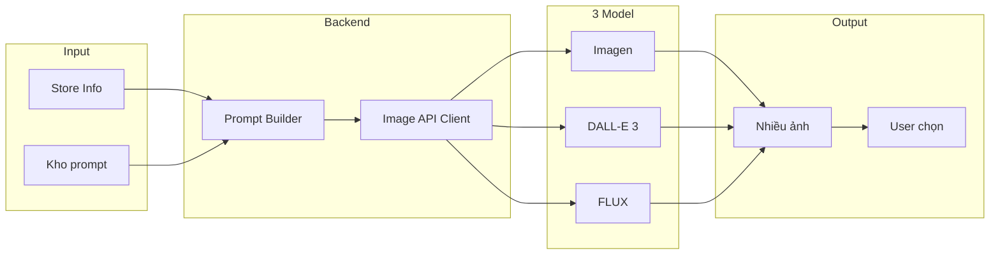

# Chọn 3 model AI tạo ảnh cho AIMAP (ứng dụng thực tế)

**Trang web hệ thống hiện tại:** [captone2.site](https://captone2.site)

**AIMAP** = *AI-Powered Marketing Automation Platform for Small Businesses*

Tài liệu này mô tả 3 model tạo ảnh có API công khai và được dùng thực tế trong sản phẩm, để AIMAP sinh nhiều phiên bản ảnh từ kho prompt và cho người dùng chọn.

---

## Bối cảnh từ tài liệu

- **Use case:** Hệ thống dùng **nhiều model** để gen **nhiều ảnh** dựa trên **kho prompt** đã chuẩn bị → người dùng **chọn** trong số các ảnh được tạo (xem AIMAP-Architecture-VN.md, Product-Backlog P2.1, P2.2, P2.9).
- **Vị trí trong kiến trúc:** **Branding Agent** (logo, banner, cover) và **Visual Post Agent** (ảnh bài đăng) gọi **Image AI**; backend có **Image API client** và **Prompt Builder** (AIMAP-Architecture-VN.md mục I, VI).
- **Yêu cầu:** 3 model **cho phép dùng AI** cho phần tạo ảnh này và **được ứng dụng thực tế** (có API production, được dùng bởi sản phẩm/doanh nghiệp).

---

## Ba model đề xuất (đều có API và dùng thực tế)

### 1. Google Imagen (Gemini API hoặc Vertex AI)

| Tiêu chí             | Chi tiết                                                                                                                             |
| -------------------- | ------------------------------------------------------------------------------------------------------------------------------------ |
| **Ứng dụng thực tế** | Dùng trong Google AI Studio, Vertex AI, nhiều sản phẩm Google và bên thứ ba; API chính thức, tài liệu rõ.                            |
| **API**              | Gemini API (ai.google.dev) hoặc Vertex AI (GCP); REST + SDK (Node.js).                                                               |
| **Phù hợp AIMAP**    | Logo, banner, ảnh marketing; có Imagen 3/4, Nano Banana (chất lượng cao, chữ trong ảnh tốt hơn).                                     |
| **Tích hợp**         | Backend Node gọi qua `@google/generative-ai` hoặc Vertex client; dùng chung API key / service account với Gemini (text) nếu đã dùng. |

**Kết luận:** Phù hợp làm **model thứ nhất**; đã được nhắc trong kiến trúc (AIMAP-Architecture-VN.md mục VI: "DALL·E 3, Stable Diffusion API, hoặc Imagen").

---

### 2. OpenAI DALL·E 3

| Tiêu chí             | Chi tiết                                                                                                                        |
| -------------------- | ------------------------------------------------------------------------------------------------------------------------------- |
| **Ứng dụng thực tế** | Chuẩn ngành; dùng bởi vô số app (design tool, chatbot, marketing tool); API production chính thức.                              |
| **API**              | OpenAI API `/v1/images/generations`, model `dall-e-3`; REST, SDK chính thức (Node).                                               |
| **Phù hợp AIMAP**    | Hỗ trợ **text trong ảnh**, nhiều tỷ lệ (1024x1024, 1792x1024, 1024x1792); quality `standard` / `hd`; style `vivid` / `natural`. |
| **Lưu ý**            | Mỗi request 1 ảnh (n=1); muốn nhiều ảnh thì gọi **song song nhiều request** (phù hợp luồng "nhiều model → nhiều lựa chọn").   |

**Kết luận:** Phù hợp làm **model thứ hai**; chất lượng và độ phổ biến cao, dễ bảo trì.

---

### 3. FLUX (qua fal.ai hoặc nền tảng tương đương)

| Tiêu chí             | Chi tiết                                                                                                                                                   |
| -------------------- | ---------------------------------------------------------------------------------------------------------------------------------------------------------- |
| **Ứng dụng thực tế** | FLUX (Black Forest Labs) dùng qua fal.ai, Replicate, CometAPI; nhiều sản phẩm tích hợp; API ổn định, có versioning.                                        |
| **API**              | REST API (fal.ai, Replicate, v.v.); Bearer token; có client JavaScript/Node.                                                                                 |
| **Phù hợp AIMAP**    | Ảnh chất lượng cao, phong cách quảng cáo/sản phẩm; FLUX 2 có **text rendering tốt**, hỗ trợ màu brand (HEX); nhiều biến thể (Turbo nhanh, Pro chất lượng). |
| **Tích hợp**         | Backend Node gọi REST (fetch/axios) hoặc SDK (nếu fal/Replicate cung cấp); một API key riêng.                                                              |

**Kết luận:** Phù hợp làm **model thứ ba**; đa dạng phong cách và tốc độ, bổ sung cho Google và OpenAI.

---

## Luồng kỹ thuật trong AIMAP

- **Prompt Builder:** Từ store info + loại ảnh (logo/banner/post) + kho prompt → tạo prompt cuối cho từng model (có thể khác nhau theo từng API).
- **Image API Client:** Gói 3 provider (Imagen, DALL·E 3, FLUX); mỗi lần tạo ảnh có thể gọi **cả 3** (song song) hoặc cho user chọn "dùng model nào" rồi trả nhiều ảnh để chọn.
- **Lưu trữ:** Ảnh từ mỗi model lưu vào Asset Storage (per user/shop); metadata ghi `modelSource` (imagen | dall-e-3 | flux) để hiển thị và trừ credit theo model (nếu cần).

---

## Gợi ý triển khai

- **Cấu hình:** Thêm biến môi trường cho từng provider (API key / endpoint): `GOOGLE_AI_API_KEY` (hoặc Vertex), `OPENAI_API_KEY`, `FAL_KEY` (hoặc key tương ứng cho FLUX).
- **Backend:** Trong `aimap/backend`, mở rộng **Image API client** (hoặc lib tương đương) thành **multi-provider**: một interface chung (ví dụ `generateImage(prompt, options)`) gọi Imagen, DALL·E 3, FLUX theo config; gọi song song khi cần "3 model cùng lúc".
- **Credit:** Hệ thống đã có **số dư user** (`credit_transactions`, hiển thị `creditBalance`). Khi triển khai trừ credit lúc gen ảnh: nếu mỗi lần gen tính 1 credit thì gọi 3 model song song có thể tính 3 credit hoặc 1 credit cho "một bộ 3 ảnh" — tùy quyết định sản phẩm. Xem `database_design.md`, `AIMAP-Architecture-VN.md` (mục triển khai credit).
- **Kho prompt:** Giữ cấu trúc kho prompt theo loại (logo, banner, post); Prompt Builder map loại + store info vào template, có thể có biến thể prompt riêng cho từng model (ví dụ format prompt Imagen vs DALL·E) nếu cần tối ưu chất lượng.

---

## Triển khai hiện tại (backend aimap)

| Biến môi trường | Mục đích |
|-----------------|----------|
| `OPENAI_API_KEY` | DALL·E 3 (UI chọn GPT). |
| `OPENAI_IMAGE_MODEL` | Mặc định `dall-e-3`. |
| `GEMINI_API_KEY` | Gemini image generation (UI Gemini). |
| `GEMINI_IMAGE_MODEL` | Ví dụ `gemini-2.0-flash-preview-image-generation`. |
| `ASSET_STORAGE_PATH` | Thư mục lưu file; serve static `/uploads`. |
| `API_PUBLIC_URL` | URL công khai (vd. `http://localhost:4111`) để `storage_path_or_url` trong gallery. |

**Luồng Save:** `POST /api/shops/:id/images/save` → ghi file → `INSERT assets` (`model_source`: `dall-e-3` \| `imagen` \| `flux`).

**Map UI:** GPT → OpenAI; Gemini → Google API (fallback OpenAI nếu Gemini không trả ảnh).

---

## Tóm tắt

| # | Model                             | Nhà cung cấp                               | Ứng dụng thực tế               | Vai trò gợi ý trong AIMAP                                                 |
|---| --------------------------------- | ------------------------------------------ | ------------------------------ | ------------------------------------------------------------------------- |
| 1 | **Imagen 3/4** (hoặc Nano Banana) | Google (Gemini API / Vertex)               | Google products, GCP customers | Logo, banner, ảnh marketing; có thể dùng chung hạ tầng với Gemini (text). |
| 2 | **DALL·E 3**                      | OpenAI                                     | Hàng nghìn app, API chính thức | Logo, banner, ảnh post; text trong ảnh; nhiều tỷ lệ.                     |
| 3 | **FLUX** (Turbo/Pro)              | Black Forest Labs (qua fal.ai / Replicate)  | Nhiều app qua fal, Replicate   | Ảnh chất lượng cao, đa phong cách; bổ sung cho 2 model trên.              |

Cả 3 đều **có API công khai**, **được dùng trong sản phẩm thực tế**, và có thể tích hợp vào backend Node của AIMAP để **gen nhiều ảnh từ kho prompt và cho người dùng chọn**.

---

## Ghi chú cho Support Marketing (text + publish)

- Tài liệu này tập trung cho **model tạo ảnh**. Với module **Support Marketing manual**, nên dùng **model text riêng** để tạo draft nội dung (ad post/caption/hashtag), không buộc dùng chung model với image-bot.
- Chỉ dùng chung phần hạ tầng API key/config và logging, còn prompt + output schema nên tách giữa image và text.
- Khi tính chi phí, tách 2 nhóm:
  - **Image cost** (theo ảnh/lần generate).
  - **Text cost** (theo token input/output).

### Chi phí tham khảo (cần kiểm tra lại trước khi chạy production)

- **Meta Graph API (Facebook Page):** không tính tiền trực tiếp theo mỗi lần post, nhưng bị giới hạn quota/rate-limit và yêu cầu app review quyền truy cập.
- **OpenAI text (`gpt-4o-mini`):** mức giá token thấp, phù hợp generate draft số lượng cao.
- **Google Gemini text (`gemini-2.5-flash` / `flash-lite`):** có free tier + paid tier; phù hợp batch lớn.
- **Google Imagen:** có mức giá theo ảnh (vd Imagen 4 Fast/Standard/Ultra theo bảng giá hiện hành).

> Lưu ý: giá model thay đổi theo thời điểm và khu vực; luôn kiểm tra trang pricing chính thức trước khi chốt ngân sách.

---

## Tài liệu liên quan

- **Kiến trúc:** `AIMAP-Architecture-VN.md`, `AIMAP-Architecture-EN.md`
- **Đọc nhanh:** `AIMAP-Quick-ReadVN.md`, `AIMAP-Quick-Read-EN.md`
- **Backlog:** `../LIST USE CASE/Product-Backlog.md`
