# AIMAP – Kiến trúc hệ thống production-ready

**Trang web hệ thống hiện tại:** [captone2.site](https://captone2.site)

**AIMAP** = *AI-Powered Marketing Automation Platform for Small Businesses*  
Capstone Project 2 – International School, Duy Tan University | Mentor: Prof Dr Anand Nayyar | Team: C2SE.10

Phạm vi (theo Proposal): Thu thập store info | AI Branding (logo, banner, cover) | AI nội dung marketing (bài viết, mô tả, caption, hashtag) | Tạo ảnh bài đăng chuẩn MXH | Đăng tự động lên Facebook Page (Meta Graph API, OAuth) | Website auto-generation & prompt-based editing | Preview realtime | Deploy (subdomain `shopname.aimap.app`) | **Mỗi 1 shop = 1 Docker** | Credit-based usage & Payment Gateway | Admin (user, log, revenue, dashboard).

---

## Danh sách đầy đủ tính năng (theo Proposal – Key Features & Requirements)

- **F1 – Unified Store Information Input:** Thu thập thông tin cửa hàng có cấu trúc làm nguồn đầu vào cho toàn bộ workflow. **Khi tạo shop** (form Create Shop): chỉ nhập thông tin cơ bản (tên, ngành, mô tả, địa chỉ trụ sở, tên chủ, quốc gia, mã zip, SĐT shop, email shop) — bắt buộc; sản phẩm, website URL và thông tin khác bổ sung sau tại trang chỉnh sửa shop.
- **F2 – AI-Based Brand & Content Generation:** Tạo logo, banner, cover (AI); tạo nội dung marketing: bài viết quảng cáo, mô tả sản phẩm, caption, gợi ý hashtag (LLM).
- **F3 – Automated Visual Post Creation:** Tạo ảnh bài đăng sẵn sàng MXH (branding + sản phẩm + text); export chuẩn kích thước Facebook.
- **F4 – Facebook Page Auto-Publishing:** OAuth (Meta Graph API), lưu token an toàn, đăng nội dung + ảnh lên Facebook Page đã ủy quyền.
- **F5 – Promotional Website Auto-Generation & Deployment:** Tạo landing page responsive từ store + branding; chỉnh sửa bằng prompt (AI hiểu context); preview realtime; deploy lên hosting (mỗi shop = 1 Docker); trả URL công khai (subdomain).
- **F6 – Multi-Agent Orchestration:** Orchestrator điều phối Branding Agent, Content Agent, Visual Post Agent, Website Builder Agent, Deploy Agent, Social Posting Agent.
- **Credit & Payment:** Mô hình sử dụng theo credit; tích hợp Payment Gateway để mua credit; Admin theo dõi doanh thu và giao dịch.
- **Administrator:** Quản lý user, xem activity log, theo dõi revenue/credit, dashboard hiệu năng hệ thống.
- **User dashboard:** User thường xem **activity log** và **access log** (lịch sử đăng nhập / IP) trên trang tổng quan — cùng bảng **`activity_logs`**, API **`GET /api/auth/me/activity`** và **`GET /api/auth/me/access-log`** (xem [`aimap/backend/danhsach_API.md`](../aimap/backend/danhsach_API.md)).

**Triển khai số dư credit (phiên bản code hiện tại):** Nguồn sự thật là bảng **`credit_transactions`**; số dư user = **SUM(`amount`)** theo **`user_profiles.id`**. Khi **verify email** sau đăng ký: ghi nhận **+100** (`type` bonus, `reference_type` **signup_bonus**). **`GET /api/auth/me`** và **POST /api/auth/login** trả **`creditBalance`**. Admin cấp thêm: **`POST /api/admin/users/:id/credits`**. Payment gateway, trừ credit khi gọi AI — giai đoạn sau.

---

## I. System Architecture (Tổng thể)

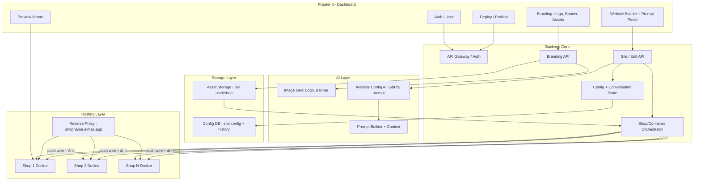


**Luồng logic (text):**

- **User** đăng nhập → **Frontend** (Dashboard).
- **Branding:** User nhập tên shop, ngành, phong cách → **Branding API** → **Image AI** (logo, banner, ảnh marketing) → lưu **Asset Storage** (theo user/shop); có thể upload ảnh riêng.
- **Website:** User tạo site → **Site API** → **Config Store** (config + conversation history) → **Web AI** (sinh/cập nhật config từ prompt) → **Orchestrator** tạo/cập nhật **Docker** tương ứng shop → **Preview** iframe trỏ tới container của shop.
- **Hosting:** Mỗi shop = 1 container; **Reverse Proxy** route `shopname.aimap.app` → container đúng; deploy = bật container + cập nhật static.

---

## 0. Chạy Production bằng Docker (không cần `npm run`)

**Mục tiêu:** chỉ cần `docker compose up -d --build` là chạy được.

**Hạ tầng thật (Production):**

| Máy chủ | IP | Vai trò |
|---------|-----|---------|
| **Main Server** | `103.77.215.133` | Frontend (Nginx), Backend (Node.js), PostgreSQL, Docker shop containers, Reverse Proxy |
| **AI VPS** | `103.116.38.145` | Ollama + model Qwen2.5:7b (Marketing AI text) |

- **Main Server** chạy toàn bộ stack ứng dụng: frontend serve static, backend API, DB và các container nginx per-shop.
- **AI VPS** chỉ chạy Ollama, backend gọi qua `MARKETING_AI_BASE_URL=http://103.116.38.145:11434`. Không expose trực tiếp ra internet; chỉ backend (103.77.215.133) gọi vào.
- **Website công khai:** [captone2.site](https://captone2.site) — trỏ về `103.77.215.133`.

**Services chính:**
- **frontend**: Nginx serve static (Vite build) + proxy `/api/` và `/uploads/` qua backend.
- **backend**: Node/Express (API `/api/*`) + serve `/uploads`.
- **database**: PostgreSQL (hiện đang dùng **DB ngoài**, connect qua `DATABASE_URL`).

**Biến môi trường:**
- **Docker/Production:** đặt ở `aimap/.env` (mẫu: `aimap/.env.example`) → docker compose inject vào container.
- **Chạy dev trực tiếp backend:** dùng `aimap/backend/.env` (mẫu: `aimap/backend/.env.example`).

**Ports mặc định:**
- Frontend: `:80` → `http://localhost`
- Backend: `:4111` → `http://localhost:4111/health`

**Lưu ý DB:**
- Nếu thiếu schema/tables, apply SQL theo `READ_CONTEXT/database_design.md`.

---

## II. Phạm vi chi tiết & Data Flow

### 1. Branding & Image Generation

- **Input:** Tên shop, ngành hàng, phong cách thương hiệu; upload ảnh riêng (optional).
- **Output:** Logo, banner, hình ảnh marketing; lưu **Asset Storage** với namespace **per shop** (chuẩn hệ thống): `shops/:shopId/assets/`. Mỗi shop có storage riêng (image, content, product). Xem [AIMAP-Data-Hierarchy.md](AIMAP-Data-Hierarchy.md).
- **Tái sử dụng:** Website config JSON tham chiếu asset bằng URL (backend trả signed URL hoặc path nội bộ); template render dùng URL đó cho img/background.
- **Flow:** User submit form → Backend gọi **Image AI** (API hoặc self-host) → lưu file vào object storage (S3/MinIO/local) → trả URL và lưu metadata (tên, loại: logo/banner/marketing) → Dashboard hiển thị thư viện; khi tạo/sửa website, user chọn asset từ thư viện hoặc AI gắn asset vào config (imageUrl, logoUrl).

**Image bot (triển khai backend):** `services/imagePromptBuilder.js` ghép template từ bảng `prompt_templates` (category=`image`, tag theo `industry_tag_mappings`) + dữ liệu shop/sản phẩm; `services/imageGeneration.js` gọi OpenAI DALL·E 3 hoặc Gemini image; route `routes/shopImageBot.js` (mount `/api/shops`): `GET …/image-prompts`, `POST …/images/generate|save|edit|rebuild`. Ảnh lưu disk (`ASSET_STORAGE_PATH`) serve tại `/uploads/…`; metadata `assets` ghi `model_source`, `prompt_template_id`. Xem `danhsach_API.md`, `AIMAP-3-Image-ModelsAI-VN.md`.

### 2. Data Flow A – Tạo website lần đầu

```
User (Dashboard) → Chọn "Tạo website" (có thể chọn branding từ asset)
  → Backend: Tạo bản ghi shop/site, config mặc định (có thể gắn logo/banner từ branding)
  → Orchestrator: Tạo Docker container cho shop (1 shop = 1 container)
  → Backend: Render HTML từ config + template
  → Đẩy HTML/assets vào container (hoặc container mount volume / pull từ backend)
  → Trả siteId, previewUrl (trỏ tới container)
  → Frontend: iframe src = previewUrl; hiển thị Prompt Panel
```

**Host:** Preview URL có thể là `https://preview.aimap.app/sites/:siteId` (proxy tới container) hoặc trực tiếp container. Sau khi user “Deploy”, subdomain `shopname.aimap.app` trỏ tới cùng container đó.

### 3. Data Flow B – Chỉnh sửa website bằng prompt

```
User nhập prompt ("Làm header nhỏ lại", "Đổi màu chủ đạo sang xanh", "Thêm phần đánh giá")
  → Frontend: POST /api/shops/:shopId/edit { prompt }
  → Backend: Load currentConfig + conversation history (last N)
  → AI Layer: Prompt builder (system + history + currentConfig + prompt) → LLM
  → LLM trả JSON config mới
  → Backend: Parse → Validate (schema + business rules)
  → Nếu invalid: 422, rollback (không lưu); nếu valid: Lưu config, append conversation history
  → Backend: Render HTML mới → Đẩy vào Docker container của shop
  → Trả 200 + config
  → Frontend: Reload iframe (hoặc srcdoc/postMessage) → Preview cập nhật ngay
```

---

## III. AI Context Handling

**Mục tiêu:** AI nhớ cấu trúc website hiện tại, không phá layout, không generate lại toàn bộ khi không cần, chỉnh sửa nhiều vòng liên tiếp.

**Đề xuất: Config-driven (JSON) + Conversation history, không AST, không diff-based patch, không vector DB cho “context website”.**


| Cơ chế                             | Nên dùng?                 | Lý do                                                                                                                                                      |
| ---------------------------------- | ------------------------- | ---------------------------------------------------------------------------------------------------------------------------------------------------------- |
| **Snapshot “code” (full HTML/JS)** | Không (cho context chính) | Dài, khó parse, AI dễ sinh lại lung tung; chỉ nên dùng làm backup/rollback nếu cần.                                                                        |
| **Parse thành AST**                | Không cho MVP             | Phức tạp, phụ thuộc ngôn ngữ; với config JSON thì không cần AST.                                                                                           |
| **Diff-based patch**               | Không cho MVP             | Khó validate đúng; merge conflict khi nhiều chỉnh sửa; JSON config “full replace” đơn giản hơn.                                                            |
| **File-based memory**              | Có (cho config + history) | Lưu file config theo shopId; lưu conversation messages (user/assistant) theo shopId. Đơn giản, dễ debug.                                                   |
| **Vector database**                | Không bắt buộc            | Dùng nếu sau này có “tìm kiếm theo ý” trong nhiều site hoặc RAG trên asset; không cần cho “nhớ cấu trúc website hiện tại” (đã có currentConfig + history). |


**Cách đảm bảo AI follow context nhiều vòng:**

- Luôn gửi **full currentConfig** (JSON) + **lịch sử hội thoại** (N turn gần nhất, ví dụ 20).
- System prompt: “Chỉ trả về JSON config mới đúng schema; không bỏ section; chỉ áp dụng thay đổi theo yêu cầu.”
- Sau mỗi lần thành công: append user message + assistant message (tóm tắt ngắn) vào history.
- Khi history quá dài: dùng model nhẹ **tóm tắt** các turn cũ thành 1 đoạn, thay thế trong history rồi gửi tiếp cho model chính.

**Kết luận:** Lưu **config JSON** (snapshot cấu trúc hiện tại) + **conversation history** (file-based hoặc DB). Không snapshot “code”, không AST, không diff patch; không cần vector DB cho context website.

---

## IV. Code Editing Strategy

AI không sửa file code trực tiếp; AI chỉ output **JSON layout config**. Backend dùng template engine render HTML từ config.


| Chiến lược                    | Ưu                                                                                           | Nhược                                                                | Đánh giá             |
| ----------------------------- | -------------------------------------------------------------------------------------------- | -------------------------------------------------------------------- | -------------------- |
| **Rewrite toàn bộ file**      | Đơn giản                                                                                     | Dễ mất đoạn không nhắc; không kiểm soát được cấu trúc; khó validate. | Không dùng.          |
| **Chỉ generate diff/patch**   | Ít token                                                                                     | Merge phức tạp; dễ lỗi; khó đảm bảo valid.                           | Không dùng cho MVP.  |
| **JSON layout config**        | Schema cố định; validate được; template render nhất quán; AI chỉ cần sinh JSON; dễ rollback. | Linh hoạt bị giới hạn bởi schema.                                    | **Đề xuất chính.**   |
| **Component-based rendering** | Cấu trúc rõ; dễ tái sử dụng.                                                                 | Có thể implement trên nền JSON config (mỗi section = component).     | Hợp với JSON config. |


**Đề xuất:** **JSON layout config** + **template engine** (Handlebars/EJS): mỗi section type (hero, features, cta, footer) = 1 partial; config chứa `sections[]` với `type` và `props`. AI chỉ sinh/cập nhật JSON; backend validate và render. Component-based = cách tổ chức template (partials), không đổi chiến lược “AI → JSON”.

---

## V. Preview Update Strategy


| Phương án                               | Cách hoạt động                                                                               | Ưu                                          | Nhược                                       |
| --------------------------------------- | -------------------------------------------------------------------------------------------- | ------------------------------------------- | ------------------------------------------- |
| **Reload iframe**                       | Sau khi edit thành công, frontend set `iframe.src = previewUrl` (hoặc cache-bust).           | Đơn giản, ổn định, không cần kênh realtime. | Có thể nháy.                                |
| **WebSocket live update**               | Backend push event “updated”; frontend reload hoặc nhận HTML/config.                         | Realtime, tốt cho collaborative.            | Phức tạp hơn; overkill cho single-user MVP. |
| **Static rebuild + cache invalidation** | Mỗi lần config đổi, backend rebuild HTML và đẩy vào container; CDN/backend invalidate cache. | Preview luôn đồng bộ với container.         | Cần đảm bảo “đẩy xong” rồi mới trả 200.     |


**Đề xuất MVP:** **Reload iframe** sau khi API edit trả 200. Backend đảm bảo đã render và đẩy HTML vào Docker container của shop trước khi trả 200. Đơn giản, đủ ổn định.

**Scale sau:** Có thể thêm **WebSocket** để broadcast “config updated” khi có nhiều tab hoặc nhiều user; frontend nhận event rồi reload iframe hoặc fetch HTML mới. Hoặc trả luôn HTML trong response edit và dùng `iframe.srcdoc` để giảm nháy (không phụ thuộc container kịp cập nhật).

---

## VI. AI Model Strategy


| Câu hỏi                                    | Đề xuất                                                                                                                                                                                                                |
| ------------------------------------------ | ---------------------------------------------------------------------------------------------------------------------------------------------------------------------------------------------------------------------- |
| **API (GPT/Claude/Gemini) hay self-host?** | **API** cho MVP (Gemini 3 Pro cho edit website + design; GPT-4o cho structured JSON nếu cần; model nhẹ cho tóm tắt history). Self-host (Gemma, Llama) khi cần giảm chi phí hoặc on-prem, chấp nhận chất lượng kém hơn. |
| **Có cần fine-tune?**                      | **Không** cho MVP. Schema rõ + prompt tốt + few-shot đủ. Fine-tune chỉ khi có lượng lớn (user, site) và cần hành vi cố định.                                                                                           |
| **Có cần code-specialized model?**         | Không bắt buộc. Nhiệm vụ là “config JSON” theo schema, không phải generate code tùy ý; model đa năng (Gemini/GPT) đủ.                                                                                                  |
| **Đảm bảo AI follow context nhiều vòng**   | Gửi **full currentConfig** + **conversation history** (last N); system prompt rõ; “trả về toàn bộ config đã cập nhật”; validate chặt; retry 1 lần khi lỗi.                                                             |


**Phân công model theo chức năng (đề xuất):**

- **Chỉnh sửa website theo prompt:** Gemini 3 Pro (hoặc Claude 3.5) – design đẹp, context lớn.
- **Structured output (ép JSON đúng schema):** GPT-4o với Structured Outputs – fallback hoặc khi ưu tiên độ chính xác schema.
- **Tạo logo/banner/ảnh marketing:** DALL·E 3, Stable Diffusion API, hoặc Imagen – tùy chất lượng và chi phí.
- **Tóm tắt lịch sử hội thoại (khi history dài):** Gemini Flash hoặc GPT-4o mini – rẻ, nhanh.

---

## VII. Storage Layer & Hosting (mỗi shop = 1 Docker)

### Hai vùng dữ liệu (Data Zones)

Mỗi shop có **một vùng chứa riêng** gồm web, ảnh và content. Hệ thống tách hai vùng:

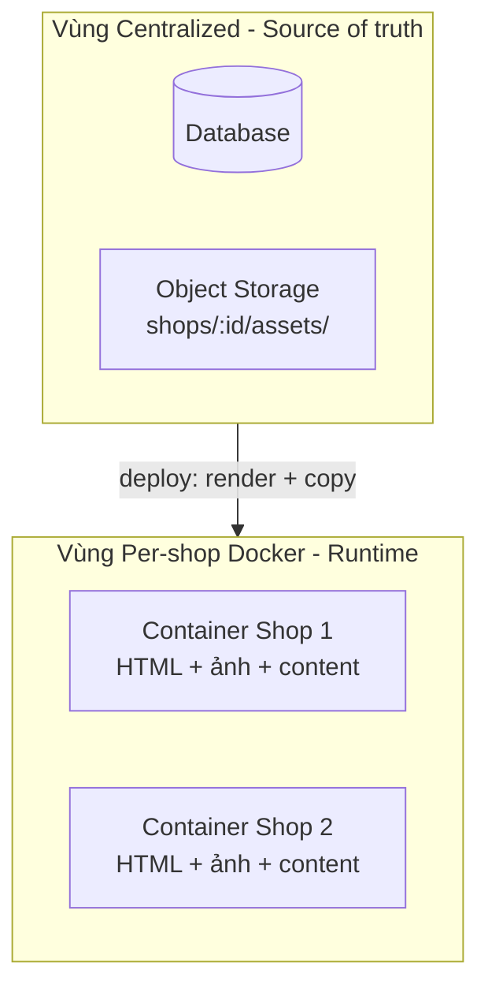

| Vùng | Nội dung |
|------|----------|
| **Centralized** | DB (config, metadata, users, credits, …); Object Storage (file ảnh gốc). Backend đọc từ đây để tạo/sửa, quản lý. |
| **Per-shop Docker** | Mỗi container = **một bó tự chứa**: HTML/CSS/JS đã render + **bản copy ảnh** (logo, banner, post) + static content. Nginx serve trực tiếp; không gọi ra Object Storage lúc runtime. |

**Luồng deploy:** Backend lấy config từ DB, ảnh từ Object Storage → render HTML → **copy ảnh + HTML vào container** shop tương ứng → container tự đủ, subdomain trỏ tới container.

---

**Storage (Centralized):**

- **Asset storage (per user/shop):** Object storage (S3/MinIO) với prefix `users/:userId/` hoặc `shops/:shopId/assets/`. Logo, banner, ảnh marketing, upload; khi deploy backend **copy** ảnh cần thiết vào container của shop.
- **Config + conversation:** DB (Postgres hoặc SQLite): bảng `sites` (siteId, shopId, config JSON, …), `conversation_messages` (siteId, role, content, timestamp).

**Dashboard / Assets & AI Tools (UI):**

- **Trang Assets:** Trước tiên hiển thị **danh sách kho theo từng shop** (dung lượng đã dùng và còn trống của bộ nhớ Docker/object storage từng shop). Khi user click vào một shop → hiển thị **ảnh (assets)** và **kho content (marketing_content)** của shop đó. Không có kho dùng chung giữa các shop.
- **Công cụ AI:** Truy cập từ **trang chi tiết shop** (`/shops/[id]`) qua **nút "AI Tool"** (không nằm ở sidebar Dashboard). User dùng Agent tạo content, Agent tạo ảnh, …; khi **Lưu** thì toàn bộ kết quả lưu vào kho (assets + marketing_content) của shop đó.
- **Pipeline (tạo và chạy):** Chỉ xuất hiện **trong từng shop**. Trên trang chi tiết shop (`/shops/[id]`) có nút **"AI Pipeline"**; user bấm để cấu hình và chạy pipeline tự động (Store info → Branding → Content → Visual Post → …) cho shop đó. Mục **"Pipeline"** trên sidebar (nếu có) chỉ là **dashboard xem** danh sách/lịch sử pipeline runs (có thể lọc theo shop), không dùng để tạo/chạy pipeline mới.

**Hosting (Per-shop Docker):**

- **Mỗi 1 shop = 1 Docker container.** Orchestrator tạo container khi tạo shop; container chạy nginx serve static **HTML + ảnh + content** (đã được push từ backend khi deploy).
- **Subdomain:** `shopname.aimap.app` → Reverse proxy (Nginx/Traefik/Caddy) route theo host → container tương ứng (mapping shopname ↔ containerId).
- **Preview:** Có thể dùng `preview.aimap.app/sites/:siteId` (proxy tới container) hoặc port riêng per container; dashboard iframe trỏ URL đó.
- **Custom domain sau:** Proxy nhận request theo Host header; map custom domain → shopId → cùng container.

---

## VIII. Rủi ro & Các bước triển khai

**Rủi ro chính:** AI trả config lỗi → validate, rollback, không lưu; config phình/lặp → business rule (section id unique, giới hạn section); history quá dài → tóm tắt bằng model nhẹ; Docker chưa kịp nhận HTML → chỉ trả 200 sau khi đẩy xong.

### Bổ sung kiến trúc cho Support Marketing (manual-first)

- **Phase A (manual):** user thao tác trong `/shops/[id]/marketing` → **Facebook workspace** `/shops/[id]/marketing/facebook`: connect page, viết content, overview, quản lý post; tạo draft / AI assist; publish (UI/API tùy phase).
- **Phase B (automation):** mới đưa vào pipeline/scheduler sau khi Phase A ổn định.
- **Triển khai backend (đã có):** prefix **`/api/shops/:shopId/facebook/...`** — `routes/shopFacebookMarketing.js`; gọi **Meta Graph** qua `services/facebookGraphService.js` (chỉ server, không lộ token client); **AI text** (tóm tắt comment, đánh giá bài, gợi ý page, assist caption) qua **`services/marketingAiBot.js`** → HTTP **Ollama** (`POST /api/generate`) tại VPS cấu hình bởi `MARKETING_AI_BASE_URL` / `MARKETING_AI_MODEL`. DB: `facebook_page_tokens` + migration **006** (`facebook_posts_cache`, `facebook_post_insight_snapshots`, `marketing_ai_cache`). Chi tiết endpoint: [`danhsach_API.md`](../aimap/backend/danhsach_API.md) mục **Facebook Marketing**.
- **Ràng buộc production với Meta Graph API:**
  - Cần app review cho quyền `pages_show_list`, `pages_manage_posts`, `pages_read_engagement`, `read_insights` (tùy tính năng).
  - Quota/rate limit phụ thuộc token/app/business use case; không nên giả định vô hạn.
  - Cần refresh/rotate token và log lỗi publish rõ ràng cho từng shop/page.
  - `META_APP_ID` trên backend để nhận diện bài do app đăng (sửa bài qua API chỉ khi khớp app id).
- **Khuyến nghị model cho text marketing:**
  - **Ollama (Qwen2.5:7b) trên VPS `103.116.38.145`** — chi phí token = 0, cần vận hành máy; hoặc API OpenAI/Gemini tách khỏi image-bot.
  - Chốt một model rẻ cho volume cao + một model fallback khi lỗi.

**Thứ tự triển khai gợi ý:**

1. Schema config + template engine (partials theo section type).
2. Backend Core: Auth, Config store, Conversation store, API tạo site / edit site.
3. AI Layer: Prompt builder, gọi Gemini/GPT, parse + validate JSON.
4. Docker orchestrator: 1 container per shop; backend render HTML và đẩy vào container.
5. Frontend: Dashboard, Branding UI (upload + gọi Image AI), Website Builder + Prompt Panel, Preview iframe.
6. Branding: Image AI (logo, banner), Asset storage per user/shop, tích hợp URL asset vào config.
7. Hosting: Reverse proxy, subdomain `shopname.aimap.app` → container; Deploy flow.
8. Tối ưu: Tóm tắt history, retry/fallback model, preview srcdoc/WebSocket nếu cần.
9. Các module theo Proposal: Store info input & validation; Content Agent (post, mô tả, caption, hashtag); Visual Post Agent; Social Posting Agent (Meta Graph API, OAuth, token); Credit & Payment Gateway; Admin (user, log, revenue, dashboard).

---

## IX. Phân tích Context Diagram

Context Diagram (Figure 2) trong Proposal mô tả hệ thống AIMAP như một hộp đen trung tâm tương tác với các tác nhân bên ngoài. Nhìn chung sơ đồ đúng hướng, nhưng cần bổ sung và điều chỉnh ở một số điểm sau:

### Điểm chính xác trong hình hiện tại

| Tác nhân | Tương tác | Đánh giá |
|----------|-----------|-----------|
| Shop Owner → Platform | Manage store information, Generate branding/content/visual assets, Manage credits & request top-up, Build/edit/preview/deploy website | Đủ, đúng |
| Admin → Platform | Monitor users, transactions, logs, performance | Đúng |
| Platform → Payment Gateway | Process credit top-up payment | Đúng |
| Platform → Facebook API | Publish generated content to Facebook Page | Đúng |
| Platform → Website Visitor | Access deployed shop website | Đúng hướng |
| Platform → AI Service Provider | Request AI generation for branding, content, website | Đúng |

### Điểm cần sửa / bổ sung

1. **Thiếu Ollama VPS như một External System riêng.** Trong thực tế, hệ thống sử dụng **2 loại AI** với 2 nguồn khác nhau:
   - **Cloud AI** (OpenAI / Google Gemini): dùng cho tạo ảnh (image bot).
   - **Self-hosted Ollama VPS** (`103.116.38.145`, model Qwen2.5:7b): dùng riêng cho Marketing AI text (caption, tóm tắt comment, gợi ý bài). Đây là một external node riêng, không phải cùng nhóm "AI Service Provider" với OpenAI/Gemini.
   → **Sửa:** Tách "AI Service Provider" thành hai hộp: **Cloud AI (OpenAI / Gemini)** và **Marketing AI (Ollama VPS)**.

2. **Mũi tên Payment Gateway nên hai chiều.** Hiện tại chỉ có một chiều "Process credit top-up payment". Thực tế Payment Gateway (VietQR) gửi **webhook callback** về platform để xác nhận giao dịch. → **Sửa:** Thêm mũi tên ngược từ Payment Gateway về Platform: *"Confirm payment via webhook"*.

3. **Website Visitor nên có mũi tên request rõ hơn.** Hiện hình cho thấy Platform → Website Visitor ("Access deployed shop website"). Chiều đúng hơn là **Website Visitor → Platform** (request) và **Platform → Website Visitor** (serve website). → **Sửa:** Đổi thành mũi tên hai chiều hoặc ghi rõ chiều request/response.

4. **Thiếu tác nhân "Shop Website Visitor" tách biệt với "User/Shop Owner".** Người truy cập website shop (khách hàng cuối) khác hoàn toàn với Shop Owner. Hình hiện tại đã có hộp "Website Visitor" riêng — giữ nguyên, chỉ cần làm rõ đây là **khách hàng của shop**, không phải người dùng AIMAP.

### Context Diagram cập nhật (mermaid tham chiếu)

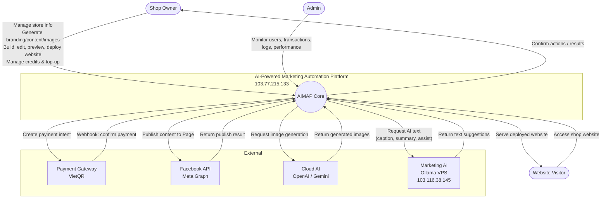

---

## X. Phân tích Component Diagram

Hệ thống AIMAP nên có **3 component diagram chính**, mỗi hình tập trung vào một tầng kiến trúc khác nhau. Không cần vẽ thêm, vì các tầng còn lại (DB, Docker nội bộ) đã được mô tả trong Allocation View.

### Component Diagram 1 — Frontend (React Dashboard)

Mô tả các module giao diện người dùng theo nhóm tính năng.

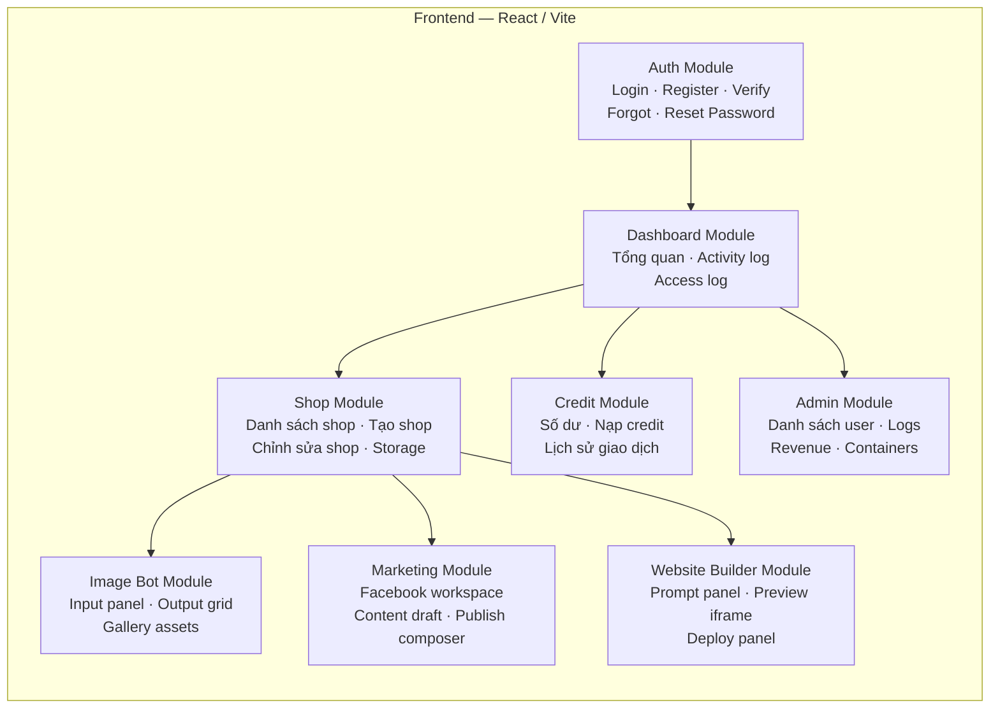

### Component Diagram 2 — Backend (Node.js / Express)

Mô tả các tầng xử lý phía server theo trách nhiệm.

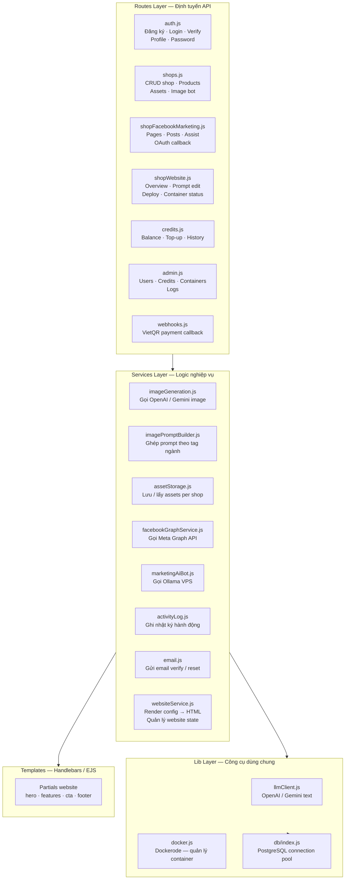

### Component Diagram 3 — External Services & AI Layer

Mô tả các dịch vụ ngoài hệ thống mà backend kết nối đến.

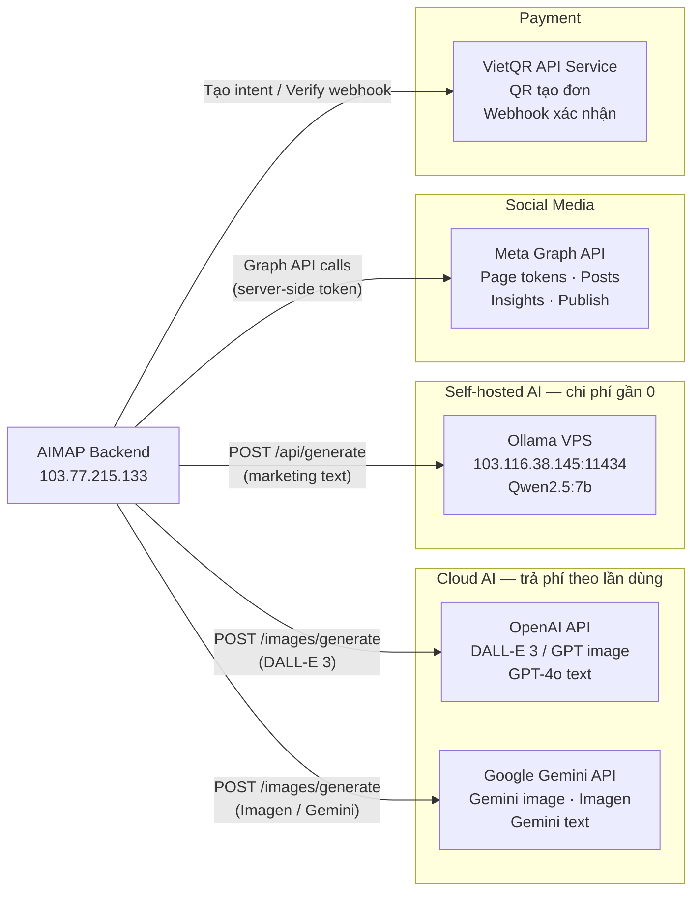

### Tóm tắt: Bao nhiêu Component Diagram là đủ?

| # | Tên | Mục tiêu |
|---|-----|-----------|
| 1 | Frontend Components | Cho thấy cấu trúc module UI |
| 2 | Backend Components | Cho thấy cách backend tổ chức theo Routes → Services → Lib |
| 3 | External Services | Cho thấy phụ thuộc bên ngoài (AI, Facebook, Payment) |

**3 hình là đủ** cho báo cáo / thuyết trình. Không cần tách thêm DB, Docker nội bộ hay template engine thành diagram riêng — những phần đó thuộc Allocation View.

---

## XI. Allocation View — Ánh xạ phần mềm lên hạ tầng

Allocation View cho thấy **component nào chạy trên máy nào** trong hệ thống production thật.

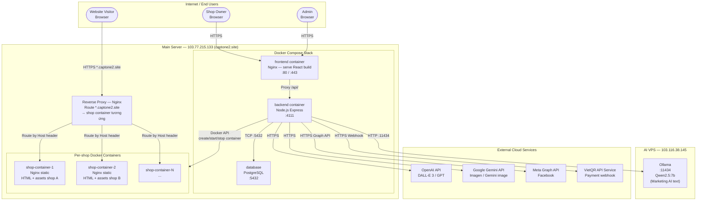

### Bảng phân bổ chi tiết

| Component | Máy chủ | Địa chỉ | Ghi chú |
|-----------|---------|---------|---------|
| React Frontend (Nginx) | Main Server | `103.77.215.133:80/443` | Serve static build |
| Node.js Backend API | Main Server | `103.77.215.133:4111` | Expose qua proxy |
| PostgreSQL | Main Server | `103.77.215.133:5432` | Nội bộ, không expose |
| Reverse Proxy (Nginx) | Main Server | `103.77.215.133:80` | Route `*.captone2.site` |
| Shop Docker Containers | Main Server | Port ngẫu nhiên (nội bộ) | 1 container/shop |
| Ollama + Qwen2.5:7b | AI VPS | `103.116.38.145:11434` | Marketing AI text |
| OpenAI API | Cloud (OpenAI) | `api.openai.com` | DALL-E 3 / GPT |
| Google Gemini API | Cloud (Google) | `generativelanguage.googleapis.com` | Imagen / Gemini image |
| Meta Graph API | Cloud (Meta) | `graph.facebook.com` | Facebook publish |
| VietQR API Service | Cloud (VietQR) | `api.vietqr.io` | Payment webhook |

### Luồng request tổng hợp qua hạ tầng

```
[Shop Owner browser]
    → HTTPS → Nginx (103.77.215.133)
        → React app (static)
        → /api/* → Node.js backend (:4111)
            → PostgreSQL (nội bộ)
            → Ollama (103.116.38.145:11434) [marketing text]
            → OpenAI / Gemini (cloud) [image generation]
            → Meta Graph API (cloud) [Facebook]
            → VietQR API (cloud) [payment]
            → Docker API → tạo/cập nhật shop containers

[Website Visitor browser]
    → HTTPS → *.captone2.site
        → Reverse Proxy (Nginx, 103.77.215.133)
            → Shop container tương ứng (nginx static)
                → Serve HTML + ảnh của shop đó (no backend call)
```

---

## XII. Sequence Diagrams

> Phần này gộp từ `sequenceDiagram.md` (đã xóa file riêng). Bộ 6 sequence diagram chính của AIMAP — bỏ qua login/logout vì đó là luồng chuẩn.

### SD-1. Luồng tổng quan toàn hệ thống

Dùng khi cần giải thích hệ thống chỉ trong một hình duy nhất.

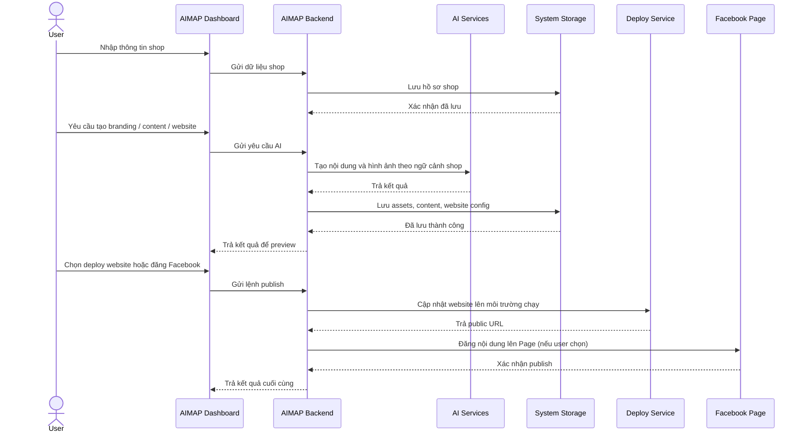

### SD-2. Quản lý shop

Gộp tạo shop, sửa shop và cập nhật sản phẩm vào một sequence.

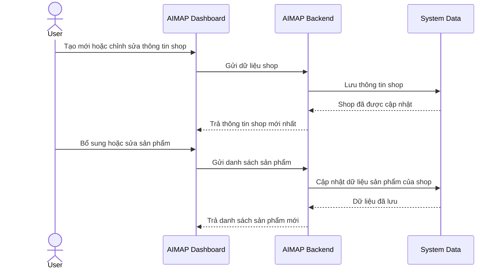

### SD-3. Tạo branding và ảnh marketing

Luồng bot tạo ảnh: logo, banner, cover hoặc ảnh bài đăng.

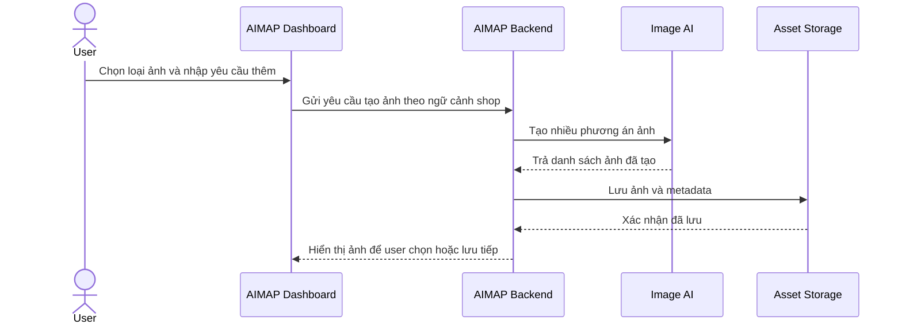

### SD-4. Quản lý thư viện tài sản

User xem, lưu, xóa và tái sử dụng assets của shop.

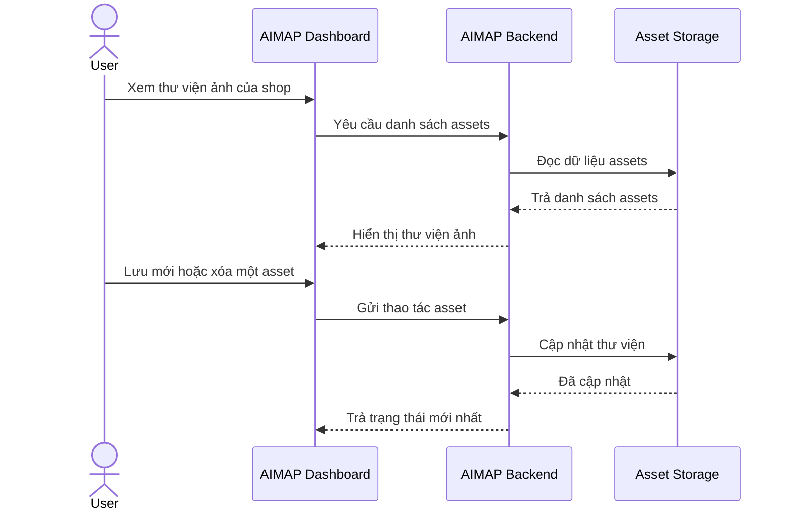

### SD-5. Support marketing và Facebook

User làm marketing thủ công với hỗ trợ AI và kết nối Facebook.

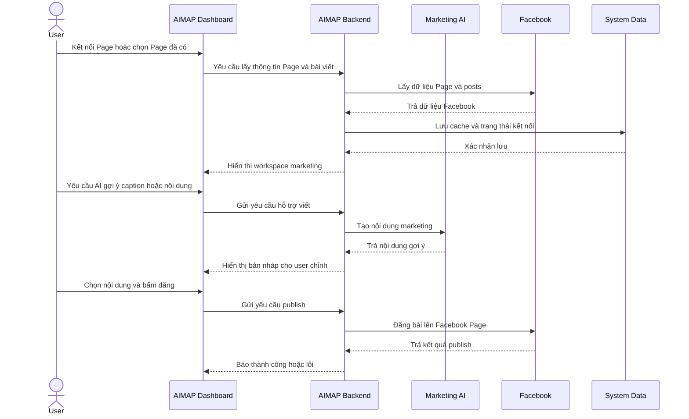

### SD-6. Tạo, chỉnh sửa và deploy website

Luồng quan trọng nhất của module Website Builder.

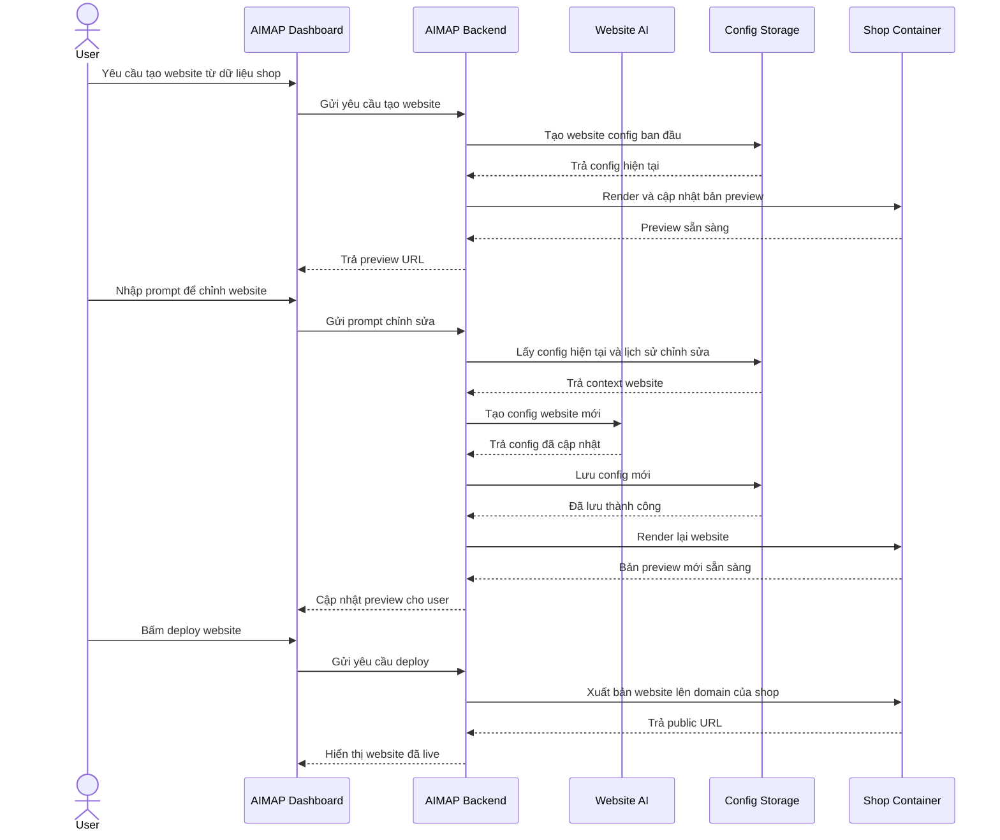

---

## Tài liệu kèm theo

- **Đọc nhanh (chức năng + lợi ích + điểm nổi bật):** `AIMAP-Quick-ReadVN.md`
- **Kiến trúc tiếng Anh (cho reviewer quốc tế):** `AIMAP-Architecture-EN.md`
- **API backend (danh sách endpoint):** [`aimap/backend/danhsach_API.md`](../aimap/backend/danhsach_API.md)
- **Thiết kế Database:** [`READ_CONTEXT/database_design.md`](database_design.md)
- **Cấu trúc folder:** [`READ_CONTEXT/Cau_truc_folder.md`](Cau_truc_folder.md)

