# Kế hoạch Triển khai Cấu trúc Trang (Routing & Pages) cho AIMAP

Kế hoạch này vạch ra các bước cụ thể để xây dựng toàn bộ giao diện người dùng (frontend routes) dựa trên tài liệu Backend và Product Backlog.

## Danh sách chi tiết các Trang (Pages) theo Nhóm

### 1. Khu vực Public & Xác thực (Auth Layout)

*Dành cho người dùng chưa đăng nhập.*

- `/` (hoặc `/home`): Landing page giới thiệu sản phẩm.
- `/login`: Đăng nhập (email/password).
- `/register`: Đăng ký tài khoản mới.
- `/verify`: Xác thực email/tài khoản sau khi đăng ký (nhập mã OTP hoặc click link).
- `/forgot-password`: Yêu cầu lấy lại mật khẩu.
- `/reset-password`: Đặt lại mật khẩu mới (có token).

### 2. Khu vực Người dùng / Chủ cửa hàng (Dashboard Layout)

*Dành cho người dùng thông thường (`role: 'user'`), quản lý shop của mình.*

**Chuẩn cấu trúc:** 1 User → N Shops. Mỗi Shop có: **Storage** (image, content, product), **Web** (1 site), **Manager Facebook Page**, **Generate** (AI: image, content, web). Các trang Assets, AI Tools, Website, Facebook, Pipeline luôn hoạt động trong **ngữ cảnh một shop** đã chọn (shop context hoặc route `/shops/[id]/...`). Xem [AIMAP-Data-Hierarchy.md](AIMAP-Data-Hierarchy.md).

**Tổng quan & Cá nhân:**

- **Header/Layout (Dashboard Layout):** Phải có **nút chuyển ngôn ngữ EN/VN** (hoặc EN/VI) trên header để user chọn Tiếng Việt hoặc English; lưu vào `user_profiles.locale`. **Không bỏ** nút này; đây là i18n chính thức của hệ thống.
- `/dashboard`: Trang tổng quan thống kê của user (số dư credit, số shop, trạng thái website).
- `/profile`: Cập nhật thông tin cá nhân (tên, avatar, đổi mật khẩu, đổi ngôn ngữ vi/en).

**Quản lý Cửa hàng (Shops):**

- `/shops`: Danh sách các cửa hàng (grid/list view).
- `/shops/create`: Form tạo cửa hàng mới — **chỉ thu thập thông tin cơ bản** (tên shop, slug, ngành, mô tả ngắn, địa chỉ trụ sở, tên chủ shop, quốc gia, mã zip, SĐT shop, email shop). Không nhập product hay website URL lúc tạo; người dùng bổ sung sau tại `/shops/[id]/edit`. Các thông tin này dùng làm context (kèm prompt người dùng + prompt trong kho) để AI sinh content, ảnh và web sau này.
- **`/shops/[id]` (Chi tiết cửa hàng):** Trang đọc + hub cho một shop. Bao gồm: thông tin shop (identity, location, contact, branding), **sản phẩm** (products), **hình ảnh của shop** (assets: logo, banner, ảnh bài đăng), **kho content** (marketing_content: ad post, mô tả, caption). Có **nút "AI Tool"**: bấm vào mở Agent tạo content, Agent tạo ảnh, …; khi Lưu thì lưu vào kho (assets + marketing_content) của shop này. Có **nút "AI Pipeline"** (hoặc "Pipeline"): bấm vào để **cấu hình và chạy** pipeline cho shop này (Store → Branding → Content → Visual Post …). Các quick action: Edit Shop, Website Builder, Manage Assets, **AI Pipeline**, Facebook.
- `/shops/[id]/edit`: Form cập nhật thông tin cửa hàng (thêm product, địa chỉ, social links).

**Quản lý Credit & Thanh toán:**

- `/credit`: Xem tổng quan số dư.
- `/credit/topup`: Chọn gói nạp và thanh toán (chuyển hướng VNPay/Stripe...).
- `/credit/history`: Bảng lịch sử các giao dịch cộng/trừ credit.

**Quản lý Tài sản (Assets / Storage):**

- **Lưu ý:** Mỗi shop có **kho lưu trữ riêng** (ảnh + content); không dùng chung giữa các shop.
- **Trang Assets (`/assets`):**
  - **Mức 1 — Danh sách kho theo shop:** Hiển thị **các shop** của user, mỗi shop một card/row với **dung lượng đã dùng** và **còn trống** của bộ nhớ (storage Docker / object storage của shop đó). User nhìn tổng quan toàn bộ kho chứa theo từng shop.
  - **Mức 2 — Khi click vào một shop:** Chuyển sang xem **ảnh (assets)** và **kho content (marketing_content)** của đúng shop đó: logo, banner, ảnh bài đăng; và nội dung đã tạo (ad post, product description, caption). Có thể dùng route `/assets` (chọn shop) rồi `/shops/[id]/assets` hoặc `/assets?shop=[id]` để hiển thị ảnh + content của shop.
- **Upload:** Giao diện tải ảnh lên **vào shop đã chọn** (trong màn hình xem ảnh/content của shop đó), route ví dụ `/shops/[id]/assets/upload`.

**Công cụ AI (AI Tools) — Truy cập từ trang chi tiết shop:**

- **AI Tools không nằm ở sidebar Dashboard** như mục độc lập; chúng nằm **trong trang chi tiết shop** `/shops/[id]`.
- Trên trang **Chi tiết shop (`/shops/[id]`)** có **một nút "AI Tool"** (hoặc "AI Tools"). Khi user bấm: mở giao diện/modal dùng **Agent tạo content**, **Agent tạo ảnh** (logo, banner, post), v.v. Khi user bấm **Lưu**, toàn bộ kết quả (content, ảnh) được **lưu vào kho của shop đó** (assets + marketing_content).
- Routes thực thi có thể vẫn là `/ai-tools/logo`, `/ai-tools/content`, … nhưng **điểm vào (entry)** là từ `/shops/[id]` (shop context luôn có sẵn); không cần mục "AI Tools" riêng trên sidebar chính.

**Tự động hóa (Pipeline) & Facebook:**

- Kết nối và đăng bài Facebook là **theo từng shop** (shop context hoặc `/shops/[id]/facebook`); không dùng chung giữa các shop.
- **Tạo và sử dụng Pipeline:** Chỉ xuất hiện **trong từng shop**. Trên trang **Chi tiết shop (`/shops/[id]`)** có nút **"AI Pipeline"** (hoặc "Pipeline"): user bấm vào để **cấu hình và chạy** pipeline cho đúng shop đó (Store info → Branding → Content → Visual Post → …). Không có mục "Chạy pipeline" ở sidebar chính — điểm vào duy nhất để **tạo/chạy** pipeline là từ trang chi tiết shop.
- **Sidebar "Pipeline" (tùy chọn):** Nếu giữ mục **Pipeline** trên sidebar, nó đóng vai trò **dashboard xem** — hiển thị **danh sách / lịch sử** tất cả pipeline runs của user (có thể lọc theo shop), trạng thái từng bước; route ví dụ `/pipeline` hoặc `/pipeline/runs`. Không dùng sidebar này để tạo/chạy pipeline mới.
- `/facebook`: Trang quản lý tài khoản Meta/Fanpage đã liên kết (trong ngữ cảnh shop hiện tại).
- `/facebook/publish`: Giao diện soạn thảo và đăng bài trực tiếp lên Fanpage (của shop đó).

**Trình tạo & Triển khai Website (Website Builder):**

- `/website`: Bảng quản lý website của shop hiện tại.
- `/website/builder`: Giao diện chỉnh sửa website bằng AI Prompt (có cửa sổ preview iframe).
- `/website/deploy`: Quản lý tình trạng deploy (Docker container, subdomain, logs build).

### 3. Khu vực Quản trị viên (Admin Layout)

*Dành riêng cho admin (`role: 'admin'`), quản lý toàn hệ thống.*

- `/admin/dashboard`: Bảng điều khiển admin (Thống kê tổng user, doanh thu tổng, api requests).
- `/admin/users`: Bảng quản lý người dùng (Block/Unblock, xem credit user).
- `/admin/shops`: Xem toàn bộ cửa hàng trên hệ thống.
- `/admin/transactions`: Lịch sử nạp tiền và dòng tiền của hệ thống.
- `/admin/prompts`: Quản lý kho System Prompts (Thêm/sửa prompt templates theo tags/ngành hàng).
- `/admin/deployments`: Quản lý danh sách toàn bộ các container Docker website đang chạy.
- `/admin/logs`: Xem nhật ký hệ thống (Activity logs, error tracking).

## Sơ đồ Cấu trúc Routing

```mermaid
flowchart TD
  Root["App Root Router"] --> AuthRoute["Auth Layout (Public)"]
  Root --> UserRoute["Dashboard Layout (Protected: User)"]
  Root --> AdminRoute["Admin Layout (Protected: Admin)"]

  AuthRoute --> Login["/login, /register, /verify, /forgot-password, /reset-password"]
  
  UserRoute --> Dashboard["/dashboard"]
  UserRoute --> Profile["/profile"]
  UserRoute --> Shops["/shops, /shops/create, /shops/[id], /shops/[id]/edit"]
  UserRoute --> Credit["/credit, /credit/topup, /credit/history"]
  UserRoute --> Assets["/assets (list shop storages), /shops/[id]/assets (images+content)"]
  UserRoute --> PipelineView["/pipeline or /pipeline/runs (view-only dashboard of runs)"]
  Shops -->|"AI Pipeline button"| PipelineRun["create/run pipeline for shop — from /shops/[id]"]
  UserRoute --> Facebook["/facebook, /facebook/publish"]
  UserRoute --> WebBuilder["/website, /website/builder, /website/deploy"]
  Shops -->|"AI Tool button"| AITools["/ai-tools/* (content, image, …) — entry from /shops/[id]"]

  AdminRoute --> AdminDash["/admin/dashboard"]
  AdminRoute --> AdminUsers["/admin/users"]
  AdminRoute --> AdminShops["/admin/shops"]
  AdminRoute --> AdminTrans["/admin/transactions"]
  AdminRoute --> AdminPrompts["/admin/prompts"]
  AdminRoute --> AdminDep["/admin/deployments"]
  AdminRoute --> AdminLogs["/admin/logs"]
```

