# Kế hoạch Triển khai Cấu trúc Trang (Routing & Pages) cho AIMAP

**Trang web hệ thống hiện tại:** [captone2.site](https://captone2.site)

Kế hoạch này vạch ra các bước cụ thể để xây dựng toàn bộ giao diện người dùng (frontend routes) dựa trên tài liệu Backend và Product Backlog.

## Danh sách chi tiết các Trang (Pages) theo Nhóm

### 1. Khu vực Public & Xác thực (Auth Layout)

*Dành cho người dùng chưa đăng nhập.*

- `/` (hoặc `/home`): Landing page giới thiệu sản phẩm.
- `/login`: Đăng nhập (email/password).
- `/register`: Đăng ký tài khoản mới.
- `/verify`: Xác thực email/tài khoản sau khi đăng ký (nhập mã OTP hoặc click link).
- `/forgot-password`: Yêu cầu lấy lại mật khẩu.
- `/reset-password`: Đặt lại mật khẩu mới (có token).

### 2. Khu vực Người dùng / Chủ cửa hàng (Dashboard Layout)

*Dành cho người dùng thông thường (`role: 'user'`), quản lý shop của mình.*

**Chuẩn cấu trúc:** 1 User → N Shops. Mỗi Shop có: **Storage** (image, content, product), **Web** (1 site), **Manager Facebook Page**, **Generate** (AI: image, content, web). Các trang Assets, AI Tools, Website, Facebook, Pipeline luôn hoạt động trong **ngữ cảnh một shop** đã chọn (shop context hoặc route `/shops/[id]/...`). Xem [AIMAP-Data-Hierarchy.md](AIMAP-Data-Hierarchy.md).

**Tổng quan & Cá nhân:**

- **Header/Layout (Dashboard Layout):** Phải có **nút chuyển ngôn ngữ EN/VN** (hoặc EN/VI) trên header để user chọn Tiếng Việt hoặc English; lưu vào `user_profiles.locale`. **Không bỏ** nút này; đây là i18n chính thức của hệ thống.
- `/dashboard` **(DashboardPage):** Tổng quan user — **Active shops** (số shop từ API), **Live websites** (placeholder `—` cho đến khi có API site/deploy), bảng **Activity log** (tạo/sửa shop, … từ `GET /auth/me/activity`), bảng **Access log** (IP + thời gian đăng nhập từ `GET /auth/me/access-log`). Số dư credit hiển thị ở sidebar (**`creditBalance`** từ **`GET /api/auth/me`**), không nhất thiết lặp lại trên `/dashboard`.
- `/profile`: Cập nhật thông tin cá nhân (tên, avatar, đổi mật khẩu, đổi ngôn ngữ vi/en).

**Quản lý Cửa hàng (Shops):**

- **`/shops` (ShopListPage)** — Dùng **Dashboard Layout** (sidebar: mục **Dashboard**, **Shops** — nhãn chữ, không icon; khối **Credit balance**; header chung).
  - **Nội dung:** Danh sách shop của user hiển thị theo **grid** (card) hoặc **list** (row). Mỗi card/row gồm: logo shop (hoặc placeholder), **tên shop**, **slug/subdomain** (ví dụ myshop.aimap.app), **ngành hàng** (industry), **trạng thái** (active/inactive); quick actions: **"Vào shop"** (→ `/shops/[id]`), **"Chỉnh sửa"** (→ `/shops/[id]/edit`).
  - **CTA:** Nút **"Tạo cửa hàng"** (primary) → `/shops/create`, đặt góc phải header của main content hoặc trên cùng danh sách.
  - **Empty state:** Khi user chưa có shop: thông báo "Bạn chưa có cửa hàng nào", nút "Tạo cửa hàng đầu tiên" → `/shops/create`.
  - **Tùy chọn:** Thống kê nhanh (card "Tổng số shop", "Website đang live") giống DashboardPage.
  - **API:** GET danh sách shop của user (id, name, slug, industry, description rút gọn, logo_url, cover_url, status, created_at; nếu có: site status để badge "Live"). Phân trang hoặc "Load more" nếu số shop nhiều.

- **`/shops/create` (Form tạo cửa hàng)** — Có thể dùng **Dashboard Layout** hoặc layout đơn giản với header chung.
  - **Chỉ thu thập thông tin cơ bản** theo DB; **không** nhập products hay website URL lúc tạo — bổ sung sau tại `/shops/[id]/edit`. Các thông tin này dùng làm context (kèm prompt người dùng + prompt trong kho) để AI sinh content, ảnh và web sau này.
  - **12 trường bắt buộc (theo database_design.md):**

    | Trường form            | DB / JSON                 | Ghi chú                                                                 |
    |------------------------|---------------------------|-------------------------------------------------------------------------|
    | Tên cửa hàng           | `shops.name`              | Text, max ~255                                                          |
    | Slug (URL/subdomain)   | `shops.slug`              | Unique; chỉ chữ thường, số, gạch ngang; validate unique qua API         |
    | Ngành hàng             | `shops.industry`          | Select/autocomplete từ industry_tag_mappings (hoặc danh sách 40 tag)   |
    | Mô tả ngắn             | `shops.description`      | Textarea                                                                |
    | Địa chỉ trụ sở         | `shops.address`           | Text/textarea                                                           |
    | Thành phố              | `shops.city`              | Text                                                                    |
    | Quận/Huyện             | `shops.district`          | Text                                                                    |
    | Quốc gia               | `shops.country`           | Text hoặc select (mặc định Vietnam)                                     |
    | Mã bưu chính           | `shops.postal_code`      | Text                                                                    |
    | Số điện thoại shop     | `contact_info.phone`      | Tel input                                                               |
    | Email shop             | `contact_info.email`      | Email input                                                             |
    | Tên chủ shop          | `contact_info.owner_name` | Text                                                                    |

  - **Optional lúc tạo (chỉ thu thập ở Edit shop):** website_url, social_links, opening_hours, brand_preferences, logo_url, cover_url, tags.
  - **UX:** Một trang form (có thể chia 2 section: "Thông tin cửa hàng" và "Liên hệ & Chủ shop"); validation required, format (email, slug), unique slug (API); submit → POST tạo shop → redirect `/shops/[id]` hoặc `/shops` với thông báo thành công.

- **`/shops/[id]` (Chi tiết cửa hàng)** — **Shop Detail Layout** (sidebar **riêng cho shop**, khác sidebar Dashboard — không có mục Dashboard/Shops toàn hệ thống); **header chung** (LanguageSwitcher + UserMenu); tiêu đề header có thể là tên shop hoặc "Shop Dashboard".
  - **Left sidebar (Shop Detail — nav theo shop):**
    1. **Shop Dashboard** — Trang tổng quan của shop (mặc định khi vào `/shops/[id]`): thống kê nhanh (số ảnh, số content, site status, pipeline gần nhất…).
    2. **Bot tạo ảnh** — Entry vào AI tạo ảnh (logo, banner, post) cho shop này; lưu vào assets của shop.
    3. **Storage (Lưu trữ)** — Toàn bộ hình ảnh của shop (assets: logo, banner, cover, post); có thể mở rộng xem marketing_content. Upload ảnh vào shop tại đây hoặc route `/shops/[id]/storage/upload`.
    4. **Support marketing** — Kho content marketing (ad post, product description, caption/hashtag): tạo/sửa/xem.
    5. **Pipeline** — Quản lý và xem quy trình tự động (chạy pipeline, xem lịch sử runs, trạng thái từng bước).
  - **Dưới cùng sidebar:** Khối **Credit balance** giống Dashboard — hiển thị số dư **user** từ API (**`GET /api/auth/me`** → field **`creditBalance`**, tổng `credit_transactions`). Khi đang tải profile có thể hiện "…". Sau khi admin cấp thêm credit, user **F5** hoặc đăng nhập lại để thấy số mới (nếu chưa có refetch tự động). Credit theo **user**, không theo shop.
  - **Route con:** `/shops/[id]` (index = Shop Dashboard), `/shops/[id]/image-bot`, `/shops/[id]/storage`, `/shops/[id]/marketing`, `/shops/[id]/pipeline`. Quick action từ trang chi tiết: Edit Shop, Website Builder, Facebook (trong ngữ cảnh shop).

- **`/shops/[id]/edit`:** Form cập nhật thông tin cửa hàng (thêm product, địa chỉ, social links, website_url, branding…).

**Quản lý Credit & Thanh toán:**

- **Đã có trên UI:** Số dư hiển thị trên sidebar Dashboard và Shop Detail (theo user).
- `/credit`: Xem tổng quan số dư (route tùy chọn — có thể làm sau).
- `/credit/topup`: Chọn gói nạp và thanh toán (chuyển hướng VNPay/Stripe...).
- `/credit/history`: Bảng lịch sử các giao dịch cộng/trừ credit.

**Quản lý Tài sản (Assets / Storage):**

- **Lưu ý:** Mỗi shop có **kho lưu trữ riêng** (ảnh + content); không dùng chung giữa các shop.
- **Điểm vào (entry):** Xem và quản lý ảnh/content của một shop qua **Shop Detail** — mục **Storage** trong sidebar (`/shops/[id]/storage`). Không có mục "Assets" riêng trên sidebar Dashboard chính cho từng shop; khi vào Shop Detail, user chọn **Storage** để xem toàn bộ hình ảnh (assets) và có thể mở rộng xem marketing_content của shop đó.
- **Trang Storage trong Shop Detail (`/shops/[id]/storage`):** Hiển thị **ảnh (assets)** của shop: logo, banner, cover, ảnh bài đăng; có thể kèm kho content (marketing_content). **Upload** ảnh vào shop tại đây hoặc route `/shops/[id]/storage/upload`.
- **Trang Assets tổng quan (`/assets`) — tùy chọn:**
  - **Mức 1 — Danh sách kho theo shop:** Hiển thị **các shop** của user, mỗi shop một card/row với **dung lượng đã dùng** và **còn trống**; click vào shop → chuyển sang **Shop Detail > Storage** (`/shops/[id]/storage`) để xem ảnh + content của shop đó.

**Công cụ AI (AI Tools) — Truy cập từ Shop Detail:**

- **AI Tools không nằm ở sidebar Dashboard** như mục độc lập; **điểm vào (entry)** là từ **Shop Detail** — sidebar có **Bot tạo ảnh** và **Support marketing**.
- **Bot tạo ảnh** (`/shops/[id]/image-bot`): Entry vào AI tạo ảnh (logo, banner, post) cho shop này; khi user **Lưu**, kết quả lưu vào **assets** của shop. Shop context luôn có sẵn.
- **Support marketing** (`/shops/[id]/marketing`): Kho content marketing (ad post, product description, caption/hashtag) — tạo/sửa/xem bằng Agent tạo content; khi **Lưu** lưu vào **marketing_content** của shop.
- Routes thực thi có thể vẫn là `/ai-tools/logo`, `/ai-tools/content`, … nhưng **entry** luôn từ Shop Detail (sidebar); không cần mục "AI Tools" riêng trên sidebar Dashboard chính.

**Tự động hóa (Pipeline) & Facebook:**

- Kết nối và đăng bài Facebook là **theo từng shop** (shop context hoặc `/shops/[id]/facebook`); không dùng chung giữa các shop.
- **Tạo và sử dụng Pipeline:** **Điểm vào duy nhất** là từ **Shop Detail** — mục **Pipeline** trong sidebar (`/shops/[id]/pipeline`). User vào đây để **cấu hình và chạy** pipeline cho đúng shop đó (Store info → Branding → Content → Visual Post → …). Không có mục "Chạy pipeline" trên sidebar Dashboard chính.
- **Pipeline view-only (tùy chọn):** Nếu giữ route `/pipeline` hoặc `/pipeline/runs` (từ Dashboard Layout), nó đóng vai trò **dashboard xem** — danh sách/lịch sử tất cả pipeline runs của user (có thể lọc theo shop), trạng thái từng bước. Không dùng để tạo/chạy pipeline mới.
- `/facebook`, `/facebook/publish`: Trang quản lý Fanpage và đăng bài (trong ngữ cảnh shop); có thể đặt trong Shop Detail hoặc route riêng với shop context.

**Trình tạo & Triển khai Website (Website Builder):**

- `/website`: Bảng quản lý website của shop hiện tại.
- `/website/builder`: Giao diện chỉnh sửa website bằng AI Prompt (có cửa sổ preview iframe).
- `/website/deploy`: Quản lý tình trạng deploy (Docker container, subdomain, logs build).

### 3. Khu vực Quản trị viên (Admin Layout)

*Dành riêng cho admin (`role: 'admin'`), quản lý toàn hệ thống.*

- `/admin/dashboard`: Bảng điều khiển admin (Thống kê tổng user, doanh thu tổng, api requests).
- `/admin/users`: Bảng quản lý người dùng (Block/Unblock, xem credit user).
- `/admin/shops`: Xem toàn bộ cửa hàng trên hệ thống.
- `/admin/transactions`: Lịch sử nạp tiền và dòng tiền của hệ thống.
- `/admin/prompts`: Quản lý kho System Prompts (Thêm/sửa prompt templates theo tags/ngành hàng).
- `/admin/deployments`: Quản lý danh sách toàn bộ các container Docker website đang chạy.
- `/admin/logs`: Xem nhật ký hệ thống (Activity logs, error tracking).

## Sơ đồ Cấu trúc Routing

- **Dashboard Layout** dùng cho: `/dashboard`, `/profile`, **`/shops`** (ShopListPage), **`/shops/create`** (Form tạo shop).
- **Shop Detail Layout** (layout riêng: header chung + sidebar 5 mục + Credit balance) dùng cho **`/shops/[id]`** và tất cả route con bên dưới.

```mermaid
flowchart TD
  Root["App Root Router"] --> AuthRoute["Auth Layout (Public)"]
  Root --> UserRoute["Dashboard Layout (Protected: User)"]
  Root --> AdminRoute["Admin Layout (Protected: Admin)"]

  AuthRoute --> Login["/login, /register, /verify, /forgot-password, /reset-password"]

  UserRoute --> Dashboard["/dashboard"]
  UserRoute --> Profile["/profile"]
  UserRoute --> ShopsList["/shops (ShopListPage)"]
  UserRoute --> ShopsCreate["/shops/create (Form tạo shop)"]
  UserRoute --> ShopDetailLayout["Shop Detail Layout: /shops/[id]"]
  UserRoute --> Credit["/credit, /credit/topup, /credit/history"]
  UserRoute --> Assets["/assets (list shop storages)"]
  UserRoute --> PipelineView["/pipeline or /pipeline/runs (view-only dashboard of runs)"]
  UserRoute --> Facebook["/facebook, /facebook/publish"]
  UserRoute --> WebBuilder["/website, /website/builder, /website/deploy"]

  ShopDetailLayout --> ShopDash["/shops/[id] — Shop Dashboard"]
  ShopDetailLayout --> ShopImageBot["/shops/[id]/image-bot — Bot tạo ảnh"]
  ShopDetailLayout --> ShopStorage["/shops/[id]/storage — Storage (ảnh)"]
  ShopDetailLayout --> ShopMarketing["/shops/[id]/marketing — Support marketing"]
  ShopDetailLayout --> ShopPipeline["/shops/[id]/pipeline — Pipeline"]
  ShopDetailLayout --> ShopEdit["/shops/[id]/edit — Edit shop"]

  AdminRoute --> AdminDash["/admin/dashboard"]
  AdminRoute --> AdminUsers["/admin/users"]
  AdminRoute --> AdminShops["/admin/shops"]
  AdminRoute --> AdminTrans["/admin/transactions"]
  AdminRoute --> AdminPrompts["/admin/prompts"]
  AdminRoute --> AdminDep["/admin/deployments"]
  AdminRoute --> AdminLogs["/admin/logs"]
```

