# Kế hoạch Triển khai Cấu trúc Trang (Routing & Pages) cho AIMAP

Kế hoạch này vạch ra các bước cụ thể để xây dựng toàn bộ giao diện người dùng (frontend routes) dựa trên tài liệu Backend và Product Backlog.

## Danh sách chi tiết các Trang (Pages) theo Nhóm

### 1. Khu vực Public & Xác thực (Auth Layout)

*Dành cho người dùng chưa đăng nhập.*

- `/` (hoặc `/home`): Landing page giới thiệu sản phẩm.
- `/login`: Đăng nhập (email/password).
- `/register`: Đăng ký tài khoản mới.
- `/verify`: Xác thực email/tài khoản sau khi đăng ký (nhập mã OTP hoặc click link).
- `/forgot-password`: Yêu cầu lấy lại mật khẩu.
- `/reset-password`: Đặt lại mật khẩu mới (có token).

### 2. Khu vực Người dùng / Chủ cửa hàng (Dashboard Layout)

*Dành cho người dùng thông thường (`role: 'user'`), quản lý shop của mình.*

**Chuẩn cấu trúc:** 1 User → N Shops. Mỗi Shop có: **Storage** (image, content, product), **Web** (1 site), **Manager Facebook Page**, **Generate** (AI: image, content, web). Các trang Assets, AI Tools, Website, Facebook, Pipeline luôn hoạt động trong **ngữ cảnh một shop** đã chọn (shop context hoặc route `/shops/[id]/...`). Xem [AIMAP-Data-Hierarchy.md](AIMAP-Data-Hierarchy.md).

**Tổng quan & Cá nhân:**

- `/dashboard`: Trang tổng quan thống kê của user (số dư credit, số shop, trạng thái website).
- `/profile`: Cập nhật thông tin cá nhân (tên, avatar, đổi mật khẩu, đổi ngôn ngữ vi/en).

**Quản lý Cửa hàng (Shops):**

- `/shops`: Danh sách các cửa hàng (grid/list view).
- `/shops/create`: Form tạo cửa hàng mới — **chỉ thu thập thông tin cơ bản** (tên shop, slug, ngành, mô tả ngắn, địa chỉ trụ sở, tên chủ shop, quốc gia, mã zip, SĐT shop, email shop). Không nhập product hay website URL lúc tạo; người dùng bổ sung sau tại `/shops/[id]/edit`. Các thông tin này dùng làm context (kèm prompt người dùng + prompt trong kho) để AI sinh content, ảnh và web sau này.
- `/shops/[id]`: Chi tiết một cửa hàng.
- `/shops/[id]/edit`: Form cập nhật thông tin cửa hàng (thêm product, địa chỉ, social links).

**Quản lý Credit & Thanh toán:**

- `/credit`: Xem tổng quan số dư.
- `/credit/topup`: Chọn gói nạp và thanh toán (chuyển hướng VNPay/Stripe...).
- `/credit/history`: Bảng lịch sử các giao dịch cộng/trừ credit.

**Quản lý Tài sản (Assets/Branding):**

- `/assets`: Thư viện hiển thị logo, banner, ảnh bài đăng đã tạo.
- `/assets/upload`: Giao diện kéo thả/tải lên file tĩnh.

**Công cụ AI (AI Tools):**

- `/ai-tools/logo`: Giao diện chat/sinh logo bằng AI (Imagen/Dall-e/Flux).
- `/ai-tools/banner`: Giao diện tạo banner/cover AI.
- `/ai-tools/content`: Giao diện sinh text (mô tả sản phẩm, ad post, hashtag).
- `/ai-tools/post-maker`: Công cụ ghép hình ảnh + text thành post Facebook hoàn chỉnh.

**Tự động hóa (Pipeline) & Facebook:**

- `/pipeline`: Cấu hình chạy 1 luồng tự động (từ Store info -> ra hình ảnh -> ra text).
- `/pipeline/runs`: Xem lịch sử các lượt chạy pipeline và trạng thái từng bước.
- `/facebook`: Trang quản lý tài khoản Meta/Fanpage đã liên kết.
- `/facebook/publish`: Giao diện soạn thảo và đăng bài trực tiếp lên Fanpage.

**Trình tạo & Triển khai Website (Website Builder):**

- `/website`: Bảng quản lý website của shop hiện tại.
- `/website/builder`: Giao diện chỉnh sửa website bằng AI Prompt (có cửa sổ preview iframe).
- `/website/deploy`: Quản lý tình trạng deploy (Docker container, subdomain, logs build).

### 3. Khu vực Quản trị viên (Admin Layout)

*Dành riêng cho admin (`role: 'admin'`), quản lý toàn hệ thống.*

- `/admin/dashboard`: Bảng điều khiển admin (Thống kê tổng user, doanh thu tổng, api requests).
- `/admin/users`: Bảng quản lý người dùng (Block/Unblock, xem credit user).
- `/admin/shops`: Xem toàn bộ cửa hàng trên hệ thống.
- `/admin/transactions`: Lịch sử nạp tiền và dòng tiền của hệ thống.
- `/admin/prompts`: Quản lý kho System Prompts (Thêm/sửa prompt templates theo tags/ngành hàng).
- `/admin/deployments`: Quản lý danh sách toàn bộ các container Docker website đang chạy.
- `/admin/logs`: Xem nhật ký hệ thống (Activity logs, error tracking).

## Sơ đồ Cấu trúc Routing

```mermaid
flowchart TD
  Root["App Root Router"] --> AuthRoute["Auth Layout (Public)"]
  Root --> UserRoute["Dashboard Layout (Protected: User)"]
  Root --> AdminRoute["Admin Layout (Protected: Admin)"]

  AuthRoute --> Login["/login, /register, /verify, /forgot-password, /reset-password"]
  
  UserRoute --> Dashboard["/dashboard"]
  UserRoute --> Profile["/profile"]
  UserRoute --> Shops["/shops, /shops/create, /shops/[id], /shops/[id]/edit"]
  UserRoute --> Credit["/credit, /credit/topup, /credit/history"]
  UserRoute --> Assets["/assets, /assets/upload"]
  UserRoute --> AITools["/ai-tools/logo, /ai-tools/banner, /ai-tools/content, /ai-tools/post-maker"]
  UserRoute --> Pipeline["/pipeline, /pipeline/runs"]
  UserRoute --> Facebook["/facebook, /facebook/publish"]
  UserRoute --> WebBuilder["/website, /website/builder, /website/deploy"]

  AdminRoute --> AdminDash["/admin/dashboard"]
  AdminRoute --> AdminUsers["/admin/users"]
  AdminRoute --> AdminShops["/admin/shops"]
  AdminRoute --> AdminTrans["/admin/transactions"]
  AdminRoute --> AdminPrompts["/admin/prompts"]
  AdminRoute --> AdminDep["/admin/deployments"]
  AdminRoute --> AdminLogs["/admin/logs"]
```

