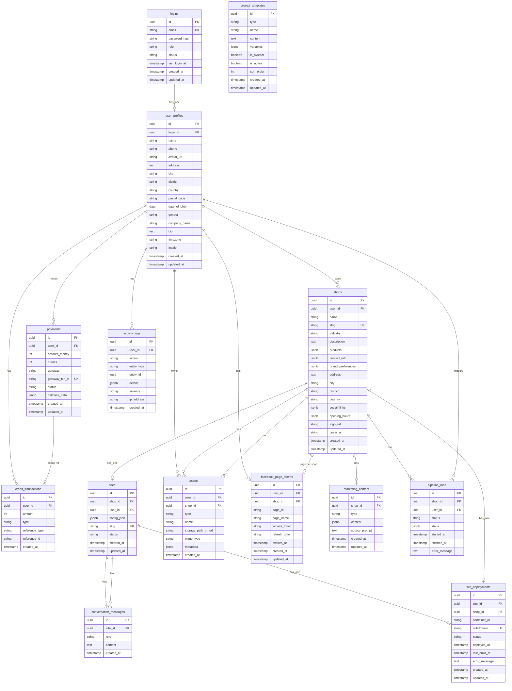

# Kế hoạch: Thiết kế phân tích hệ thống để làm Database

## 1. Mục tiêu giai đoạn

- **Đầu vào:** Yêu cầu từ [AIMAP-Architecture-VN.md](d:\CAPTONE2\testKhaThi\READ_CONTEXT\AIMAP-Architecture-VN.md), [Product-Backlog.md](d:\CAPTONE2\testKhaThi\LIST USE CASE\Product-Backlog.md), [Sprint-1-Detailed-Backlog.md](d:\CAPTONE2\testKhaThi\LIST USE CASE\Sprint-1-Detailed-Backlog.md); **Sprint 2** P2.1–P2.18 (assets, content, pipeline, Facebook).
- **Đầu ra:** Một tài liệu thiết kế database thống nhất cho **toàn bộ hệ thống** (entities, ER, schema, ràng buộc) và căn cứ để viết migrations cho **Sprint 1**, **Sprint 2** và **Sprint 3**.

---

## 2. Phạm vi dữ liệu cần lưu (từ kiến trúc & backlog)

| Nhóm                   | Dữ liệu                                                                                                                               | Nguồn                                 |
| ---------------------- | ------------------------------------------------------------------------------------------------------------------------------------- | ------------------------------------- |
| **Auth & User**        | Tài khoản (email, password hash), thông tin cá nhân (name), role (user/admin)                                                         | P1.3–P1.7, Architecture               |
| **Store/Shop**         | Thông tin cửa hàng: tên, ngành, mô tả, sản phẩm (name, price, …), liên hệ, branding preferences                                       | F1, P1.13, P1.14, Architecture        |
| **Site (Website)**     | Mỗi shop 1 site: config JSON (layout/sections), slug, trạng thái; subdomain → container                                               | Architecture VII, P3.1–P3.5           |
| **Conversation**       | Lịch sử chỉnh sửa website bằng prompt: siteId, role (user/assistant), content, timestamp                                              | Architecture III, P3.5                |
| **Credit**             | Balance = SUM(amount); từng giao dịch: user_id, amount (+/-), type, ref (payment_id hoặc action)                                      | P1.8–P1.12, Architecture              |
| **Payment**            | Giao dịch nạp tiền: amount_money, credits, gateway, gateway_txn_id, status, callback_data                                             | P1.9, Architecture                    |
| **Facebook**           | Page Access Token (hoặc link tới user/shop), refresh, page_id (Sprint 2)                                                              | P2.15–P2.18                           |
| **Assets**             | Metadata ảnh (logo, banner, post): url/path, type, user/shop, tên (Sprint 2; file lưu object storage)                                 | Architecture, P2.3, P2.4              |
| **Deploy / Container** | Site deployment: container_id, subdomain, status, deployed_at (Sprint 3)                                                              | P3.6, P3.8, P3.9, P3.10, Architecture |
| **Activity logs**      | Nhật ký hành động (mỗi công đoạn tạo web, lỗi): action, entity, details, severity (Sprint 3)                                          | P3.11, P3.13, P3.14                   |
| **Prompt templates**   | Kho prompt hệ thống: type, content, variables (Sprint 2)                                                                              | Prompt Builder, P2.x                  |
| **Lưu trữ ảnh / web**  | Ảnh: object storage (shops/:id/assets/). Source web: config trong DB; output trong container; snapshot optional trong object storage. | Architecture, Bước 5f                 |
| **Đa ngôn ngữ (i18n)** | Hệ thống cho phép đổi ngôn ngữ giao diện: **Tiếng Việt** và **English**; ưu tiên lưu trong user_profiles.locale (vi \| en). | Bước 5g                              |

---

## 3. Đối chiếu với tài liệu hiện có

- **Sprint-1-Detailed-Backlog (T1.M1–M3):** Chỉ định 3 bảng:
  - `users`: id, email, password_hash, name, role, created_at
  - `sites`: id, user_id, name, slug, config_json, created_at
  - `credit_transactions`: user_id, amount, type, ref, created_at
  Thiếu: bảng **store/shop** (P1.13, P1.14), bảng **payments** (P1.9 callback), và `sites` đang FK `user_id` trong khi kiến trúc nói **shop** → 1 site (nên có `shop_id`).
- **[Promp_AI/database_read.md](d:\CAPTONE2\testKhaThi\Promp_AI\database_read.md):** Schema chi tiết hơn: `logins` + `user_profiles` (tách đăng nhập / profile), `shops` (products JSONB, contact_info, brand_preferences), `sites` (shop_id, user_id, config_json), `credit_transactions`, `payments`. Chưa có: `conversation_messages`, bảng Facebook tokens, bảng assets metadata.

**Đề xuất:** Thống nhất trên một **System Design – Database** duy nhất cho **cả hệ thống**: **tách bảng tài khoản (logins) và thông tin cá nhân (user_profiles)** với profile mở rộng đủ chất lượng; **mở rộng thông tin shop**; thêm bảng **payments**; thiết kế đầy đủ **Sprint 2** (assets, facebook_page_tokens, marketing_content, pipeline_runs), **Sprint 3** (conversation_messages, site_deployments, activity_logs); **log từng công đoạn tạo web**; **hỗ trợ admin** (thu nhập, hoạt động, trạng thái user); **kho prompt (prompt_templates)**; làm rõ **vị trí lưu ảnh và source web** (object storage + container).

---

## 4. Các bước thiết kế phân tích (hành động cụ thể)

### Bước 1: Thu thập và liệt kê entities

- Liệt kê toàn bộ **entity**: **logins**, **user_profiles**, Shop, Site, CreditTransaction, Payment (Sprint 1); Asset, FacebookToken, MarketingContent, PipelineRun, **PromptTemplate** (Sprint 2); ConversationMessage, SiteDeployment, ActivityLog (Sprint 3).
- Ghi rõ entity nào dùng trong Sprint 1, Sprint 2, Sprint 3 (để chia phase migration).

### Bước 2: Quan hệ (ER) và ràng buộc nghiệp vụ

- **Quan hệ:** Login 1–1 UserProfile, UserProfile 1–N Shop, Shop 1–1 Site, UserProfile 1–N CreditTransaction, UserProfile 1–N Payment (Sprint 1); UserProfile/Shop 1–N Asset, Shop 1–1 FacebookToken, Shop 1–N MarketingContent, Shop 1–N PipelineRun (Sprint 2); **PromptTemplate** (bảng độc lập, không FK user/shop); Site 1–N ConversationMessage, Site 1–1 SiteDeployment, UserProfile 1–N ActivityLog (Sprint 3).
- **Ràng buộc:** email unique; balance = SUM(credit_transactions.amount); payment success → 1 credit_transaction (topup); slug unique per site/shop; ref trong credit_transactions có thể reference_type + reference_id (payment, feature_action).

### Bước 3: Tách tài khoản và thông tin cá nhân – Mô hình User (Phương án B)

- **Quyết định:** Tách rõ **tài khoản đăng nhập** và **thông tin cá nhân** để bảo mật và mở rộng profile đủ chất lượng.
- **logins** (chỉ credentials + role + status): id (PK), username (UNIQUE nullable), email (UNIQUE NOT NULL), password_hash (NOT NULL), role (user | admin), status (active | suspended | pending_verify), last_login_at (nullable), created_at, updated_at. Không lưu tên, SĐT, địa chỉ ở đây.
- **user_profiles** (thông tin cá nhân đầy đủ): id (PK), login_id (FK → logins UNIQUE NOT NULL), name (NOT NULL), phone, avatar_url, address (TEXT), city, district, country, postal_code, date_of_birth, gender, company_name (optional), bio (TEXT), timezone, locale, email_contact (override hoặc copy từ login), created_at, updated_at. Mọi bảng nghiệp vụ (shops, credit_transactions, payments, …) FK tới **user_profiles(id)**. Profile đủ trường để form cá nhân và báo cáo admin có chất lượng.

### Bước 4: Schema chi tiết từng bảng (Sprint 1)

- **logins:** id (PK), username (UNIQUE), email (UNIQUE NOT NULL), password_hash, role, status, last_login_at, created_at, updated_at. Index (email, role, status).
- **user_profiles:** id (PK), login_id (FK UNIQUE), name, phone, avatar_url, address, city, district, country, postal_code, date_of_birth, gender, company_name, bio, timezone, **locale** (VARCHAR: 'vi' | 'en' — ngôn ngữ giao diện Tiếng Việt/English), email_contact, created_at, updated_at. Index (login_id).
- **shops** (mở rộng đủ chất lượng): id (PK), user_id (FK → user_profiles), name, slug (UNIQUE), industry, description (TEXT), products (JSONB), contact_info (JSONB), brand_preferences (JSONB), address (TEXT), city, district, country, postal_code, tax_id, business_registration, website_url, social_links (JSONB), opening_hours (JSONB), logo_url, cover_url, tags (JSONB), status, created_at, updated_at.
- **sites:** id (PK), shop_id (FK), user_id (FK → user_profiles), name, slug (UNIQUE), config_json (JSONB), status (draft/deployed), created_at, updated_at. Khớp Architecture VII và “1 shop = 1 site”.
- **credit_transactions:** id (PK), user_id (FK → user_profiles), amount (integer), type, reference_type, reference_id, description, created_at. Index (user_id, created_at).
- **payments:** id (PK), user_id (FK → user_profiles), amount_money, credits, gateway, gateway_txn_id (UNIQUE), status, callback_data (JSONB), created_at, updated_at.

### Bước 5: Schema chi tiết Sprint 2 (đủ để viết migration)

Thiết kế đầy đủ các bảng dùng trong Sprint 2 (AI Automation & Facebook), khớp P2.1–P2.18:

- **assets** (metadata ảnh): id (PK), user_id (FK), shop_id (FK), type (logo | banner | cover | post), name, storage_path_or_url, mime_type, metadata (JSONB, optional: dimensions, model_used), created_at. File thật lưu object storage; bảng này cho thư viện, tái sử dụng (P2.3, P2.4, P2.11). Index (shop_id, type), (user_id, created_at).
- **facebook_page_tokens:** id (PK), user_id (FK), shop_id (FK, nullable), page_id (Meta Page ID), page_name, access_token (encrypted hoặc ref secret store), refresh_token (nếu có), expires_at, created_at, updated_at. Unique (user_id, shop_id, page_id) hoặc 1 page per shop. Cho P2.15–P2.18 (connect, save/refresh token, disconnect).
- **marketing_content** (nội dung AI sinh): id (PK), shop_id (FK), type (ad_post | product_description | caption_hashtag), content (JSONB hoặc TEXT), source_prompt (TEXT, optional), created_at, updated_at. Để lưu bài quảng cáo, mô tả SP, caption/hashtag (P2.5–P2.8 view/edit). Index (shop_id, type).
- **pipeline_runs** (tùy chọn): id (PK), shop_id (FK), user_id (FK), status (running | completed | failed), steps (JSONB: [{ step, status, result_ref }]), started_at, finished_at, error_message (TEXT). Cho P2.12, P2.14 (chạy pipeline Store → Branding → Content → Visual Post; xem trạng thái từng bước). Trừ credit vẫn dùng credit_transactions với reference_type = 'pipeline_run', reference_id = pipeline_runs.id (và có thể từng bước nhỏ trong description hoặc bảng con).

Ràng buộc Sprint 2: asset.shop_id thuộc user; facebook_page_tokens một page_id không trùng cho cùng shop; pipeline_runs.steps có thể tham chiếu tới assets.id hoặc marketing_content.id.

### Bước 5c: Schema chi tiết Sprint 3 (Website Builder, Deploy & Operations)

Phân tích Sprint 3 (P3.1–P3.14) và thiết kế đủ bảng cho deploy, prompt-edit history, dashboard và activity:

- **conversation_messages:** id (PK), site_id (FK), role (user | assistant), content (TEXT), created_at. Lịch sử chỉnh sửa website bằng prompt (P3.4, P3.5); AI context cho lần edit tiếp theo. Index (site_id, created_at).
- **site_deployments** (hoặc **deployments**): id (PK), site_id (FK), shop_id (FK, redundant nhưng tiện query), container_id (VARCHAR: Docker container ID), subdomain (VARCHAR UNIQUE, e.g. shopname.aimap.app), status (draft | building | running | stopped | error), deployed_at (TIMESTAMP nullable), last_build_at, error_message (TEXT nullable), created_at, updated_at. Cho P3.6 (tạo container), P3.8 (proxy subdomain → container), P3.9 (deploy), P3.10 (kiểm tra trạng thái). Ràng buộc: 1 site có 0 hoặc 1 deployment đang active (status = running); subdomain unique toàn hệ thống.
- **activity_logs:** id (PK), user_id (FK → user_profiles nullable), action (VARCHAR: login, create_shop, create_site, edit_site_prompt, build_site, deploy_site, publish_facebook, topup, …), entity_type (VARCHAR), entity_id (UUID nullable), details (JSONB: step, status, error, error_message, duration), severity (info | warning | error), ip_address (VARCHAR nullable), created_at. Mỗi công đoạn tạo web đều ghi log; khi lỗi ghi details.error + severity = error. Index (user_id, created_at), (entity_type, entity_id), (severity), (created_at).

Sprint 3 không thêm bảng cho revenue/credit reports (P3.12): dùng sẵn credit_transactions và payments với aggregate query.

**Log cho từng công đoạn tạo web:** Mỗi bước liên quan web (tạo site, chỉnh config bằng prompt, build, deploy, update static) đều ghi vào **activity_logs**: action = create_site | edit_site_prompt | build_site | deploy_site | update_site_static; entity_type = site; entity_id = site_id; details (JSONB) chứa step, status, error (nếu có), duration. Khi có lỗi: details.error = true, details.error_message = string. Nhờ vậy khi lỗi có thể tra log theo site_id hoặc thời gian để fix. Có thể bổ sung cột **severity** (info | warning | error) trong activity_logs nếu cần filter nhanh lỗi.

### Bước 5d: Hỗ trợ Admin (đã bao gồm trong database)

Database đã hỗ trợ đầy đủ chức năng admin; cần ghi rõ trong Design để implement đúng:

- **Thu nhập / revenue:** Aggregate từ **payments** (SUM(amount_money) WHERE status = success), **credit_transactions** (topup vs deduct theo thời gian). Báo cáo doanh thu theo ngày/tháng, theo gateway.
- **Hoạt động người dùng:** Bảng **activity_logs** (user_id, action, entity_type, entity_id, details, created_at). Admin filter theo user, theo action, theo thời gian; xem chi tiết từng bước (đăng nhập, tạo shop, deploy, đăng Facebook, nạp credit, …).
- **Trạng thái user:** **logins.status** (active | suspended | pending_verify). Admin xem danh sách user (join logins + user_profiles), lọc theo status, kích hoạt/tạm khóa.
- **Danh sách user, shop, site:** logins, user_profiles, shops, sites — đủ cho admin list và tìm kiếm.
- **Trạng thái container / deploy:** **site_deployments** (status, container_id, subdomain, error_message) cho P3.10.
- **Lỗi / monitor:** activity_logs với details.error hoặc severity = error; site_deployments.error_message. Admin dashboard có thể query các bản ghi lỗi để xử lý.

Không cần thêm bảng riêng cho admin; cần đảm bảo **activity_logs** ghi đủ hành động và **logins.status** có sẵn.

### Bước 5e: Kho lưu trữ prompt (prompt_templates)

Thêm bảng **prompt_templates** (kho prompt của hệ thống) cho AI image/content generation:

- **prompt_templates:** id (PK), type (VARCHAR: logo | banner | cover | post | product_description | caption | …), name (VARCHAR, mô tả ngắn), content (TEXT: nội dung prompt, có placeholder như {{shop_name}}, {{industry}}), variables (JSONB: danh sách biến có thể thay thế), is_system (boolean: true = prompt hệ thống, false = có thể do user tạo sau), is_active (boolean), sort_order (integer, optional), created_at, updated_at. Index (type, is_active). Backend/Prompt Builder đọc theo type + is_active để build prompt cuối trước khi gọi API. Migration: Sprint 2 (hoặc Sprint 1 nếu lib prompt builder dùng sớm).

### Bước 5f: Lưu trữ ảnh và source web – vị trí vật lý

- **Ảnh (logo, banner, post):** Metadata trong bảng **assets** (storage_path_or_url, mime_type). File vật lý lưu ở **object storage** (S3, MinIO hoặc thư mục local): prefix **shops/:shopId/assets/** hoặc **users/:userId/assets/**. URL trả về cho frontend: backend generate signed URL (nếu S3/MinIO) hoặc serve qua route static (nếu local). Ghi rõ trong Design: "Ảnh: DB lưu metadata (assets); file lưu object storage tại shops/:shopId/assets/."
- **Source web (HTML/static đã render):** Config nguồn trong **sites.config_json**. Output render (HTML, CSS, JS) được đẩy vào **Docker container** của shop (volume mount hoặc copy vào container khi build/deploy) — đây là "source web" đang chạy. Không lưu full HTML vào DB. Tùy chọn backup: lưu snapshot HTML vào object storage **shops/:shopId/site_snapshots/:timestamp/** (file index.html + assets) khi deploy thành công để rollback hoặc audit. Ghi rõ trong Design: "Source web: config trong sites.config_json; output render trong container của shop; backup snapshot (optional) trong object storage shop_snapshots."

### Bước 5g: Đa ngôn ngữ – Tiếng Việt và English

Hệ thống cho phép người dùng **đổi ngôn ngữ giao diện** giữa **Tiếng Việt** và **English**.

- **Lưu ưu tiên ngôn ngữ:** Dùng cột **user_profiles.locale** (VARCHAR, ví dụ: `'vi'` | `'en'`). Khi user chọn ngôn ngữ trong dashboard, cập nhật PATCH /users/me với `locale: 'vi'` hoặc `'en'`; lần sau đăng nhập frontend đọc locale từ profile (hoặc cookie/localStorage) để hiển thị đúng ngôn ngữ.
- **Ràng buộc:** locale nên có giá trị mặc định (ví dụ `'vi'`) và chỉ chấp nhận `'vi'` | `'en'` (enum hoặc check constraint).
- **Triển khai:** Frontend dùng file dịch (ví dụ JSON: `vi.json`, `en.json`) hoặc bảng **i18n_translations** (key, locale, value) nếu muốn quản lý chuỗi dịch trong DB; backend trả locale trong API profile và có thể trả message/validation error theo locale. Không cần thêm bảng bắt buộc nếu dùng file dịch; nếu cần Admin chỉnh chuỗi dịch trong DB thì thêm bảng **i18n_translations** (id, key, locale, value, updated_at) với unique (key, locale).

### Bước 6: Sơ đồ ER (mermaid) và tài liệu đầu ra

- Vẽ **ER diagram** (mermaid) trong tài liệu: entities, quan hệ 1–1, 1–N, tên FK.
- Viết **một file thiết kế** (ví dụ `READ_CONTEXT/AIMAP-Database-Design.md`): mục đích, phạm vi; **logins + user_profiles** (tách tài khoản / thông tin cá nhân), **shops** mở rộng; schema **Sprint 1, 2, 3** (gồm **prompt_templates**, **activity_logs** với severity và log từng công đoạn web); ràng buộc; **vị trí lưu ảnh** (object storage) và **source web** (config trong DB, output trong container, snapshot optional).
- Cập nhật **Sprint-1-Detailed-Backlog** (nếu cần): thêm migration bảng **stores/shops** và **payments** nếu hiện chỉ có users, sites, credit_transactions; đồng bộ tên cột với thiết kế (ví dụ reference_type, reference_id thay vì ref đơn).

### Bước 7: Đồng bộ với database_read.md

- Quyết định: **database_read.md** sẽ là “read reference” rút gọn từ AIMAP-Database-Design, hay Design là nguồn gốc và database_read chỉ copy schema chính. Đề xuất: Design là nguồn gốc; sau khi hoàn thành Design, cập nhật database_read.md cho khớp: logins, user_profiles, shops mở rộng, prompt_templates, activity_logs (severity), và ghi rõ lưu trữ ảnh (object storage) + source web (container + optional snapshot).

---

## 5. Sơ đồ quan hệ (minh họa)

---

## 6. Deliverables (sản phẩm giai đoạn)

| Deliverable                                              | Nội dung                                                                                                                                                      |
| -------------------------------------------------------- | ------------------------------------------------------------------------------------------------------------------------------------------------------------- |
| **AIMAP-Database-Design.md** (READ_CONTEXT hoặc design/) | Mục đích, phạm vi, mô hình User, ER, schema chi tiết **Sprint 1**, **Sprint 2** và **Sprint 3**, ràng buộc, index; diagram mermaid.                           |
| **Sprint 1 migrations**                                  | users, shops, sites, credit_transactions, payments; thống nhất tên cột (reference_type, reference_id); sites có shop_id.                                      |
| **Sprint 2 migrations**                                  | assets, facebook_page_tokens, marketing_content, pipeline_runs (nếu dùng), **prompt_templates**; DDL hoặc migration script trong Design / thư mục migrations. |
| **Sprint 3 migrations**                                  | conversation_messages, site_deployments, activity_logs; DDL hoặc migration script trong Design / thư mục migrations.                                          |
| **Cập nhật database_read.md**                            | Đồng bộ với Design (schema đọc nhanh cho dev/prompt), gồm bảng **Sprint 1, Sprint 2 và Sprint 3**.                                                            |

---

## 7. Thứ tự thực hiện gợi ý

1. Viết draft **AIMAP-Database-Design.md**: entities, ER, quyết định User, schema đầy đủ **Sprint 1** (users, shops, sites, credit_transactions, payments).
2. **Mở rộng cho Sprint 2:** Thêm schema chi tiết bảng **assets**, **facebook_page_tokens**, **marketing_content**, **pipeline_runs**; ràng buộc và index; mapping P2.1–P2.18.
3. **Phân tích và mở rộng cho Sprint 3:** Thêm schema chi tiết **conversation_messages**, **site_deployments**, **activity_logs**; ràng buộc và index; mapping P3.1–P3.14.
4. Vẽ ER (mermaid) gồm **Sprint 1 + Sprint 2 + Sprint 3** và chỉnh Design cho nhất quán.
5. Cập nhật Sprint-1-Detailed-Backlog (migrations T1.M1–M5): dùng **logins** + **user_profiles** thay users; thêm shops (mở rộng), payments; sites có shop_id.
6. Ghi rõ trong Design **danh sách migration Sprint 2** (hoặc file DDL/SQL riêng): assets, facebook_page_tokens, marketing_content, pipeline_runs (nếu dùng), **prompt_templates**.
7. Ghi rõ trong Design **danh sách migration Sprint 3** (hoặc file DDL/SQL riêng): conversation_messages, site_deployments, activity_logs.
8. Cập nhật Promp_AI/database_read.md theo bản Design đã chốt (**Sprint 1 + Sprint 2 + Sprint 3**).

Sau giai đoạn này, thiết kế database **hoàn thiện cho cả hệ thống**; team implement migrations Sprint 1 ngay, Sprint 2 khi bắt đầu Sprint 2, Sprint 3 khi bắt đầu Sprint 3 theo Design.