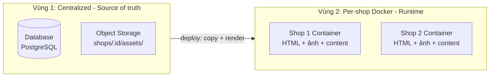
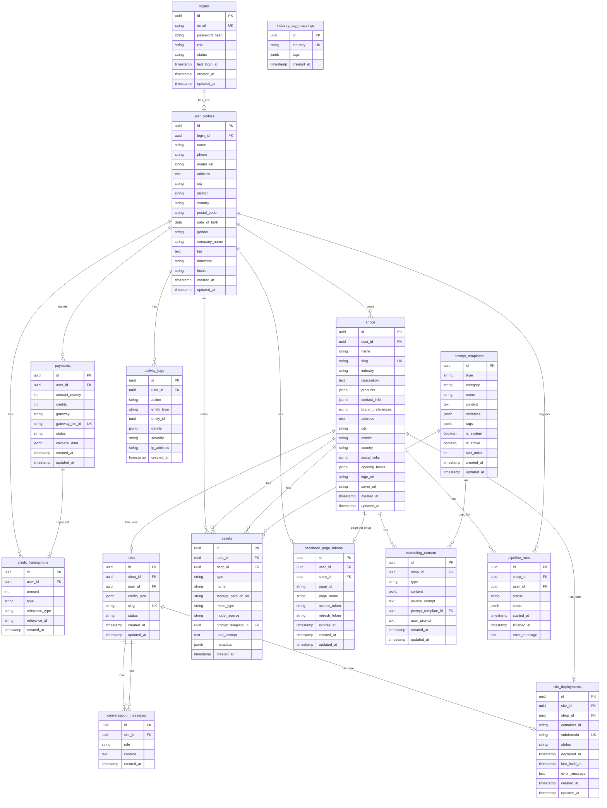

# AIMAP – Thiết kế Database & Tài liệu đọc tham chiếu

**AIMAP** = *AI-Powered Marketing Automation Platform for Small Businesses*

Tài liệu này là **nguồn tham chiếu chính** cho thiết kế database của hệ thống AIMAP: entities, quan hệ, schema chi tiết (Sprint 1–3), hai vùng dữ liệu (Centralized vs Per-shop Docker), và danh sách migrations. Dùng cho dev implement và cho prompt/context khi làm backend, migrations hoặc tích hợp AI (kho prompt, assets theo model).

**Tài liệu liên quan (READ_CONTEXT):**

| File | Nội dung |
|------|----------|
| [AIMAP-Architecture-VN.md](AIMAP-Architecture-VN.md) / [AIMAP-Architecture-EN.md](AIMAP-Architecture-EN.md) | Kiến trúc tổng thể, Storage Layer, Hosting (1 shop = 1 Docker), Data Flow |
| [AIMAP-Data-Hierarchy.md](AIMAP-Data-Hierarchy.md) | **Chuẩn cấu trúc:** 1 User → N Shops; mỗi Shop có Storage (image, content, product), Web, Facebook Page, Generate |
| [AIMAP-Quick-ReadVN.md](AIMAP-Quick-ReadVN.md) / [AIMAP-Quick-Read-EN.md](AIMAP-Quick-Read-EN.md) | Chức năng, lợi ích người dùng, điểm nổi bật |
| [AIMAP-3-Image-ModelsAI-VN.md](AIMAP-3-Image-ModelsAI-VN.md) | 3 model tạo ảnh (Imagen, DALL·E 3, FLUX), luồng Prompt Builder → Image API Client, metadata `model_source` cho assets |

---

## Bảng đọc nhanh (Quick reference – bảng theo Sprint)

| Sprint | Bảng | Mục đích chính |
|--------|------|-----------------|
| **1** | logins | Tài khoản đăng nhập (email, password_hash, role, status) |
| **1** | user_profiles | Thông tin cá nhân (name, phone, locale i18n, …); FK từ shops, credit, payment |
| **1** | shops | Cửa hàng (mở rộng: address, social_links, opening_hours, logo_url, …) |
| **1** | sites | Website: config_json, slug, shop_id, status (draft/deployed) |
| **1** | credit_transactions | Giao dịch credit (amount, type, reference_type, reference_id) |
| **1** | payments | Thanh toán nạp credit (gateway, gateway_txn_id, status) |
| **2** | assets | Metadata ảnh; model_source (imagen \| dall-e-3 \| flux); **prompt_template_id** + **user_prompt** (prompt gốc + bổ sung) |
| **2** | facebook_page_tokens | Token Facebook Page (OAuth, Meta Graph API) |
| **2** | marketing_content | Nội dung AI (ad_post, product_description, caption_hashtag); **prompt_template_id** + **user_prompt** |
| **2** | pipeline_runs | Chạy pipeline (branding → content → visual → …); steps JSONB |
| **2** | prompt_templates | Kho prompt hệ thống gắn **tag ngành hàng** + **category** (image/content); Prompt Builder lọc theo tag → gen 4–5 ảnh/content cho user chọn |
| **2** | industry_tag_mappings | Map ngành hàng (shops.industry) → tag(s) cho prompt (40 tag, seed data) |
| **3** | conversation_messages | Lịch sử chỉnh website bằng prompt (site_id, role, content) |
| **3** | site_deployments | Deploy: container_id, subdomain, status; 1 site → 1 container |
| **3** | activity_logs | Log từng công đoạn (create_site, edit_site_prompt, build_site, deploy_site); severity, details JSONB |

---

## 1. Mục tiêu giai đoạn

- **Đầu vào:** Yêu cầu từ [AIMAP-Architecture-VN.md](AIMAP-Architecture-VN.md), [Product-Backlog.md](../LIST%20USE%20CASE/Product-Backlog.md), [Sprint-1-Detailed-Backlog.md](../LIST%20USE%20CASE/Sprint-1-Detailed-Backlog.md); **Sprint 2** P2.1–P2.18 (assets, content, pipeline, Facebook).
- **Đầu ra:** Một tài liệu thiết kế database thống nhất cho **toàn bộ hệ thống** (entities, ER, schema, ràng buộc) và căn cứ để viết migrations cho **Sprint 1**, **Sprint 2** và **Sprint 3**.

---

## 2. Phạm vi dữ liệu cần lưu (từ kiến trúc & backlog)


| Nhóm                   | Dữ liệu                                                                                                                               | Nguồn                                 |
| ---------------------- | ------------------------------------------------------------------------------------------------------------------------------------- | ------------------------------------- |
| **Auth & User**        | Tài khoản (email, password hash), thông tin cá nhân (name), role (user/admin)                                                         | P1.3–P1.7, Architecture               |
| **Store/Shop**         | Thông tin cửa hàng: tên, ngành, mô tả, sản phẩm (name, price, …), liên hệ, branding preferences                                       | F1, P1.13, P1.14, Architecture        |
| **Site (Website)**     | Mỗi shop 1 site: config JSON (layout/sections), slug, trạng thái; subdomain → container                                               | Architecture VII, P3.1–P3.5           |
| **Conversation**       | Lịch sử chỉnh sửa website bằng prompt: siteId, role (user/assistant), content, timestamp                                              | Architecture III, P3.5                |
| **Credit**             | Balance = SUM(amount); từng giao dịch: user_id, amount (+/-), type, ref (payment_id hoặc action)                                      | P1.8–P1.12, Architecture              |
| **Payment**            | Giao dịch nạp tiền: amount_money, credits, gateway, gateway_txn_id, status, callback_data                                             | P1.9, Architecture                    |
| **Facebook**           | Page Access Token **theo từng shop** (facebook_page_tokens.shop_id); mỗi shop kết nối/đăng bài riêng, không dùng chung. | P2.15–P2.18                           |
| **Assets**             | Metadata ảnh (logo, banner, post): url/path, type, **per shop (shop_id)**, tên; không có kho ảnh chung; **model_source** (imagen \| dall-e-3 \| flux) cho ảnh AI sinh (Sprint 2; file lưu object storage) | Architecture, P2.3, P2.4, [AIMAP-3-Image-ModelsAI-VN](AIMAP-3-Image-ModelsAI-VN.md) |
| **Deploy / Container** | Site deployment: container_id, subdomain, status, deployed_at (Sprint 3)                                                              | P3.6, P3.8, P3.9, P3.10, Architecture |
| **Activity logs**      | Nhật ký hành động (mỗi công đoạn tạo web, lỗi): action, entity, details, severity (Sprint 3)                                          | P3.11, P3.13, P3.14                   |
| **Prompt templates**   | Kho prompt hệ thống: type, content, variables (Sprint 2)                                                                              | Prompt Builder, P2.x                  |
| **Lưu trữ ảnh / web**  | Ảnh: object storage (shops/:id/assets/). Source web: config trong DB; output trong container; snapshot optional trong object storage. | Architecture, Bước 5f                 |
| **Đa ngôn ngữ (i18n)** | Hệ thống cho phép đổi ngôn ngữ giao diện: **Tiếng Việt** và **English**; ưu tiên lưu trong user_profiles.locale (vi \| en). | Bước 5g                              |

---

## 2b. Hai vùng dữ liệu (Data Zones)

Hệ thống tách rõ **hai vùng dữ liệu**: (1) **Centralized** – nguồn gốc, quản lý; (2) **Per-shop Docker** – bản runtime tự chứa web + ảnh + content để serve.



| Vùng | Thành phần | Nội dung |
|------|------------|----------|
| **Centralized** | Database | logins, user_profiles, shops, sites (config_json), assets (metadata), credit_transactions, payments, site_deployments, activity_logs, … |
| **Centralized** | Object Storage | File ảnh (logo, banner, post) tại `shops/:shopId/assets/`; snapshot web (optional). |
| **Per-shop Docker** | Container filesystem | Container = **gói toàn bộ dữ liệu runtime của một shop**: web đã render + bản copy ảnh của shop đó + content tĩnh của shop đó; không chứa dữ liệu shop khác. Nginx serve trực tiếp, không gọi ra ngoài. |

**Luồng deploy:** Backend đọc config từ DB + file ảnh từ Object Storage → render HTML → **copy ảnh + HTML vào container** của shop → container tự đủ, user truy cập subdomain chỉ cần container.

---

## 3. Đối chiếu với tài liệu hiện có

- **Sprint-1-Detailed-Backlog (T1.M1–M3):** Chỉ định 3 bảng:
  - `users`: id, email, password_hash, name, role, created_at
  - `sites`: id, user_id, name, slug, config_json, created_at
  - `credit_transactions`: user_id, amount, type, ref, created_at
  Thiếu: bảng **store/shop** (P1.13, P1.14), bảng **payments** (P1.9 callback), và `sites` đang FK `user_id` trong khi kiến trúc nói **shop** → 1 site (nên có `shop_id`).
- **Promp_AI/database_read.md** (nếu có): Nên đồng bộ schema với tài liệu này; đủ bảng Sprint 1–3, gồm `logins`, `user_profiles`, `shops` mở rộng, `sites`, `credit_transactions`, `payments`, `assets` (có model_source), `facebook_page_tokens`, `marketing_content`, `pipeline_runs`, `prompt_templates`, `conversation_messages`, `site_deployments`, `activity_logs`.

**Đề xuất:** Thống nhất trên một **System Design – Database** duy nhất cho **cả hệ thống**: **tách bảng tài khoản (logins) và thông tin cá nhân (user_profiles)** với profile mở rộng đủ chất lượng; **mở rộng thông tin shop**; thêm bảng **payments**; thiết kế đầy đủ **Sprint 2** (assets, facebook_page_tokens, marketing_content, pipeline_runs), **Sprint 3** (conversation_messages, site_deployments, activity_logs); **log từng công đoạn tạo web**; **hỗ trợ admin** (thu nhập, hoạt động, trạng thái user); **kho prompt (prompt_templates)**; làm rõ **vị trí lưu ảnh và source web** (object storage + container).

---

## 4. Các bước thiết kế phân tích (hành động cụ thể)

### Bước 1: Thu thập và liệt kê entities

- Liệt kê toàn bộ **entity**: **logins**, **user_profiles**, Shop, Site, CreditTransaction, Payment (Sprint 1); Asset, FacebookToken, MarketingContent, PipelineRun, **PromptTemplate** (Sprint 2); ConversationMessage, SiteDeployment, ActivityLog (Sprint 3).
- Ghi rõ entity nào dùng trong Sprint 1, Sprint 2, Sprint 3 (để chia phase migration).

### Bước 2: Quan hệ (ER) và ràng buộc nghiệp vụ

- **Quan hệ:** Login 1–1 UserProfile, **UserProfile 1–N Shop** (chuẩn: 1 user nhiều shop). Mỗi Shop có: Storage (assets, marketing_content, products trong shops), Web (1 site), Facebook (facebook_page_tokens), Pipeline (pipeline_runs). Shop 1–1 Site, UserProfile 1–N CreditTransaction, UserProfile 1–N Payment (Sprint 1); Shop 1–N Asset, Shop 1–1 (hoặc N) FacebookToken, Shop 1–N MarketingContent, Shop 1–N PipelineRun (Sprint 2). Chi tiết hierarchy: [AIMAP-Data-Hierarchy.md](AIMAP-Data-Hierarchy.md). **PromptTemplate** (bảng độc lập, không FK user/shop); Site 1–N ConversationMessage, Site 1–1 SiteDeployment, UserProfile 1–N ActivityLog (Sprint 3).
- **Ràng buộc:** email unique; balance = SUM(credit_transactions.amount); payment success → 1 credit_transaction (topup); slug unique per site/shop; ref trong credit_transactions có thể reference_type + reference_id (payment, feature_action).

### Bước 3: Tách tài khoản và thông tin cá nhân – Mô hình User (Phương án B)

- **Quyết định:** Tách rõ **tài khoản đăng nhập** và **thông tin cá nhân** để bảo mật và mở rộng profile đủ chất lượng.
- **logins** (chỉ credentials + role + status): id (PK), username (UNIQUE nullable), email (UNIQUE NOT NULL), password_hash (NOT NULL), role (user | admin), status (active | suspended | pending_verify), last_login_at (nullable), created_at, updated_at. Không lưu tên, SĐT, địa chỉ ở đây.
- **user_profiles** (thông tin cá nhân đầy đủ): id (PK), login_id (FK → logins UNIQUE NOT NULL), name (NOT NULL), phone, avatar_url, address (TEXT), city, district, country, postal_code, date_of_birth, gender, company_name (optional), bio (TEXT), timezone, locale, email_contact (override hoặc copy từ login), created_at, updated_at. Mọi bảng nghiệp vụ (shops, credit_transactions, payments, …) FK tới **user_profiles(id)**. Profile đủ trường để form cá nhân và báo cáo admin có chất lượng.

### Bước 4: Schema chi tiết từng bảng (Sprint 1)

- **logins:** id (PK), username (UNIQUE), email (UNIQUE NOT NULL), password_hash, role, status, last_login_at, created_at, updated_at. Index (email, role, status).
- **user_profiles:** id (PK), login_id (FK UNIQUE), name, phone, avatar_url, address, city, district, country, postal_code, date_of_birth, gender, company_name, bio, timezone, **locale** (VARCHAR: 'vi' | 'en' — ngôn ngữ giao diện Tiếng Việt/English), email_contact, created_at, updated_at. Index (login_id).
- **shops** (mở rộng đủ chất lượng): id (PK), user_id (FK → user_profiles), name, slug (UNIQUE), industry, description (TEXT), products (JSONB), contact_info (JSONB), brand_preferences (JSONB), address (TEXT), city, district, country, postal_code, tax_id, business_registration, website_url, social_links (JSONB), opening_hours (JSONB), logo_url, cover_url, tags (JSONB), status, created_at, updated_at.
  - **contact_info (JSONB)** — cấu trúc khuyến nghị khi tạo shop: `{ "phone": string, "email": string, "owner_name": string }`. Các trường này **bắt buộc nhập** ở form Create Shop; dùng làm context (kèm prompt người dùng + prompt trong kho) để AI sinh content, ảnh và web sau này.
  - **Create shop (form `/shops/create`):** Chỉ thu thập thông tin cơ bản. **Bắt buộc:** name, slug, industry, description, address, city, district, country, postal_code, contact_info.phone, contact_info.email, contact_info.owner_name. **Không** nhập products hay website_url lúc tạo — người dùng bổ sung sau tại `/shops/[id]/edit`. Xem [AIMAP-Data-Hierarchy.md](AIMAP-Data-Hierarchy.md) và [UI STRUCT.md](UI%20STRUCT.md).
- **sites:** id (PK), shop_id (FK), user_id (FK → user_profiles), name, slug (UNIQUE), config_json (JSONB), status (draft/deployed), created_at, updated_at. Khớp Architecture VII và “1 shop = 1 site”.
- **credit_transactions:** id (PK), user_id (FK → user_profiles), amount (integer), type, reference_type, reference_id, description, created_at. Index (user_id, created_at).
- **payments:** id (PK), user_id (FK → user_profiles), amount_money, credits, gateway, gateway_txn_id (UNIQUE), status, callback_data (JSONB), created_at, updated_at.

### Bước 5: Schema chi tiết Sprint 2 (đủ để viết migration)

Thiết kế đầy đủ các bảng dùng trong Sprint 2 (AI Automation & Facebook), khớp P2.1–P2.18:

- **assets** (metadata ảnh): id (PK), user_id (FK), shop_id (FK), type (logo | banner | cover | post), name, storage_path_or_url, mime_type, **model_source** (VARCHAR nullable: 'imagen' | 'dall-e-3' | 'flux'), **prompt_template_id** (FK → prompt_templates, nullable — prompt gốc đã dùng), **user_prompt** (TEXT nullable — prompt bổ sung của user), metadata (JSONB), created_at. File thật lưu object storage; bảng này cho thư viện, tái sử dụng (P2.3, P2.4, P2.11). Index (shop_id, type), (user_id, created_at). **Chuẩn hệ thống:** Mỗi shop có thư viện asset riêng, không dùng chung asset giữa các shop; nên đặt **shop_id NOT NULL** (mỗi asset luôn thuộc một shop). Object storage: prefix `shops/:shopId/assets/` (không lưu chung theo user).
- **facebook_page_tokens:** id (PK), user_id (FK), shop_id (FK, nullable), page_id (Meta Page ID), page_name, access_token (encrypted hoặc ref secret store), refresh_token (nếu có), expires_at, created_at, updated_at. Unique (user_id, shop_id, page_id) hoặc 1 page per shop. Cho P2.15–P2.18 (connect, save/refresh token, disconnect).
- **marketing_content** (nội dung AI sinh): id (PK), shop_id (FK), type (ad_post | product_description | caption_hashtag), content (JSONB hoặc TEXT), source_prompt (TEXT, optional), **prompt_template_id** (FK → prompt_templates, nullable — prompt gốc đã dùng), **user_prompt** (TEXT nullable — prompt bổ sung của user), created_at, updated_at. Để lưu bài quảng cáo, mô tả SP, caption/hashtag (P2.5–P2.8 view/edit). Index (shop_id, type).
- **pipeline_runs** (tùy chọn): id (PK), shop_id (FK), user_id (FK), status (running | completed | failed), steps (JSONB: [{ step, status, result_ref }]), started_at, finished_at, error_message (TEXT). Cho P2.12, P2.14 (chạy pipeline Store → Branding → Content → Visual Post; xem trạng thái từng bước). Trừ credit vẫn dùng credit_transactions với reference_type = 'pipeline_run', reference_id = pipeline_runs.id (và có thể từng bước nhỏ trong description hoặc bảng con).

Ràng buộc Sprint 2: asset.shop_id thuộc user; facebook_page_tokens một page_id không trùng cho cùng shop; pipeline_runs.steps có thể tham chiếu tới assets.id hoặc marketing_content.id.

### Bước 5c: Schema chi tiết Sprint 3 (Website Builder, Deploy & Operations)

Phân tích Sprint 3 (P3.1–P3.14) và thiết kế đủ bảng cho deploy, prompt-edit history, dashboard và activity:

- **conversation_messages:** id (PK), site_id (FK), role (user | assistant), content (TEXT), created_at. Lịch sử chỉnh sửa website bằng prompt (P3.4, P3.5); AI context cho lần edit tiếp theo. Index (site_id, created_at).
- **site_deployments** (hoặc **deployments**): id (PK), site_id (FK), shop_id (FK, redundant nhưng tiện query), container_id (VARCHAR: Docker container ID), subdomain (VARCHAR UNIQUE, e.g. shopname.aimap.app), status (draft | building | running | stopped | error), deployed_at (TIMESTAMP nullable), last_build_at, error_message (TEXT nullable), created_at, updated_at. Cho P3.6 (tạo container), P3.8 (proxy subdomain → container), P3.9 (deploy), P3.10 (kiểm tra trạng thái). Ràng buộc: 1 site có 0 hoặc 1 deployment đang active (status = running); subdomain unique toàn hệ thống.
- **activity_logs:** id (PK), user_id (FK → user_profiles nullable), action (VARCHAR: login, create_shop, create_site, edit_site_prompt, build_site, deploy_site, publish_facebook, topup, …), entity_type (VARCHAR), entity_id (UUID nullable), details (JSONB: step, status, error, error_message, duration), severity (info | warning | error), ip_address (VARCHAR nullable), created_at. Mỗi công đoạn tạo web đều ghi log; khi lỗi ghi details.error + severity = error. Index (user_id, created_at), (entity_type, entity_id), (severity), (created_at).

Sprint 3 không thêm bảng cho revenue/credit reports (P3.12): dùng sẵn credit_transactions và payments với aggregate query.

**Log cho từng công đoạn tạo web:** Mỗi bước liên quan web (tạo site, chỉnh config bằng prompt, build, deploy, update static) đều ghi vào **activity_logs**: action = create_site | edit_site_prompt | build_site | deploy_site | update_site_static; entity_type = site; entity_id = site_id; details (JSONB) chứa step, status, error (nếu có), duration. Khi có lỗi: details.error = true, details.error_message = string. Nhờ vậy khi lỗi có thể tra log theo site_id hoặc thời gian để fix. Có thể bổ sung cột **severity** (info | warning | error) trong activity_logs nếu cần filter nhanh lỗi.

### Bước 5d: Hỗ trợ Admin (đã bao gồm trong database)

Database đã hỗ trợ đầy đủ chức năng admin; cần ghi rõ trong Design để implement đúng:

- **Thu nhập / revenue:** Aggregate từ **payments** (SUM(amount_money) WHERE status = success), **credit_transactions** (topup vs deduct theo thời gian). Báo cáo doanh thu theo ngày/tháng, theo gateway.
- **Hoạt động người dùng:** Bảng **activity_logs** (user_id, action, entity_type, entity_id, details, created_at). Admin filter theo user, theo action, theo thời gian; xem chi tiết từng bước (đăng nhập, tạo shop, deploy, đăng Facebook, nạp credit, …).
- **Trạng thái user:** **logins.status** (active | suspended | pending_verify). Admin xem danh sách user (join logins + user_profiles), lọc theo status, kích hoạt/tạm khóa.
- **Danh sách user, shop, site:** logins, user_profiles, shops, sites — đủ cho admin list và tìm kiếm.
- **Trạng thái container / deploy:** **site_deployments** (status, container_id, subdomain, error_message) cho P3.10.
- **Lỗi / monitor:** activity_logs với details.error hoặc severity = error; site_deployments.error_message. Admin dashboard có thể query các bản ghi lỗi để xử lý.

Không cần thêm bảng riêng cho admin; cần đảm bảo **activity_logs** ghi đủ hành động và **logins.status** có sẵn.

### Bước 5e: Kho prompt theo tag ngành hàng (prompt_templates + industry_tag_mappings)

Hệ thống dùng **kho prompt** được gắn **tag ngành hàng** để tự động chọn prompt phù hợp với loại shop, sinh ra 4–5 ảnh/content cho user chọn. User cũng có thể **bổ sung prompt riêng** để chỉnh sửa.

#### 5e.1 Bảng prompt_templates (mở rộng)

- **prompt_templates:** id (PK), type (VARCHAR: logo | banner | cover | post | product_description | caption | website_section | general), **category** (VARCHAR: 'image' | 'content' — phân biệt prompt tạo ảnh vs viết nội dung), name (VARCHAR), content (TEXT: nội dung prompt, có placeholder như {{shop_name}}, {{industry}}, {{products}}), variables (JSONB), **tags** (JSONB array: danh sách tag ngành hàng, ví dụ `["DOUONG", "DOAN"]`), is_system (boolean), is_active (boolean), sort_order (integer), created_at, updated_at.
- **Index:** (type, category, is_active), GIN index trên tags cho query `@>`.
- **Query mẫu:** `SELECT * FROM prompt_templates WHERE tags @> '["DOUONG"]' AND type = 'logo' AND category = 'image' AND is_active = TRUE ORDER BY sort_order LIMIT 5;`

#### 5e.2 Bảng industry_tag_mappings (map ngành hàng → tag)

Để hệ thống tự động map `shops.industry` sang tag(s):

- **industry_tag_mappings:** id (PK), industry (VARCHAR UNIQUE — tên ngành hàng, ví dụ "Đồ uống"), tags (JSONB array: `["DOUONG"]`), created_at.
- Backend khi user tạo shop → lấy `shops.industry` → query `industry_tag_mappings` → lấy tags → dùng để filter `prompt_templates`.

#### 5e.3 Danh sách 40 tag ngành hàng

| # | Tag | Ngành hàng / Mô tả |
|---|-----|---------------------|
| 1 | `DOUONG` | Đồ uống, cafe, trà sữa, nước ép, smoothie |
| 2 | `DOAN` | Đồ ăn, nhà hàng, quán ăn, bakery, fastfood |
| 3 | `AOQUAN` | Quần áo, thời trang nam/nữ |
| 4 | `GIAYDEP` | Giày dép, sneaker, sandal |
| 5 | `PHUKIEN` | Phụ kiện thời trang: túi xách, mũ, kính, trang sức |
| 6 | `DULICH` | Du lịch, tour, dịch vụ lữ hành |
| 7 | `BOOKING` | Đặt phòng, khách sạn, homestay, resort |
| 8 | `GIAODUC` | Giáo dục, trung tâm, khóa học, luyện thi |
| 9 | `SUCKHOE` | Sức khỏe, phòng khám, dược phẩm |
| 10 | `SPA` | Spa, massage, chăm sóc cơ thể |
| 11 | `GYM` | Gym, fitness, yoga, pilates |
| 12 | `MYPHAM` | Mỹ phẩm, skincare, makeup, làm đẹp |
| 13 | `TOCHUC` | Tóc, barbershop, salon tóc |
| 14 | `CONGNGHE` | Công nghệ, điện tử, gadget, phần mềm |
| 15 | `NOITHAT` | Nội thất, trang trí nhà, decor |
| 16 | `XAYDUNG` | Xây dựng, vật liệu, kiến trúc |
| 17 | `BATDONGSAN` | Bất động sản, môi giới, cho thuê nhà |
| 18 | `OTO` | Ô tô, xe hơi, đại lý, phụ tùng |
| 19 | `XEMAY` | Xe máy, xe điện, phụ kiện xe |
| 20 | `THUYCUNG` | Thú cưng, pet shop, pet care, thú y |
| 21 | `HOAQUA` | Hoa quả, trái cây, nông sản sạch |
| 22 | `HOA` | Hoa tươi, shop hoa, quà tặng hoa |
| 23 | `SUKIEN` | Tổ chức sự kiện, wedding, party, hội nghị |
| 24 | `NHIEPAN` | Nhiếp ảnh, studio, chụp hình, quay phim |
| 25 | `INANUONG` | In ấn, thiết kế đồ họa, bao bì |
| 26 | `VANTAI` | Vận tải, giao hàng, logistics, chuyển phát |
| 27 | `TAICHINH` | Tài chính, bảo hiểm, ngân hàng, đầu tư |
| 28 | `LUATPHAP` | Luật, tư vấn pháp lý, kế toán |
| 29 | `NONGSAN` | Nông sản, thực phẩm sạch, organic |
| 30 | `THUISAN` | Thủy hải sản, hải sản tươi sống |
| 31 | `TREEM` | Trẻ em, mẹ & bé, đồ chơi, quần áo trẻ em |
| 32 | `THETHAO` | Thể thao, dụng cụ thể thao, sportswear |
| 33 | `GAME` | Game, esports, gaming gear |
| 34 | `SACH` | Sách, văn phòng phẩm, nhà sách |
| 35 | `DIENGIA` | Điện gia dụng, thiết bị nhà bếp, gia dụng |
| 36 | `THUOCLA` | Vape, shisha, phụ kiện (nếu hợp pháp) |
| 37 | `NHACCU` | Nhạc cụ, âm nhạc, studio thu âm |
| 38 | `HANDMADE` | Handmade, thủ công mỹ nghệ, DIY |
| 39 | `NGOAINGU` | Ngoại ngữ, trung tâm Anh/Nhật/Hàn/Trung |
| 40 | `GENERAL` | Dùng chung cho mọi ngành (prompt tổng quát) |

> Danh sách mở rộng được: chỉ cần INSERT thêm vào `industry_tag_mappings` và thêm tag vào `prompt_templates.tags`, không cần sửa schema.

#### 5e.4 Luồng hoạt động prompt → ảnh/content

```
1. User tạo shop (industry: "Đồ uống")
   → Backend: query industry_tag_mappings WHERE industry = 'Đồ uống' → tags: ['DOUONG']

2. User yêu cầu tạo logo
   → Backend: query prompt_templates
     WHERE tags @> '["DOUONG"]' AND type = 'logo' AND category = 'image' AND is_active
     → Lấy 4–5 prompt khác nhau (kèm thêm prompt có tag GENERAL nếu cần)
   → Gọi 3 model ảnh (Imagen, DALL·E 3, FLUX) với từng prompt
   → Trả về 4–5 ảnh → Lưu assets (prompt_template_id, model_source) → User chọn

3. User muốn chỉnh ảnh đã chọn
   → User nhập thêm prompt: "Thêm lá bạc hà, đổi nền sang xanh lá"
   → Backend: lấy prompt gốc (từ prompt_template_id) + kẹp user_prompt vào cuối
   → Gọi lại model → trả ảnh mới → Lưu assets (prompt_template_id + user_prompt)

4. Tương tự cho content (ad_post, caption, product_description)
   → Query prompt_templates WHERE category = 'content' AND tags @> ...
   → Gen 4–5 bản content → User chọn → User chỉnh bằng user_prompt
```

#### 5e.5 Liên kết với assets & marketing_content

- **assets:** thêm cột **prompt_template_id** (FK → prompt_templates, nullable) và **user_prompt** (TEXT, nullable) — để biết ảnh gen từ prompt nào và user đã bổ sung gì.
- **marketing_content:** thêm cột **prompt_template_id** (FK → prompt_templates, nullable) và **user_prompt** (TEXT, nullable) — tương tự cho content.

Migration: Sprint 2.

### Bước 5f: Lưu trữ ảnh và source web – vị trí vật lý

- **Ảnh (logo, banner, post):** Metadata trong bảng **assets** (storage_path_or_url, mime_type). File vật lý lưu ở **object storage** (S3, MinIO hoặc thư mục local): prefix **shops/:shopId/assets/** (mỗi shop một namespace riêng, không dùng chung asset giữa các shop). Khi **deploy**, backend **copy ảnh cần thiết** (theo config site) vào Docker container của shop → container tự chứa đủ ảnh để nginx serve, không gọi ra Object Storage lúc runtime. URL trả về cho dashboard/thư viện: backend generate signed URL hoặc serve qua route static.
- **Source web (HTML/static đã render):** Config nguồn trong **sites.config_json**. Output render (HTML, CSS, JS) + **bản copy ảnh** được đẩy vào **Docker container** của shop (volume mount hoặc copy khi build/deploy) — mỗi shop = một bó (web + ảnh + content) độc lập. Không lưu full HTML vào DB. Tùy chọn backup: lưu snapshot HTML vào object storage **shops/:shopId/site_snapshots/:timestamp/** khi deploy thành công để rollback hoặc audit.

### Bước 5g: Đa ngôn ngữ – Tiếng Việt và English

Hệ thống cho phép người dùng **đổi ngôn ngữ giao diện** giữa **Tiếng Việt** và **English**.

- **Lưu ưu tiên ngôn ngữ:** Dùng cột **user_profiles.locale** (VARCHAR, ví dụ: `'vi'` | `'en'`). Khi user chọn ngôn ngữ trong dashboard, cập nhật PATCH /users/me với `locale: 'vi'` hoặc `'en'`; lần sau đăng nhập frontend đọc locale từ profile (hoặc cookie/localStorage) để hiển thị đúng ngôn ngữ.
- **Ràng buộc:** locale nên có giá trị mặc định (ví dụ `'vi'`) và chỉ chấp nhận `'vi'` | `'en'` (enum hoặc check constraint).
- **Triển khai:** Frontend dùng file dịch (ví dụ JSON: `vi.json`, `en.json`) hoặc bảng **i18n_translations** (key, locale, value) nếu muốn quản lý chuỗi dịch trong DB; backend trả locale trong API profile và có thể trả message/validation error theo locale. Không cần thêm bảng bắt buộc nếu dùng file dịch; nếu cần Admin chỉnh chuỗi dịch trong DB thì thêm bảng **i18n_translations** (id, key, locale, value, updated_at) với unique (key, locale).

### Bước 6: Sơ đồ ER (mermaid) và tài liệu đầu ra

- Vẽ **ER diagram** (mermaid) trong tài liệu: entities, quan hệ 1–1, 1–N, tên FK.
- Viết **một file thiết kế** (ví dụ `READ_CONTEXT/AIMAP-Database-Design.md`): mục đích, phạm vi; **logins + user_profiles** (tách tài khoản / thông tin cá nhân), **shops** mở rộng; schema **Sprint 1, 2, 3** (gồm **prompt_templates**, **activity_logs** với severity và log từng công đoạn web); ràng buộc; **vị trí lưu ảnh** (object storage) và **source web** (config trong DB, output trong container, snapshot optional).
- Cập nhật **Sprint-1-Detailed-Backlog** (nếu cần): thêm migration bảng **stores/shops** và **payments** nếu hiện chỉ có users, sites, credit_transactions; đồng bộ tên cột với thiết kế (ví dụ reference_type, reference_id thay vì ref đơn).

### Bước 7: Đồng bộ với database_read (nếu có file riêng)

- **Nguồn tham chiếu chính:** File này (**database_design.md**) là tài liệu thiết kế và đọc tham chiếu chính. Nếu có file riêng (ví dụ Promp_AI/database_read.md) thì đồng bộ với Design, gồm “read reference”  logins, user_profiles, shops mở rộng, assets (có model_source), prompt_templates, activity_logs (severity), lưu trữ ảnh (object storage) + source web (container + optional snapshot).

---

## 5. Sơ đồ quan hệ (minh họa)

Các bảng dưới đây thuộc **vùng Centralized** (Database). Vùng Per-shop Docker không có schema DB mà chỉ chứa file tĩnh (web + ảnh đã copy), xem mục **2b**.




---

## 6. Deliverables (sản phẩm giai đoạn)


| Deliverable                                              | Nội dung                                                                                                                                                      |
| -------------------------------------------------------- | ------------------------------------------------------------------------------------------------------------------------------------------------------------- |
| **AIMAP-Database-Design.md** (READ_CONTEXT hoặc design/) | Mục đích, phạm vi, mô hình User, ER, schema chi tiết **Sprint 1**, **Sprint 2** và **Sprint 3**, ràng buộc, index; diagram mermaid.                           |
| **Sprint 1 migrations**                                  | users, shops, sites, credit_transactions, payments; thống nhất tên cột (reference_type, reference_id); sites có shop_id.                                      |
| **Sprint 2 migrations**                                  | assets, facebook_page_tokens, marketing_content, pipeline_runs (nếu dùng), **prompt_templates**; DDL hoặc migration script trong Design / thư mục migrations. |
| **Sprint 3 migrations**                                  | conversation_messages, site_deployments, activity_logs; DDL hoặc migration script trong Design / thư mục migrations.                                          |
| **Tài liệu đọc DB (database_design.md)**                 | File này là tài liệu đọc tham chiếu chính; đồng bộ schema với migrations. Nếu có file riêng `database_read.md` (ví dụ Promp_AI/) thì sync từ Design (bảng Sprint 1, 2, 3, model_source trong assets). |


---

## 7. Thứ tự thực hiện gợi ý

1. Viết draft **AIMAP-Database-Design.md**: entities, ER, quyết định User, schema đầy đủ **Sprint 1** (users, shops, sites, credit_transactions, payments).
2. **Mở rộng cho Sprint 2:** Thêm schema chi tiết bảng **assets**, **facebook_page_tokens**, **marketing_content**, **pipeline_runs**; ràng buộc và index; mapping P2.1–P2.18.
3. **Phân tích và mở rộng cho Sprint 3:** Thêm schema chi tiết **conversation_messages**, **site_deployments**, **activity_logs**; ràng buộc và index; mapping P3.1–P3.14.
4. Vẽ ER (mermaid) gồm **Sprint 1 + Sprint 2 + Sprint 3** và chỉnh Design cho nhất quán.
5. Cập nhật Sprint-1-Detailed-Backlog (migrations T1.M1–M5): dùng **logins** + **user_profiles** thay users; thêm shops (mở rộng), payments; sites có shop_id.
6. Ghi rõ trong Design **danh sách migration Sprint 2** (hoặc file DDL/SQL riêng): assets, facebook_page_tokens, marketing_content, pipeline_runs (nếu dùng), **prompt_templates**.
7. Ghi rõ trong Design **danh sách migration Sprint 3** (hoặc file DDL/SQL riêng): conversation_messages, site_deployments, activity_logs.
8. Cập nhật Promp_AI/database_read.md theo bản Design đã chốt (**Sprint 1 + Sprint 2 + Sprint 3**).

Sau giai đoạn này, thiết kế database **hoàn thiện cho cả hệ thống**; team implement migrations Sprint 1 ngay, Sprint 2 khi bắt đầu Sprint 2, Sprint 3 khi bắt đầu Sprint 3 theo Design.

---

## 8. SQL — Bộ lệnh tạo Database đầy đủ

> Chạy theo thứ tự: Extension → Sprint 1 → Sprint 2 → Sprint 3 → Trigger & Views.
> Dùng cho **PostgreSQL 13+** (Cloud SQL, local, Docker). Nếu Cloud SQL không hỗ trợ `uuid-ossp`, thay `uuid_generate_v4()` bằng `gen_random_uuid()` và bỏ dòng CREATE EXTENSION tương ứng.

**Lệnh bổ sung (chỉ chạy khi đã có bảng `shops`):** Nếu database đã tạo bảng `shops` trước đó, chỉ cần chạy lệnh sau trong PostgreSQL để ghi chú cấu trúc `contact_info` (dùng cho form Create Shop — phone, email, owner_name bắt buộc):

```sql
COMMENT ON COLUMN shops.contact_info IS 'JSONB: { "phone": string, "email": string, "owner_name": string }. Required at create shop; feeds prompts for AI content, image, and web generation.';
```

### 8.0 Khởi tạo Database & Extension

```sql
-- Tạo database (chạy bằng superuser / postgres — bỏ qua nếu tạo bằng UI)
-- CREATE DATABASE aimap
--   WITH ENCODING = 'UTF8'
--        LC_COLLATE = 'en_US.UTF-8'
--        LC_CTYPE = 'en_US.UTF-8'
--        TEMPLATE = template0;

-- Bật extension (chạy trong database postgres hoặc database đang dùng)
CREATE EXTENSION IF NOT EXISTS "uuid-ossp";
CREATE EXTENSION IF NOT EXISTS "pgcrypto";
```

### 8.1 Sprint 1 — Auth, Shop, Site, Credit, Payment (6 bảng)

```sql
-- ============================================================
-- SPRINT 1: Core tables
-- ============================================================

-- 1. logins (tài khoản đăng nhập — tách khỏi profile)
CREATE TABLE logins (
    id              UUID PRIMARY KEY DEFAULT uuid_generate_v4(),
    username        VARCHAR(100) UNIQUE,
    email           VARCHAR(255) NOT NULL UNIQUE,
    password_hash   VARCHAR(255) NOT NULL,
    role            VARCHAR(20)  NOT NULL DEFAULT 'user'
                        CHECK (role IN ('user', 'admin')),
    status          VARCHAR(30)  NOT NULL DEFAULT 'pending_verify'
                        CHECK (status IN ('active', 'suspended', 'pending_verify')),
    last_login_at   TIMESTAMPTZ,
    created_at      TIMESTAMPTZ  NOT NULL DEFAULT NOW(),
    updated_at      TIMESTAMPTZ  NOT NULL DEFAULT NOW()
);

CREATE INDEX idx_logins_email   ON logins (email);
CREATE INDEX idx_logins_role    ON logins (role);
CREATE INDEX idx_logins_status  ON logins (status);

-- 2. user_profiles (thông tin cá nhân, đủ chất lượng cho form + admin report)
CREATE TABLE user_profiles (
    id              UUID PRIMARY KEY DEFAULT uuid_generate_v4(),
    login_id        UUID NOT NULL UNIQUE
                        REFERENCES logins(id) ON DELETE CASCADE,
    name            VARCHAR(200) NOT NULL,
    phone           VARCHAR(30),
    avatar_url      VARCHAR(500),
    address         TEXT,
    city            VARCHAR(100),
    district        VARCHAR(100),
    country         VARCHAR(100) DEFAULT 'Vietnam',
    postal_code     VARCHAR(20),
    date_of_birth   DATE,
    gender          VARCHAR(20),
    company_name    VARCHAR(200),
    bio             TEXT,
    timezone        VARCHAR(50)  DEFAULT 'Asia/Ho_Chi_Minh',
    locale          VARCHAR(5)   NOT NULL DEFAULT 'vi'
                        CHECK (locale IN ('vi', 'en')),
    email_contact   VARCHAR(255),
    created_at      TIMESTAMPTZ  NOT NULL DEFAULT NOW(),
    updated_at      TIMESTAMPTZ  NOT NULL DEFAULT NOW()
);

CREATE INDEX idx_user_profiles_login_id ON user_profiles (login_id);

-- 3. shops (cửa hàng — mở rộng đầy đủ)
CREATE TABLE shops (
    id                      UUID PRIMARY KEY DEFAULT uuid_generate_v4(),
    user_id                 UUID NOT NULL
                                REFERENCES user_profiles(id) ON DELETE CASCADE,
    name                    VARCHAR(255) NOT NULL,
    slug                    VARCHAR(255) NOT NULL UNIQUE,
    industry                VARCHAR(100),
    description             TEXT,
    products                JSONB DEFAULT '[]'::jsonb,
    contact_info            JSONB DEFAULT '{}'::jsonb,
    brand_preferences       JSONB DEFAULT '{}'::jsonb,
    address                 TEXT,
    city                    VARCHAR(100),
    district                VARCHAR(100),
    country                 VARCHAR(100) DEFAULT 'Vietnam',
    postal_code             VARCHAR(20),
    tax_id                  VARCHAR(50),
    business_registration   VARCHAR(100),
    website_url             VARCHAR(500),
    social_links            JSONB DEFAULT '{}'::jsonb,
    opening_hours           JSONB DEFAULT '{}'::jsonb,
    logo_url                VARCHAR(500),
    cover_url               VARCHAR(500),
    tags                    JSONB DEFAULT '[]'::jsonb,
    status                  VARCHAR(20) NOT NULL DEFAULT 'active'
                                CHECK (status IN ('active', 'inactive', 'suspended')),
    created_at              TIMESTAMPTZ NOT NULL DEFAULT NOW(),
    updated_at              TIMESTAMPTZ NOT NULL DEFAULT NOW()
);

CREATE INDEX idx_shops_user_id ON shops (user_id);
CREATE INDEX idx_shops_slug    ON shops (slug);
CREATE INDEX idx_shops_status  ON shops (status);

-- contact_info: store phone, email, owner_name (required at create); used as context for AI content/image/web generation.
COMMENT ON COLUMN shops.contact_info IS 'JSONB: { "phone": string, "email": string, "owner_name": string }. Required at create shop; feeds prompts for AI content, image, and web generation.';

-- 4. sites (website config — 1 shop = 1 site)
CREATE TABLE sites (
    id              UUID PRIMARY KEY DEFAULT uuid_generate_v4(),
    shop_id         UUID NOT NULL
                        REFERENCES shops(id) ON DELETE CASCADE,
    user_id         UUID NOT NULL
                        REFERENCES user_profiles(id) ON DELETE CASCADE,
    name            VARCHAR(255),
    slug            VARCHAR(255) NOT NULL UNIQUE,
    config_json     JSONB DEFAULT '{}'::jsonb,
    status          VARCHAR(20) NOT NULL DEFAULT 'draft'
                        CHECK (status IN ('draft', 'deployed', 'archived')),
    created_at      TIMESTAMPTZ NOT NULL DEFAULT NOW(),
    updated_at      TIMESTAMPTZ NOT NULL DEFAULT NOW()
);

CREATE INDEX idx_sites_shop_id ON sites (shop_id);
CREATE INDEX idx_sites_user_id ON sites (user_id);
CREATE INDEX idx_sites_slug    ON sites (slug);

-- 5. credit_transactions (giao dịch credit; balance = SUM(amount))
CREATE TABLE credit_transactions (
    id              UUID PRIMARY KEY DEFAULT uuid_generate_v4(),
    user_id         UUID NOT NULL
                        REFERENCES user_profiles(id) ON DELETE CASCADE,
    amount          INTEGER NOT NULL,
    type            VARCHAR(30) NOT NULL
                        CHECK (type IN ('topup', 'deduct', 'refund', 'bonus')),
    reference_type  VARCHAR(50),
    reference_id    VARCHAR(100),
    description     TEXT,
    created_at      TIMESTAMPTZ NOT NULL DEFAULT NOW()
);

CREATE INDEX idx_credit_tx_user_id ON credit_transactions (user_id, created_at);
CREATE INDEX idx_credit_tx_ref     ON credit_transactions (reference_type, reference_id);

-- 6. payments (thanh toán nạp credit qua payment gateway)
CREATE TABLE payments (
    id              UUID PRIMARY KEY DEFAULT uuid_generate_v4(),
    user_id         UUID NOT NULL
                        REFERENCES user_profiles(id) ON DELETE CASCADE,
    amount_money    INTEGER NOT NULL,
    credits         INTEGER NOT NULL,
    gateway         VARCHAR(50) NOT NULL,
    gateway_txn_id  VARCHAR(255) UNIQUE,
    status          VARCHAR(30) NOT NULL DEFAULT 'pending'
                        CHECK (status IN ('pending', 'success', 'failed', 'cancelled')),
    callback_data   JSONB,
    created_at      TIMESTAMPTZ NOT NULL DEFAULT NOW(),
    updated_at      TIMESTAMPTZ NOT NULL DEFAULT NOW()
);

CREATE INDEX idx_payments_user_id ON payments (user_id, created_at);
CREATE INDEX idx_payments_status  ON payments (status);
```

### 8.2 Sprint 2 — Prompt Templates, Assets, Facebook, Content, Pipeline (6 bảng)

> Thứ tự tạo bảng: **prompt_templates** và **industry_tag_mappings** trước (không FK sang bảng Sprint 2 khác), sau đó **assets** và **marketing_content** (có FK → prompt_templates), rồi **facebook_page_tokens**, **pipeline_runs**.

```sql
-- ============================================================
-- SPRINT 2: AI Automation & Facebook
-- ============================================================

-- 7. prompt_templates (kho prompt hệ thống — gắn tag ngành hàng + category image/content)
CREATE TABLE prompt_templates (
    id              UUID PRIMARY KEY DEFAULT uuid_generate_v4(),
    type            VARCHAR(50) NOT NULL
                        CHECK (type IN (
                            'logo', 'banner', 'cover', 'post',
                            'product_description', 'caption',
                            'website_section', 'general'
                        )),
    category        VARCHAR(20) NOT NULL DEFAULT 'image'
                        CHECK (category IN ('image', 'content')),
    name            VARCHAR(255) NOT NULL,
    content         TEXT NOT NULL,
    variables       JSONB DEFAULT '[]'::jsonb,
    tags            JSONB DEFAULT '["GENERAL"]'::jsonb,
    is_system       BOOLEAN NOT NULL DEFAULT TRUE,
    is_active       BOOLEAN NOT NULL DEFAULT TRUE,
    sort_order      INTEGER DEFAULT 0,
    created_at      TIMESTAMPTZ NOT NULL DEFAULT NOW(),
    updated_at      TIMESTAMPTZ NOT NULL DEFAULT NOW()
);

CREATE INDEX idx_prompt_tpl_type_active ON prompt_templates (type, category, is_active);
CREATE INDEX idx_prompt_tpl_tags        ON prompt_templates USING GIN (tags);

-- 8. industry_tag_mappings (map ngành hàng shop → tag cho prompt)
CREATE TABLE industry_tag_mappings (
    id          UUID PRIMARY KEY DEFAULT uuid_generate_v4(),
    industry    VARCHAR(100) NOT NULL UNIQUE,
    tags        JSONB NOT NULL DEFAULT '[]'::jsonb,
    created_at  TIMESTAMPTZ NOT NULL DEFAULT NOW()
);

-- Seed data: 40 tag ngành hàng
INSERT INTO industry_tag_mappings (industry, tags) VALUES
    ('Đồ uống',          '["DOUONG"]'),
    ('Cafe',             '["DOUONG"]'),
    ('Trà sữa',         '["DOUONG"]'),
    ('Đồ ăn',           '["DOAN"]'),
    ('Nhà hàng',        '["DOAN"]'),
    ('Quán ăn',          '["DOAN"]'),
    ('Bakery',           '["DOAN"]'),
    ('Fastfood',         '["DOAN", "DOUONG"]'),
    ('Quần áo',          '["AOQUAN"]'),
    ('Thời trang',       '["AOQUAN", "PHUKIEN"]'),
    ('Giày dép',         '["GIAYDEP"]'),
    ('Phụ kiện',         '["PHUKIEN"]'),
    ('Du lịch',          '["DULICH"]'),
    ('Tour',             '["DULICH"]'),
    ('Khách sạn',        '["BOOKING"]'),
    ('Homestay',         '["BOOKING"]'),
    ('Resort',           '["BOOKING", "DULICH"]'),
    ('Giáo dục',         '["GIAODUC"]'),
    ('Trung tâm',        '["GIAODUC"]'),
    ('Khóa học',         '["GIAODUC"]'),
    ('Sức khỏe',         '["SUCKHOE"]'),
    ('Phòng khám',       '["SUCKHOE"]'),
    ('Spa',              '["SPA"]'),
    ('Gym',              '["GYM"]'),
    ('Yoga',             '["GYM"]'),
    ('Mỹ phẩm',         '["MYPHAM"]'),
    ('Skincare',         '["MYPHAM"]'),
    ('Salon tóc',        '["TOCHUC"]'),
    ('Barbershop',       '["TOCHUC"]'),
    ('Công nghệ',        '["CONGNGHE"]'),
    ('Điện tử',          '["CONGNGHE"]'),
    ('Nội thất',         '["NOITHAT"]'),
    ('Xây dựng',         '["XAYDUNG"]'),
    ('Bất động sản',     '["BATDONGSAN"]'),
    ('Ô tô',            '["OTO"]'),
    ('Xe máy',           '["XEMAY"]'),
    ('Thú cưng',         '["THUYCUNG"]'),
    ('Hoa quả',          '["HOAQUA"]'),
    ('Hoa tươi',         '["HOA"]'),
    ('Sự kiện',          '["SUKIEN"]'),
    ('Wedding',          '["SUKIEN"]'),
    ('Nhiếp ảnh',        '["NHIEPAN"]'),
    ('Studio',           '["NHIEPAN"]'),
    ('In ấn',            '["INANUONG"]'),
    ('Vận tải',          '["VANTAI"]'),
    ('Logistics',        '["VANTAI"]'),
    ('Tài chính',        '["TAICHINH"]'),
    ('Bảo hiểm',         '["TAICHINH"]'),
    ('Luật',             '["LUATPHAP"]'),
    ('Nông sản',         '["NONGSAN"]'),
    ('Thủy hải sản',     '["THUISAN"]'),
    ('Trẻ em',           '["TREEM"]'),
    ('Mẹ và bé',         '["TREEM"]'),
    ('Thể thao',         '["THETHAO"]'),
    ('Game',             '["GAME"]'),
    ('Sách',             '["SACH"]'),
    ('Điện gia dụng',    '["DIENGIA"]'),
    ('Nhạc cụ',          '["NHACCU"]'),
    ('Handmade',         '["HANDMADE"]'),
    ('Ngoại ngữ',        '["NGOAINGU", "GIAODUC"]'),
    ('Khác',             '["GENERAL"]');

-- 9. assets (metadata ảnh — file thật ở object storage; mỗi shop một kho riêng, không dùng chung)
CREATE TABLE assets (
    id                  UUID PRIMARY KEY DEFAULT uuid_generate_v4(),
    user_id             UUID NOT NULL
                            REFERENCES user_profiles(id) ON DELETE CASCADE,
    shop_id             UUID NOT NULL
                            REFERENCES shops(id) ON DELETE CASCADE,
    type                VARCHAR(30) NOT NULL
                            CHECK (type IN ('logo', 'banner', 'cover', 'post', 'product', 'other')),
    name                VARCHAR(255),
    storage_path_or_url VARCHAR(1000) NOT NULL,
    mime_type           VARCHAR(100),
    model_source        VARCHAR(30)
                            CHECK (model_source IN ('imagen', 'dall-e-3', 'flux')),
    prompt_template_id  UUID
                            REFERENCES prompt_templates(id) ON DELETE SET NULL,
    user_prompt         TEXT,
    metadata            JSONB DEFAULT '{}'::jsonb,
    created_at          TIMESTAMPTZ NOT NULL DEFAULT NOW()
);

CREATE INDEX idx_assets_shop_id  ON assets (shop_id, type);
CREATE INDEX idx_assets_user_id  ON assets (user_id, created_at);
CREATE INDEX idx_assets_model    ON assets (model_source);
CREATE INDEX idx_assets_prompt   ON assets (prompt_template_id);

COMMENT ON TABLE assets IS 'Mỗi shop có thư viện asset riêng; object storage prefix shops/:shopId/assets/. Không có kho ảnh chung.';

-- 10. facebook_page_tokens (OAuth token cho Facebook Page — theo từng shop, không dùng chung)
CREATE TABLE facebook_page_tokens (
    id              UUID PRIMARY KEY DEFAULT uuid_generate_v4(),
    user_id         UUID NOT NULL
                        REFERENCES user_profiles(id) ON DELETE CASCADE,
    shop_id         UUID NOT NULL
                        REFERENCES shops(id) ON DELETE CASCADE,
    page_id         VARCHAR(100) NOT NULL,
    page_name       VARCHAR(255),
    access_token    TEXT NOT NULL,
    refresh_token   TEXT,
    expires_at      TIMESTAMPTZ,
    created_at      TIMESTAMPTZ NOT NULL DEFAULT NOW(),
    updated_at      TIMESTAMPTZ NOT NULL DEFAULT NOW(),

    UNIQUE (user_id, shop_id, page_id)
);

CREATE INDEX idx_fb_tokens_user_id ON facebook_page_tokens (user_id);
CREATE INDEX idx_fb_tokens_shop_id ON facebook_page_tokens (shop_id);

-- 11. marketing_content (nội dung AI sinh: bài đăng, mô tả SP, caption)
CREATE TABLE marketing_content (
    id                  UUID PRIMARY KEY DEFAULT uuid_generate_v4(),
    shop_id             UUID NOT NULL
                            REFERENCES shops(id) ON DELETE CASCADE,
    type                VARCHAR(40) NOT NULL
                            CHECK (type IN ('ad_post', 'product_description', 'caption_hashtag')),
    content             JSONB NOT NULL DEFAULT '{}'::jsonb,
    source_prompt       TEXT,
    prompt_template_id  UUID
                            REFERENCES prompt_templates(id) ON DELETE SET NULL,
    user_prompt         TEXT,
    created_at          TIMESTAMPTZ NOT NULL DEFAULT NOW(),
    updated_at          TIMESTAMPTZ NOT NULL DEFAULT NOW()
);

CREATE INDEX idx_mkt_content_shop_id ON marketing_content (shop_id, type);
CREATE INDEX idx_mkt_content_prompt  ON marketing_content (prompt_template_id);

-- 12. pipeline_runs (chạy pipeline automation: branding → content → visual → ...)
CREATE TABLE pipeline_runs (
    id              UUID PRIMARY KEY DEFAULT uuid_generate_v4(),
    shop_id         UUID NOT NULL
                        REFERENCES shops(id) ON DELETE CASCADE,
    user_id         UUID NOT NULL
                        REFERENCES user_profiles(id) ON DELETE CASCADE,
    status          VARCHAR(20) NOT NULL DEFAULT 'running'
                        CHECK (status IN ('running', 'completed', 'failed', 'cancelled')),
    steps           JSONB NOT NULL DEFAULT '[]'::jsonb,
    started_at      TIMESTAMPTZ NOT NULL DEFAULT NOW(),
    finished_at     TIMESTAMPTZ,
    error_message   TEXT
);

CREATE INDEX idx_pipeline_shop_id ON pipeline_runs (shop_id);
CREATE INDEX idx_pipeline_user_id ON pipeline_runs (user_id);
CREATE INDEX idx_pipeline_status  ON pipeline_runs (status);
```

### 8.3 Sprint 3 — Conversation, Deploy, Activity Logs (3 bảng)

```sql
-- ============================================================
-- SPRINT 3: Website Builder, Deploy & Operations
-- ============================================================

-- 13. conversation_messages (lịch sử chỉnh website bằng prompt)
CREATE TABLE conversation_messages (
    id              UUID PRIMARY KEY DEFAULT uuid_generate_v4(),
    site_id         UUID NOT NULL
                        REFERENCES sites(id) ON DELETE CASCADE,
    role            VARCHAR(20) NOT NULL
                        CHECK (role IN ('user', 'assistant', 'system')),
    content         TEXT NOT NULL,
    created_at      TIMESTAMPTZ NOT NULL DEFAULT NOW()
);

CREATE INDEX idx_conv_msg_site_id ON conversation_messages (site_id, created_at);

-- 14. site_deployments (deploy: 1 site → 1 container Docker)
CREATE TABLE site_deployments (
    id              UUID PRIMARY KEY DEFAULT uuid_generate_v4(),
    site_id         UUID NOT NULL
                        REFERENCES sites(id) ON DELETE CASCADE,
    shop_id         UUID NOT NULL
                        REFERENCES shops(id) ON DELETE CASCADE,
    container_id    VARCHAR(100),
    subdomain       VARCHAR(255) NOT NULL UNIQUE,
    status          VARCHAR(20) NOT NULL DEFAULT 'draft'
                        CHECK (status IN ('draft', 'building', 'running', 'stopped', 'error')),
    deployed_at     TIMESTAMPTZ,
    last_build_at   TIMESTAMPTZ,
    error_message   TEXT,
    created_at      TIMESTAMPTZ NOT NULL DEFAULT NOW(),
    updated_at      TIMESTAMPTZ NOT NULL DEFAULT NOW()
);

CREATE INDEX idx_deploy_site_id   ON site_deployments (site_id);
CREATE INDEX idx_deploy_shop_id   ON site_deployments (shop_id);
CREATE INDEX idx_deploy_subdomain ON site_deployments (subdomain);
CREATE INDEX idx_deploy_status    ON site_deployments (status);

-- 15. activity_logs (log từng công đoạn: tạo web, deploy, lỗi, ...)
CREATE TABLE activity_logs (
    id              UUID PRIMARY KEY DEFAULT uuid_generate_v4(),
    user_id         UUID
                        REFERENCES user_profiles(id) ON DELETE SET NULL,
    action          VARCHAR(80) NOT NULL,
    entity_type     VARCHAR(50),
    entity_id       UUID,
    details         JSONB DEFAULT '{}'::jsonb,
    severity        VARCHAR(10) NOT NULL DEFAULT 'info'
                        CHECK (severity IN ('info', 'warning', 'error')),
    ip_address      VARCHAR(50),
    created_at      TIMESTAMPTZ NOT NULL DEFAULT NOW()
);

CREATE INDEX idx_activity_user_id    ON activity_logs (user_id, created_at);
CREATE INDEX idx_activity_entity     ON activity_logs (entity_type, entity_id);
CREATE INDEX idx_activity_severity   ON activity_logs (severity);
CREATE INDEX idx_activity_created_at ON activity_logs (created_at);
CREATE INDEX idx_activity_action     ON activity_logs (action);
```

### 8.4 Trigger auto-update `updated_at`

```sql
-- Trigger function: tự động cập nhật updated_at khi UPDATE
CREATE OR REPLACE FUNCTION trigger_set_updated_at()
RETURNS TRIGGER AS $$
BEGIN
    NEW.updated_at = NOW();
    RETURN NEW;
END;
$$ LANGUAGE plpgsql;

-- Gắn trigger cho các bảng có cột updated_at
DO $$
DECLARE
    tbl TEXT;
BEGIN
    FOREACH tbl IN ARRAY ARRAY[
        'logins', 'user_profiles', 'shops', 'sites',
        'payments', 'facebook_page_tokens', 'marketing_content',
        'prompt_templates', 'site_deployments'
    ]
    LOOP
        EXECUTE format(
            'CREATE TRIGGER trg_%s_updated_at
             BEFORE UPDATE ON %I
             FOR EACH ROW EXECUTE FUNCTION trigger_set_updated_at();',
            tbl, tbl
        );
    END LOOP;
END $$;
```

### 8.5 Views tiện ích cho Admin

```sql
-- View: credit balance per user
CREATE VIEW v_user_credit_balance AS
SELECT
    up.id           AS user_id,
    up.name,
    l.email,
    COALESCE(SUM(ct.amount), 0) AS balance
FROM user_profiles up
JOIN logins l ON l.id = up.login_id
LEFT JOIN credit_transactions ct ON ct.user_id = up.id
GROUP BY up.id, up.name, l.email;

-- View: revenue report (successful payments)
CREATE VIEW v_revenue_summary AS
SELECT
    DATE_TRUNC('month', p.created_at) AS month,
    p.gateway,
    COUNT(*)            AS total_transactions,
    SUM(p.amount_money) AS total_revenue,
    SUM(p.credits)      AS total_credits_issued
FROM payments p
WHERE p.status = 'success'
GROUP BY DATE_TRUNC('month', p.created_at), p.gateway
ORDER BY month DESC;

-- View: error logs for admin dashboard
CREATE VIEW v_error_logs AS
SELECT
    al.id,
    al.user_id,
    up.name AS user_name,
    al.action,
    al.entity_type,
    al.entity_id,
    al.details,
    al.ip_address,
    al.created_at
FROM activity_logs al
LEFT JOIN user_profiles up ON up.id = al.user_id
WHERE al.severity = 'error'
ORDER BY al.created_at DESC;
```

### 8.6 Tóm tắt SQL

| Sprint | Bảng | Số lượng |
|--------|------|----------|
| **1** | `logins`, `user_profiles`, `shops`, `sites`, `credit_transactions`, `payments` | 6 bảng |
| **2** | `assets`, `facebook_page_tokens`, `marketing_content`, `pipeline_runs`, `prompt_templates`, `industry_tag_mappings` | 6 bảng + seed data |
| **3** | `conversation_messages`, `site_deployments`, `activity_logs` | 3 bảng |
| **Util** | Trigger `updated_at`, Views (balance, revenue, error logs) | 1 function + 9 triggers + 3 views |

**Tổng: 15 bảng, 1 trigger function, 9 triggers auto-update, 3 views admin, 61 seed rows (industry_tag_mappings).**

---


## Tài liệu tham chiếu (READ_CONTEXT)

- **Kiến trúc:** [AIMAP-Architecture-VN.md](AIMAP-Architecture-VN.md), [AIMAP-Architecture-EN.md](AIMAP-Architecture-EN.md) — Storage Layer, hai vùng dữ liệu (Centralized / Per-shop Docker), Data Flow.
- **Đọc nhanh:** [AIMAP-Quick-ReadVN.md](AIMAP-Quick-ReadVN.md), [AIMAP-Quick-Read-EN.md](AIMAP-Quick-Read-EN.md) — chức năng, lợi ích, điểm nổi bật.
- **3 model ảnh:** [AIMAP-3-Image-ModelsAI-VN.md](AIMAP-3-Image-ModelsAI-VN.md) — Imagen, DALL·E 3, FLUX; Prompt Builder → Image API Client; lưu **model_source** trong bảng **assets**.
