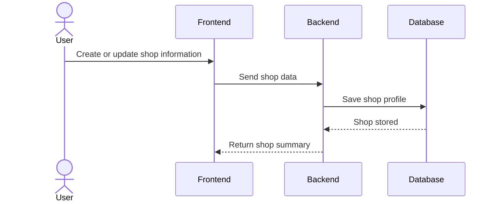
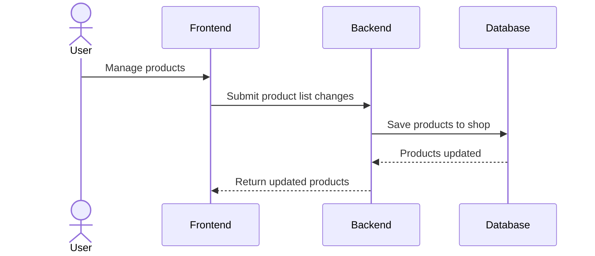
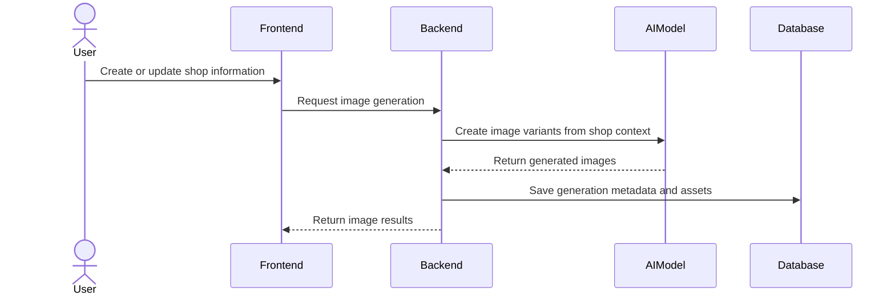
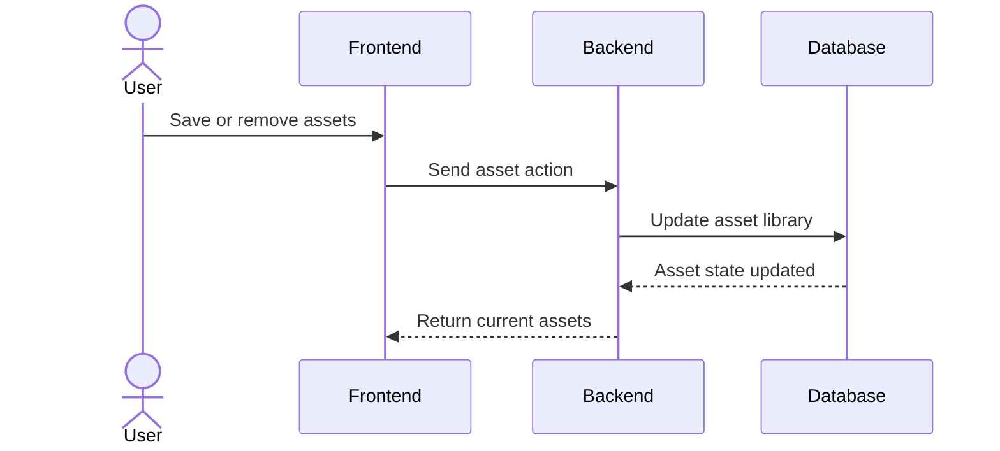
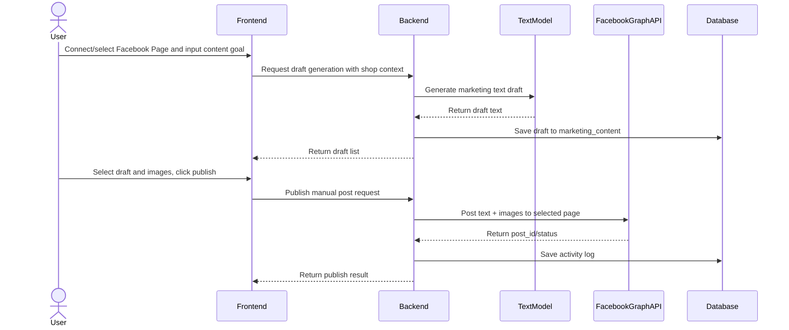

Shop Management

```mermaid
sequenceDiagram
    actor User
    participant FE as Frontend
    participant BE as Backend
    participant DB as Database

    User->>FE: Create or update shop information
    FE->>BE: Send shop data
    BE->>DB: Save shop profile
    DB-->>BE: Shop stored
    BE-->>FE: Return shop summary
```

Product Management

```mermaid
sequenceDiagram
    actor User
    participant FE as Frontend
    participant BE as Backend
    participant DB as Database

    User->>FE: Manage products
    FE->>BE: Submit product list changes
    BE->>DB: Save products to shop
    DB-->>BE: Products updated
    BE-->>FE: Return updated products
```

Image Generation

```mermaid
sequenceDiagram
    actor User
    participant FE as Frontend
    participant BE as Backend
    participant AI as AIModel
    participant DB as Database

    User->>FE: Create or update shop information
    FE->>BE: Request image generation
    BE->>AI: Create image variants from shop context
    AI-->>BE: Return generated images
    BE->>DB: Save generation metadata and assets
    BE-->>FE: Return image results
```

Asset Storage Management

```mermaid
sequenceDiagram
    actor User
    participant FE as Frontend
    participant BE as Backend
    participant DB as Database

    User->>FE: Save or remove assets
    FE->>BE: Send asset action
    BE->>DB: Update asset library
    DB-->>BE: Asset state updated
    BE-->>FE: Return current assets
```

Support Marketing Manual Flow

```mermaid
sequenceDiagram
    actor User
    participant FE as Frontend
    participant BE as Backend
    participant AI as TextModel
    participant FB as FacebookGraphAPI
    participant DB as Database

    User->>FE: Connect/select Facebook Page and input content goal
    FE->>BE: Request draft generation with shop context
    BE->>AI: Generate marketing text draft
    AI-->>BE: Return draft text
    BE->>DB: Save draft to marketing_content
    BE-->>FE: Return draft list
    User->>FE: Select draft and images, click publish
    FE->>BE: Publish manual post request
    BE->>FB: Post text + images to selected page
    FB-->>BE: Return post_id/status
    BE->>DB: Save activity log
    BE-->>FE: Return publish result
```

