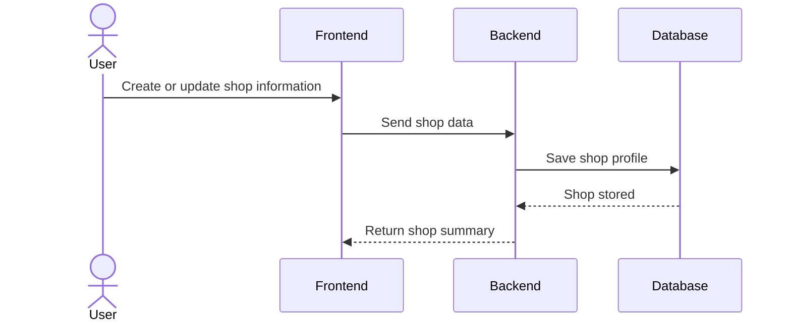
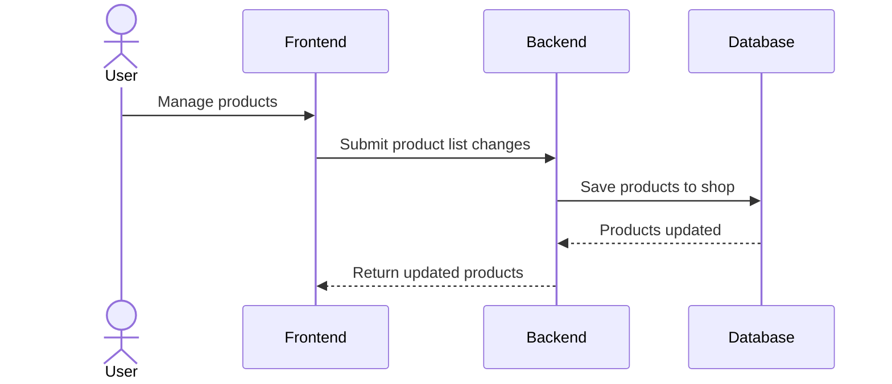
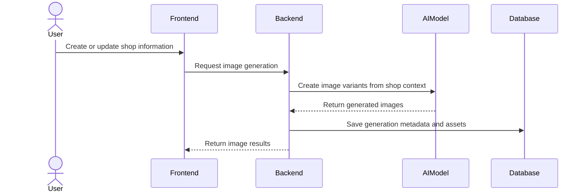
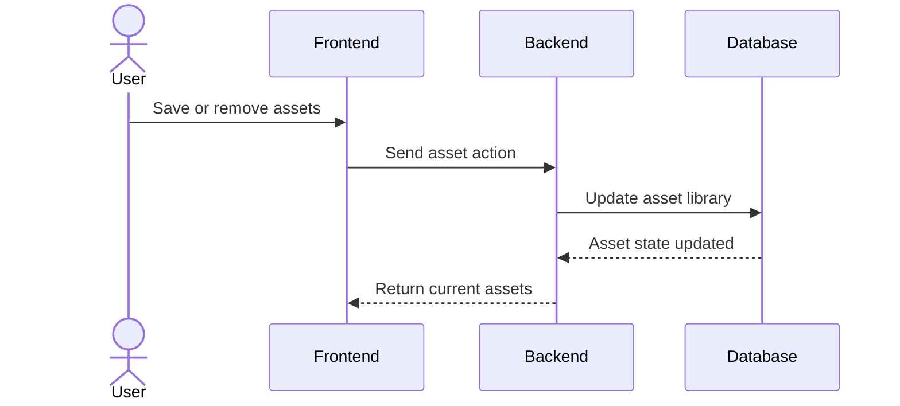

Shop Management

```mermaid
sequenceDiagram
    actor User
    participant FE as Frontend
    participant BE as Backend
    participant DB as Database

    User->>FE: Create or update shop information
    FE->>BE: Send shop data
    BE->>DB: Save shop profile
    DB-->>BE: Shop stored
    BE-->>FE: Return shop summary
```

Product Management

```mermaid
sequenceDiagram
    actor User
    participant FE as Frontend
    participant BE as Backend
    participant DB as Database

    User->>FE: Manage products
    FE->>BE: Submit product list changes
    BE->>DB: Save products to shop
    DB-->>BE: Products updated
    BE-->>FE: Return updated products
```

Image Generation

```mermaid
sequenceDiagram
    actor User
    participant FE as Frontend
    participant BE as Backend
    participant AI as AIModel
    participant DB as Database

    User->>FE: Create or update shop information
    FE->>BE: Request image generation
    BE->>AI: Create image variants from shop context
    AI-->>BE: Return generated images
    BE->>DB: Save generation metadata and assets
    BE-->>FE: Return image results
```

Asset Storage Management

```mermaid
sequenceDiagram
    actor User
    participant FE as Frontend
    participant BE as Backend
    participant DB as Database

    User->>FE: Save or remove assets
    FE->>BE: Send asset action
    BE->>DB: Update asset library
    DB-->>BE: Asset state updated
    BE-->>FE: Return current assets
```

