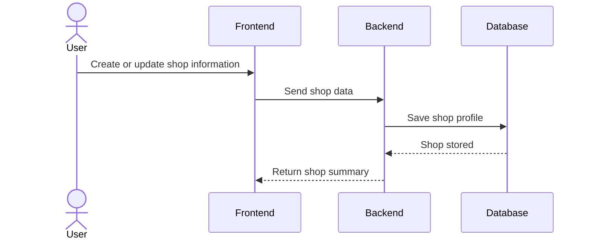
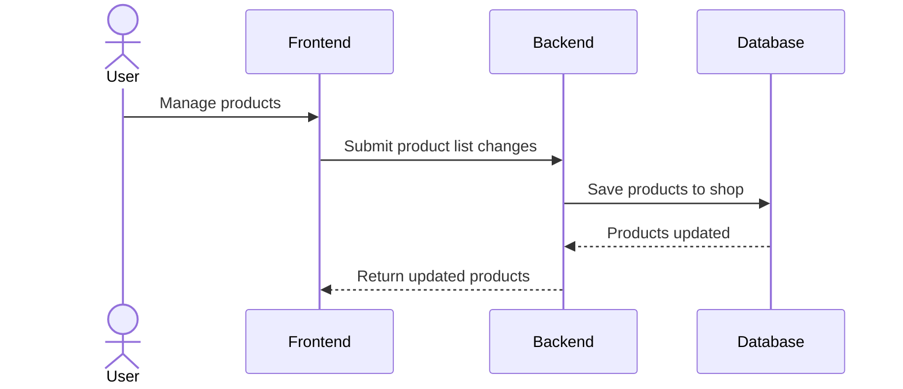
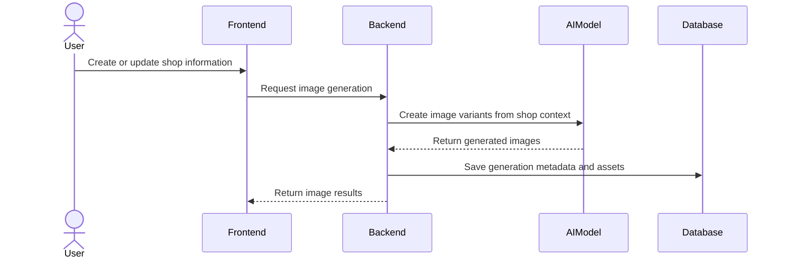
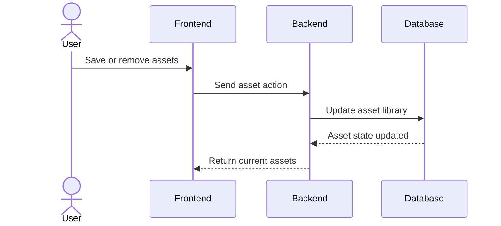

Shop Management


Product Management


Image Generation


Asset Storage Management


Support Marketing Manual Flow
```mermaid
sequenceDiagram
    actor User
    participant FE as Frontend
    participant BE as Backend
    participant Ollama as Ollama_VPS
    participant FB as Meta_Graph_API
    participant DB as Database

    User->>FE: Connect Page (hoặc nhập page token) / xem post / yêu cầu AI
    FE->>BE: GET/POST /api/shops/:id/facebook/... (pages, posts, assist)
    BE->>FB: Graph API (token server-side, không lộ client)
    FB-->>BE: Page list, posts, insights
    BE->>DB: Cache facebook_posts_cache, snapshots, tokens
    BE-->>FE: JSON cho UI

    User->>FE: AI assist / tóm tắt comment / gợi ý caption
    FE->>BE: POST .../assist (hoặc route tương đương)
    BE->>Ollama: POST /api/generate (MARKETING_AI_*)
    Ollama-->>BE: Text
    BE->>DB: marketing_ai_cache (tuỳ gọi)
    BE-->>FE: Gợi ý text

    Note over BE,FB: OAuth flow đầy đủ có thể bổ sung sau; hiện có thể connect bằng page token / bước manual.
```

