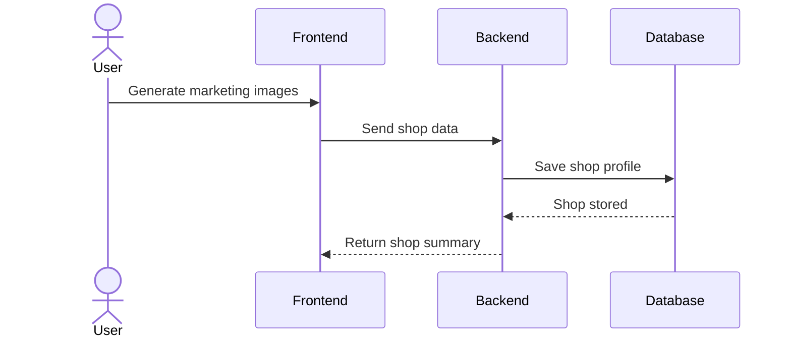
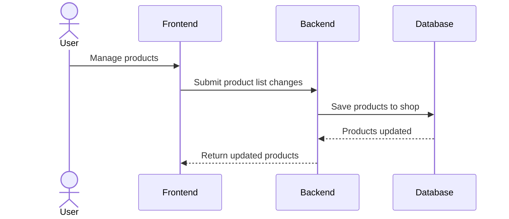
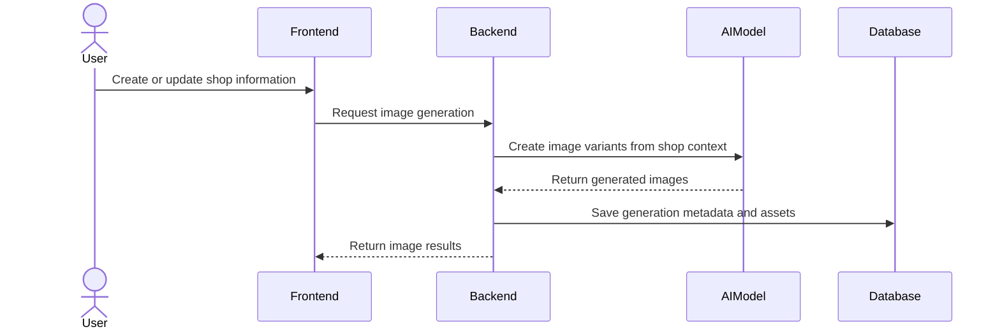
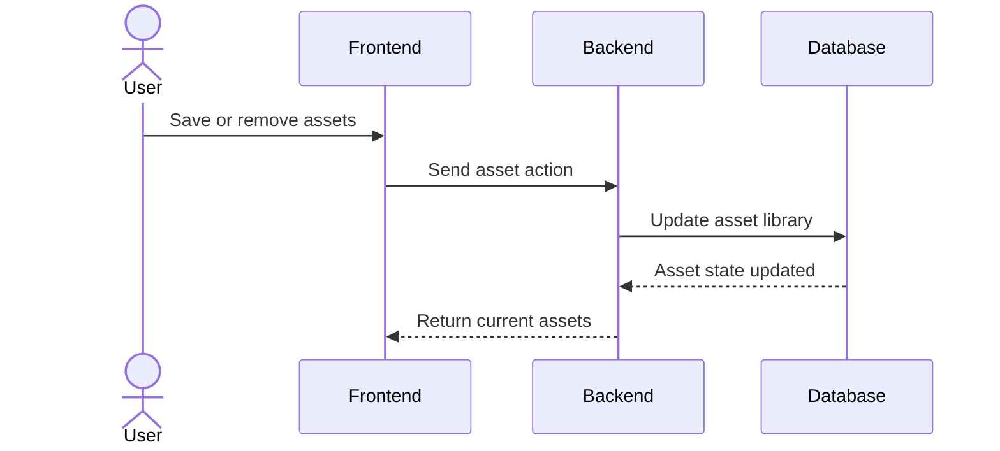
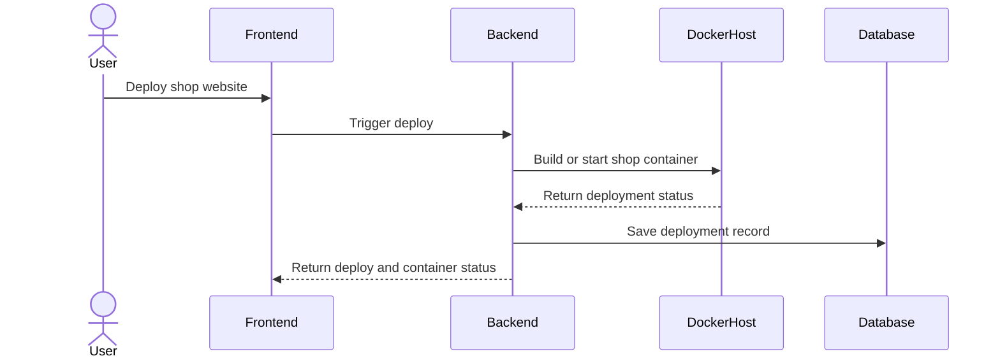
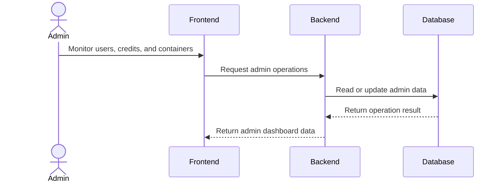

```mermaid
sequenceDiagram
    actor User
    participant FE as Frontend
    participant BE as Backend
    participant DB as Database

    User->>FE: Generate marketing images
    FE->>BE: Send shop data
    BE->>DB: Save shop profile
    DB-->>BE: Shop stored
    BE-->>FE: Return shop summary
```

```mermaid
sequenceDiagram
    actor User
    participant FE as Frontend
    participant BE as Backend
    participant DB as Database

    User->>FE: Manage products
    FE->>BE: Submit product list changes
    BE->>DB: Save products to shop
    DB-->>BE: Products updated
    BE-->>FE: Return updated products
```

```mermaid
sequenceDiagram
    actor User
    participant FE as Frontend
    participant BE as Backend
    participant AI as AIModel
    participant DB as Database

    User->>FE: Create or update shop information
    FE->>BE: Request image generation
    BE->>AI: Create image variants from shop context
    AI-->>BE: Return generated images
    BE->>DB: Save generation metadata and assets
    BE-->>FE: Return image results
```

```mermaid
sequenceDiagram
    actor User
    participant FE as Frontend
    participant BE as Backend
    participant DB as Database

    User->>FE: Save or remove assets
    FE->>BE: Send asset action
    BE->>DB: Update asset library
    DB-->>BE: Asset state updated
    BE-->>FE: Return current assets
```

```mermaid
sequenceDiagram
    actor User
    participant FE as Frontend
    participant BE as Backend
    participant DK as DockerHost
    participant DB as Database

    User->>FE: Deploy shop website
    FE->>BE: Trigger deploy
    BE->>DK: Build or start shop container
    DK-->>BE: Return deployment status
    BE->>DB: Save deployment record
    BE-->>FE: Return deploy and container status
```

```mermaid
sequenceDiagram
    actor Admin
    participant FE as Frontend
    participant BE as Backend
    participant DB as Database

    Admin->>FE: Monitor users, credits, and containers
    FE->>BE: Request admin operations
    BE->>DB: Read or update admin data
    DB-->>BE: Return operation result
    BE-->>FE: Return admin dashboard data
```
